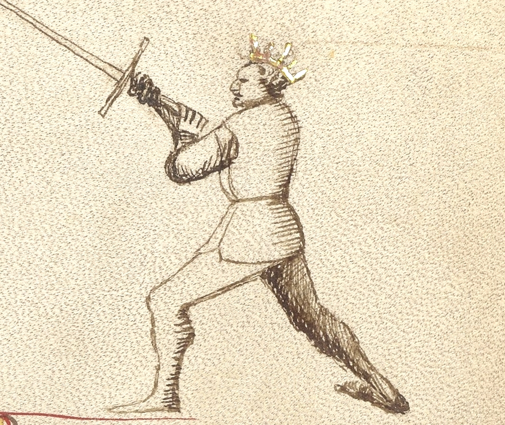
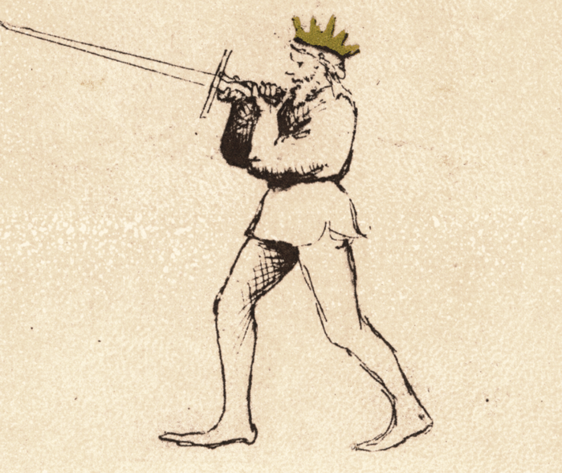

# Bicorno

<em>Getty MS Ludwig XV 13, c. 1409 - J. Paul Getty Museum (Open Content)</em>

<em>Flos Duellatorum (Pisani-Dossi MS), c. 1409 - Novati facsimile edition, 1902</em>

*The Two-Horned Guard*

Classification: *Instabile — Mutable Guard*

Bicorno is unlike any other guard in Fiore's longsword system. Where every other guard uses a conventional placement of both hands on the handle, Bicorno introduces a reversed grip: both hands remain on the handle, but the front hand grips near the pommel with the palm rotated outward, while both elbows press inward toward each other. The sword is raised overhead, the elbows form the guard's characteristic horned silhouette, and the guard presents two simultaneous threats: the point projecting forward from above, and the pommel ready at close quarters.

For the modern fencer, Bicorno teaches a principle that no other guard addresses so directly: **the sword in close combat is not only a blade: it is a lever, a hook, a bludgeon, and a handle**. When measure collapses and the blade is too long to swing freely, Bicorno transforms the weapon from a distance tool into a close-quarters control instrument.

Fiore calls it "perfect defense." That precision of language is worth noting. Not strong, not stable, but *perfect*.

---

## **Fiore's Description**

### **Getty Manuscript Text**

*"Bicorno son chiamado, per nome si perfecta, che cum doe punte e cum doe tagli, facio mia defesa perfecta. E posso ferir e defender cum li agudissimi mei corni. E per tal cason io son contra le altre prese ad ogne homo adorni."*

### **Translation**

"I am called Two-Horned, by name so perfect, for with two points and two edges I make my defense perfect. And I can strike and defend with my very sharp horns. And for this reason I am against the other grips, adorned for every man."

Fiore's description has a different quality from the other guards. He does not describe physical positioning or tactical movement — he declares perfection. Two points and two edges. Perfect defense. Against the other grips.

The language of "horns" is deliberate and precise. The guard does not simply have one threatening point; it has two. And both horns are sharp.

---

## **The Meaning of the Name**

*Bicorno* means *Two-Horned*, from the Italian *bi* (two) and *corno* (horn).

The name refers to the dual-threat structure of the guard. The first horn is the sword's point, projecting forward from the overhead position. The second horn is the pommel, positioned toward the opponent by the reversed front hand and ready to strike or hook at close distance.

The shape of the guard itself expresses the name: the elbows pressed inward and raised overhead form the arcing silhouette of two horns rising from the body's center. The image is immediate and physical. This is a guard that looks like what it is.

---

## **The Reversed Grip**

Bicorno introduces a grip configuration found nowhere else in Fiore's longsword system.

In the standard grip, both hands hold the handle with the palms facing the same direction. In Bicorno, the front hand is reversed: it grips near the pommel with the palm rotated outward and the elbow pressed inward toward the body's centerline.

This reversed configuration accomplishes several things.

**It creates the horned silhouette.** The elbows, pressed inward and raised overhead, form the characteristic shape that gives the guard its name. The inward pressure of both elbows produces a strong triangular structure that resists displacement from multiple directions.

**It positions the pommel as an active weapon.** With the front hand reversed near the pommel, that end of the sword is oriented toward the opponent and can be struck forward or used to hook at close distance.

**It locks the overhead structure.** The combination of elbows inward and reversed front hand creates a position that is genuinely difficult to press through or displace. This is the "perfect defense" Fiore describes — not because the guard covers every line passively, but because its structure resists interference.

**It enables immediate transitions.** As an Instabile guard, Bicorno is not meant to be held statically. The reversed grip can release quickly into descending cuts or thrusts as the tactical moment demands.

---

## **Physical Structure**

### **Body Position**

The stance is forward-weighted, reflecting the guard's commitment to close-quarters engagement.

The body leans slightly into the overhead structure. Where Posta Corona and Posta Frontale hold the elevated position from a neutral stance, Bicorno's forward weight reflects its role as an entering guard — it is built for the moment when distance has already collapsed and the fencer is in close contact.

---

### **Hand and Sword Position**

Both hands grip the handle: the rear hand in a standard grip, the front hand reversed near the pommel with the palm facing outward.

The sword is raised overhead with both elbows pressed inward toward the centerline. The point projects forward and slightly downward from the overhead position, threatening at roughly the opponent's face height from above.

The elbows form the "horns" of the guard. Their inward pressure creates a compact structural triangle — body, rear arm, front arm — that is very difficult to displace.

The pommel, held by the reversed front hand, remains available for striking or hooking actions at close distance.

---

## **Tactical Function**

Bicorno's tactical identity is built around one specific context: *gioco stretto*, the narrow play at close distance where the opponent's blade is no longer free to swing.

When two fencers have closed to bind distance and the full cutting arcs of the longsword are no longer available, most guards become difficult to deploy. Bicorno is designed for exactly this range.

**Perfect defense through dual threats:** With the point projecting from above and the pommel available at close range, the guard covers two lines simultaneously. An opponent trying to find an opening must account for both threats, and the angle of the overhead position makes many attacking lines converge directly on one or the other.

**Precision thrusting from above:** The overhead position angles the point downward at an unusual approach, arriving from above rather than straight ahead, which makes it difficult to read and hard to parry with a standard guard response. Against armored opponents, this downward angle was critical for finding gaps in the armor around the neck and shoulders.

**Against grips and grappling:** Fiore says the guard is "against the other grips." When an opponent attempts to grab or control the sword or the fencer's body, the pommel provides immediate counter-options, and the locked structure of the reversed grip makes the fencer's weapon more secure against attempts to disarm.

---

## **The Two Horns**

Understanding both horns of Bicorno as active and simultaneous threats is essential to understanding the guard correctly.

**The blade point:** Projecting forward from the overhead position, the point threatens the opponent's face, throat, and upper chest. A thrust from this position arrives at an unusual downward angle, which makes it difficult to read and hard to parry with a standard guard response.

**The pommel:** The reversed front hand near the pommel positions that end of the sword toward the opponent for hooking, striking, or controlling actions. In close quarters where the blade cannot swing freely, the pommel can impact with significant force.

An opponent who tries to close against Bicorno discovers that both ends of the weapon are dangerous. There is no safe angle of approach.

---

## **Modern Application**

In modern fencing, Bicorno is most relevant in two contexts.

**As a close-quarters guard:** When sparring has closed to bind distance and neither fencer can freely swing, Bicorno provides a structured response rather than scrambling. The locked overhead structure allows the fencer to maintain control, continue threatening with both the point from above and the pommel at close range, and seek the decisive thrust that ends the exchange.

**As a pedagogical tool:** The reversed grip teaches students that the sword can be held in configurations beyond the standard grip, and that both ends of the weapon can be threatening simultaneously. Practicing Bicorno develops a more complete understanding of the weapon's versatility at close distance.

---

## **Connection to the Four Virtues**

Bicorno most strongly expresses the **Elephant**.

The reversed grip structure creates a guard that is genuinely very difficult to displace or overwhelm. The inward elbows, the overhead position, and the locked geometry all contribute to a structural solidity that can receive pressure from multiple directions without collapsing. Like the elephant with its castle, Bicorno holds its ground through structural superiority rather than agility.

The **Tiger** governs the speed of the close-quarters thrust. At narrow play distance, the thrust from Bicorno must arrive before the opponent can reset to a more advantageous position.

The **Lynx** reads which horn is appropriate — the point thrust or the pommel strike — based on what the opponent is doing and where the opening exists.

The **Lion** commits to the close-quarters range that Bicorno requires. Maintaining the guard at narrow play distance, with the opponent immediately present, demands courage and willingness to engage at the most demanding measure.

---

## **Defeating the Guard**

Bicorno is most vulnerable before close distance is established.

At standard measure, where full cutting arcs are available, the overhead grip sacrifices the flexibility that a standard grip provides. An opponent who can maintain or create distance prevents the guard from reaching its optimal range.

The guard is also less effective against opponents with superior physical strength who can use grappling or wrestling actions to overwhelm the overhead structure before the point or pommel can be brought to bear.

Finally, the overhead structure leaves the lower body and legs more exposed than most guards. An opponent who directs attacks low, while staying outside the immediate threat of the two horns, can find lines that Bicorno does not naturally cover.

---

## **What This Guard Is Not For**

Bicorno is not a guard for middle or long measure. Its design is explicitly for close quarters — the narrow play where other guards have lost their primary function.

It is also not a guard for wide cutting actions. The reversed grip and locked elbow structure limit the available cutting arcs. The guard favors controlled thrusting and close-quarters control over large rotational cuts.

Finally, the guard requires familiarity with the reversed grip before it can be used confidently. Students should practice the grip structure and locked elbow position in isolation before attempting to apply it in dynamic exchanges.

---

## **Training the Guard**

### **Drill 1 — Establishing the Reversed Grip**

Begin by establishing the reversed grip: rear hand on the handle with a standard grip, front hand reversed near the pommel with the palm facing outward.

Raise the sword overhead, pressing both elbows inward toward the centerline. The point projects forward from the overhead position.

A partner applies gentle downward pressure on the blade from above. Maintain the structure without the elbows collapsing outward or the reversed front hand losing its connection.

Hold for ten seconds, then rest. Repeat five times. Focus on the structural triangle formed by the elbows and sword, and the feeling of the locked overhead position.

---

### **Drill 2 — The Overhead Thrust**

From Bicorno, step forward and deliver a controlled thrust downward and forward from the overhead position.

The point drops toward a specific target — a partner holds their fist at face height as a reference point.

The overhead starting position gives the thrust an unusual downward angle. Repeat ten times, adjusting the target height: face, throat, chest.

The goal is to experience the distinctive angle of the overhead thrust and the way the locked structure guides the point forward.

---

### **Drill 3 — Defending the Overhead**

One fencer assumes Bicorno. The partner delivers a slow descending Fendente toward the Bicorno fencer's head.

The Bicorno fencer uses the overhead structure — the elevated blade and locked elbows — to receive the descending strike, allowing it to contact the blade and be deflected.

After the deflection, the Bicorno fencer immediately delivers a controlled thrust downward from the overhead position.

Repeat ten times, then switch roles. The lesson: the overhead structure in Bicorno is not passive — it catches the incoming strike and immediately creates the opportunity for a counter-thrust.

---

## **Common Errors**

The most common mistake is allowing the elbows to collapse outward rather than pressing them inward. The elbows-in position is what creates the structural lock and the characteristic "horned" shape. Elbows pointing outward convert Bicorno into an unstable overhead position with no structural advantage.

Another frequent error is reversing the wrong hand or gripping too loosely with the front hand. The front hand should be near the pommel, fully reversed with the palm facing outward, and with enough grip to maintain control under pressure.

Some students also treat Bicorno as a purely defensive guard and fail to use both horns actively. The point must remain threatening forward, and the pommel must remain available as a striking or hooking option. Focusing only on one horn misses the guard's defining characteristic.

Finally, hunched or collapsed shoulders reduce the structural integrity of the overhead position. The shoulders should be relaxed and the structure open — tension in the upper body creates rigidity that slows response.

---

## **Key Idea**

Bicorno is the guard of the narrow space.

It carries two threats simultaneously — the point projecting from above, the pommel ready below — and holds them both through the locked structure of the reversed grip. Against attempts to control, grab, or overwhelm at close distance, it presents a problem with two sharp answers.

**Perfect defense does not mean perfect coverage of every line. It means that wherever the opponent reaches, one horn is already there.**
