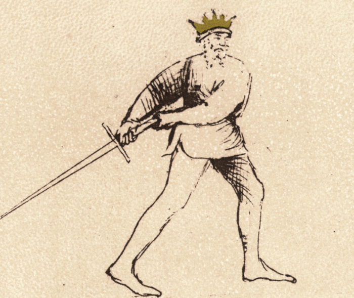

# Coda Longa

<em>Flos Duellatorum (Pisani-Dossi MS), c. 1409 - Novati facsimile edition, 1902</em>

*The Long Tail*

Classification: *Stabile — Stable Guard*

Coda Longa is one of the most deceptive guards in the Getty manuscript of Fiore dei Liberi. The sword trails behind the body like the tail of an animal, appearing withdrawn, passive, or even vulnerable.

But this appearance is intentional.

Fiore describes Coda Longa as a *false guard*, a position designed to mislead the opponent about your true intentions. Although the posture appears defensive, the guard is built for sudden offense, explosive upward strikes, and aggressive entry.

For the modern fencer, Coda Longa teaches an essential tactical principle:

What appears weak may actually be preparing to attack.

This guard is not about waiting safely behind structure. It is about baiting the opponent into overcommitting before launching forward with explosive motion.

This chapter treats Coda Longa Destra and Coda Longa Sinestra together, since both versions express the same tactical idea through mirrored body mechanics.

---

## **Fiore’s Description**

### **Getty Manuscript Text**

*"*Questa si e posta di coda longa ch'e destesa in terra di dredo, ella po metter punta, e denançi po covrir e ferire. E se ello passa inançi e tra del fendente, in Lo zogo stretto entra senza fallimento, che tal guardia e bona per aspettare, che de quella in altre tosto po intrare*."*

### **Translation**

“This is the guard of the Long Tail which is extended to the ground behind [you]. It can make a thrust, and to the front it can cover and strike. And if [the fencer] passes forward and enters with a Fendente, [he] enters into the narrow play without fail. For such a guard is good for waiting, and from it [the fencer] can quickly enter into other [guards].”

This description immediately establishes the identity of the guard.

Coda Longa is deceptive by nature. Its purpose is not simply to defend, but to disguise offensive intent behind an apparently withdrawn posture.

---

## **The Meaning of the Name**

The name “Coda Longa,” or “Long Tail,” refers to the sword trailing behind the body like the tail of an animal.

The blade extends rearward while the body appears withdrawn and defensive.

This creates two important effects:

* the opponent often underestimates the immediate threat  
* the sword gains a long path for acceleration into rising attacks

Like many of Fiore’s guards, the name describes both the shape of the position and the tactical behavior associated with it.

---

## **Right and Left Variations**

Like many guards in Fiore’s system, Coda Longa exists on both the right and left sides of the body.

Although the tactical purpose remains the same, the angle of acceleration and entry changes significantly between the two versions.

---

### **Coda Longa Destra**

In the right-side variation, the sword trails behind the right side of the body while the right foot remains forward.

The guard naturally launches:

* sottano destra  
* rising thrusts from the right side  
* explosive diagonal entries

This is the version most commonly associated with the classic Getty image of Coda Longa.

---

### **Coda Longa Sinestra**

In the left-side variation, the sword trails behind the left side of the body, with the left foot typically forward and the body withdrawn to the right.

This version naturally generates:

* Sottano Sinestra, the rising cut from the left
* Rising thrusts from the left line
* Explosive diagonal entry from the left side

The angle of acceleration and the line of attack feel noticeably different from the Destra version. The rising cut from the left approaches the opponent’s right side, a line they may be less practiced at defending, and the entry angle shifts enough to require genuine bilateral training rather than simple mirroring.

The false guard concept applies equally on both sides. An opponent who has learned to read Coda Longa Destra as a bait may not immediately recognize the same trap presented from the left. Training Sinestra with equal intention gives the guard a second deceptive dimension.

Training both sides reinforces Fiore’s bilateral approach and prevents the guard from becoming predictable or one-sided.

---

## **Physical Structure**

Coda Longa is held low and withdrawn with the sword positioned behind the body.

### **Body Position**

The stance is typically rear-weighted with the lead foot forward and the body slightly withdrawn.

The posture should feel balanced and mobile rather than collapsed or retreating.

Although the guard appears defensive, the body remains prepared to drive explosively forward.

The guard should feel loaded.

---

### **Hand and Sword Position**

The hands are held low near or behind the hip while the sword trails behind the body.

The blade should feel chambered rather than abandoned.

This is important.

The guard is not passive. The sword is deeply loaded behind the body in preparation for rapid upward or forward motion.

The posture should resemble a compressed spring.

---

## **Upper Hand vs Lower Hand Hip Connection**

One of the most important structural details in Coda Longa is which hand remains closest to the hip during the chamber.

Small changes here significantly affect:

* distance  
* leverage  
* acceleration  
* structure

---

### **Lower Hand Connected to the Hip**

When the lower hand remains structurally connected to the hip, the sword becomes strongly integrated into the body.

This creates:

* stronger mechanical structure  
* greater rotational power  
* more explosive acceleration  
* better whole-body connection

The strike tends to feel:

* compact  
* heavy  
* powerful

This version often sacrifices a small amount of reach in exchange for stronger body-driven mechanics.

For many fencers, this creates the clearest “loaded spring” feeling.

---

### **Upper Hand Connected to the Hip**

When the upper hand remains closer to the hip while the lower hand extends farther away, the sword gains additional reach and extension.

This creates:

* longer striking distance  
* wider acceleration arc  
* increased reach during the release

However, the structure often feels:

* less compact  
* slightly less mechanically powerful  
* more dependent on timing and distance

This variation can produce very fast and difficult-to-read rising attacks, but may feel less structurally stable under pressure.

---

### **Tactical Implications**

The difference between these structures reflects an important principle in Fiore’s system:

Greater extension often increases reach and unpredictability, while tighter body connection increases structure and power.

Neither version is universally correct.

Different fencers may emphasize:

* explosive power  
* deceptive reach  
* structural stability  
* acceleration

depending on:

* body type  
* tactical preference  
* weapon length  
* fencing context

The important thing is that the guard remains mechanically connected and prepared to explode forward.

---

## **Tactical Function**

Coda Longa is a guard of deception, invitation, and explosive offense.

The position encourages the opponent to believe:

* you are retreating  
* you are vulnerable  
* you are defending passively  
* you have surrendered initiative

In reality:

* the sword is deeply chambered  
* the body is prepared to advance  
* the guard is built to launch explosive attacks

This is not a waiting guard.

It is a trap.

---

## **The False Guard Concept**

Coda Longa is one of the clearest expressions of deception in Fiore’s system.

A false guard deliberately communicates misleading information to the opponent.

The guard appears weak while secretly preparing strength.

This is an important tactical lesson for modern fencing.

Opponents frequently react not only to actual threats, but also to perceived intent. Coda Longa manipulates those expectations by disguising offense as defense.

The guard invites the opponent to attack first, then punishes their commitment with sudden acceleration.

---

## **The Natural Strike — Sottano**

Because the sword begins low and withdrawn, the most natural action from Coda Longa is a rising cut, or *sottano*.

From the rearward chamber, the blade whips upward from below in a long accelerating arc.

This rising action is difficult to read because much of the blade’s motion begins behind the body and outside the opponent’s immediate line of sight.

The strike emerges suddenly and violently from below.

---

## **The Rising Sottano into High Guards**

One of the defining actions of Coda Longa is the explosive transition from low withdrawal into high offensive positions.

As the sword launches upward in a rising sottano, the blade naturally finishes in high guards such as:

* Posta di Fenestra  
* Posta Frontale

This creates a powerful tactical transition:

* withdrawn deception  
* explosive rising attack  
* immediate high-line pressure

The motion should feel continuous and accelerating rather than segmented into separate actions.

---

## **Drawing the Attack**

One of the primary tactical purposes of Coda Longa is to provoke commitment from the opponent.

Because the guard appears defensive or withdrawn, opponents are often tempted to:

* rush forward  
* overextend  
* attempt to seize initiative  
* attack aggressively into perceived weakness

Coda Longa exploits this reaction.

As the opponent commits, the guard launches upward into the opening created by their forward motion.

This is why Fiore describes the guard as both deceptive and aggressive simultaneously.

---

## **Modern Application**

In modern fencing, Coda Longa is often underestimated because it appears unconventional and vulnerable.

In practice, however, it can be extremely effective for:

* baiting aggressive opponents  
* disguising upward attacks  
* creating explosive acceleration  
* forcing reactions through deceptive posture

The guard is especially useful against opponents who:

* overcommit aggressively  
* chase perceived openings  
* attack recklessly into withdrawn positions

For modern practitioners, the greatest value of Coda Longa lies in understanding how posture and intention influence an opponent’s decisions.

---

## **Connection to the Four Virtues**

Coda Longa strongly expresses the Lynx.

The guard depends on observation, timing, and deception. The fencer studies the opponent and invites a reaction before striking.

The Tiger appears in the explosive acceleration of the release.  
 The Elephant appears in the stable rear-weighted structure.  
 The Lion appears in the courage required to stand in an apparently vulnerable position.

---

## **Defeating the Guard**

Coda Longa is strongest when opponents attack impulsively into its invitation.

The guard becomes less effective when the opponent:

* refuses to overcommit  
* controls distance carefully  
* pressures safely from above  
* forces the guard to act first

Because the sword begins deeply chambered behind the body, interrupting the rising action early can limit the guard’s effectiveness.

Maintaining measured pressure while denying explosive entry is often more effective than rushing aggressively into the trap.

---

## **What This Guard Is Not For**

Coda Longa is not designed for passive retreating.

Although the posture appears defensive, the guard functions through aggressive offensive intent.

It is also not intended for static point control or prolonged centerline dominance. The sword begins withdrawn rather than extended.

Finally, the guard should not become rigid or visibly tense. Its effectiveness depends heavily on relaxed explosiveness and deceptive presentation.

---

## **Training the Guard**

The following drills develop the deceptive posture, explosive release, and tactical timing of Coda Longa.

---

### **Drill 1 — Establishing the False Guard**

Begin in Coda Longa with the body withdrawn and the sword trailing behind the hip.

Maintain relaxed structure while preserving readiness to move explosively forward.

The posture should appear passive while still feeling balanced and prepared.

Have a partner observe the posture and describe what intentions it appears to communicate.

---

### **Drill 2 — Explosive Sottano**

From Coda Longa, step forward explosively and launch a rising sottano from below.

Allow the blade to travel naturally upward into Posta di Fenestra or Posta Frontale.

Focus on:

* acceleration  
* relaxed release  
* whole-body motion  
* continuous upward flow

Practice from both Destra and Sinestra.

---

### **Drill 3 — Baiting the Attack**

Begin with one fencer in Coda Longa and the other in an aggressive guard such as Donna or Fenestra.

The fencer in Coda Longa presents apparent vulnerability while maintaining readiness to launch forward.

As the opponent commits to attack, explode upward with the rising sottano.

The goal is to intercept the opponent during their forward commitment.

---

### **Drill 4 — Continuous Offensive Flow**

Launch a rising sottano from Coda Longa into a high guard.

From the high position, immediately continue into a descending fendente before recovering.

This drill develops the flowing offensive transitions naturally generated by the guard.

---

## **Common Errors**

A common mistake is becoming genuinely defensive in the guard. Coda Longa only functions correctly when the offensive intention remains active.

Another issue is visibly tensing before the strike. Telegraphing the attack reduces the effectiveness of the deception.

Some students also fail to withdraw the body sufficiently. The deeper the chamber and withdrawal, the greater the explosive potential of the release.

---

## **Key Idea**

Coda Longa is a guard of hidden offense.

It appears defensive while secretly preparing explosive attack.

Like the release of a compressed spring, the sword launches upward from behind the body with sudden acceleration, punishing opponents who mistake apparent weakness for true vulnerability.

