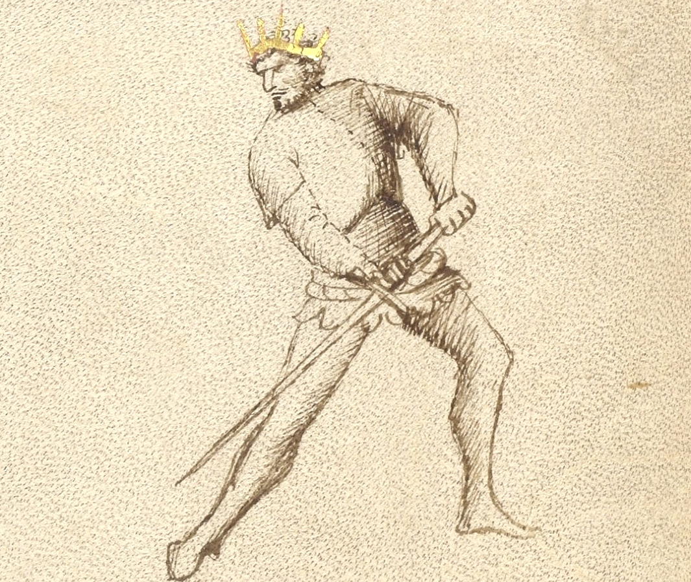
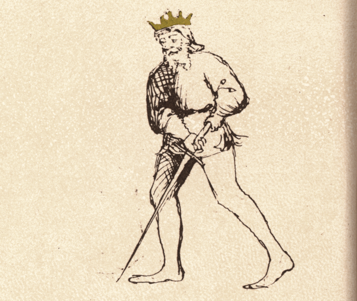

# Dente di Zenghiaro Destra and Sinestra

<em>Getty MS Ludwig XV 13, c. 1409 - J. Paul Getty Museum (Open Content)</em>

<em>Flos Duellatorum (Pisani-Dossi MS), c. 1409 - Novati facsimile edition, 1902</em>

*The Wild Boar’s Tusk*

Classification: *Stabile — Stable Guard*

Dente di Zenghiaro is one of the most aggressive low guards in the Getty manuscript of Fiore dei Liberi. Although held low near the hip, the guard is not passive or withdrawn. Like the strike of a wild boar, it rises suddenly upward before returning downward with force.

For the modern fencer, Dente di Zenghiaro teaches an essential principle of Fiore’s system: a guard may appear defensive while still threatening immediate offense. The sword waits low, hidden beneath the line of engagement, ready to thrust upward into the opponent before descending again into control.

Unlike high guards such as Posta di Donna, which generate descending force from above, Dente di Zenghiaro generates power from below through rising actions, thrusts, and returning cuts.

This chapter treats Dente di Zenghiaro Destra and Sinestra together, since the tactical principles remain the same on both sides of the body.

---

## **Fiore’s Description**

### **Getty Manuscript Text**

*"Questo si e dente di zenghiaro perche a modo di senghiaro sie feri. E talvolta fa le punte forti de sotto in suso ala faza senza passare del pe. E torna cum la punta per la medesima strada cum rebatter fendente ale braze. Anchora fa la punta alta ala faza cum lo pe denanci passando fora de strada. E torna cum fendenti ala testa e ale braze e torna in sua guardia. E subito tira un'altra punta cum lo pe denanci passando fora de strada. E questa guardia si po fare bona defensa in zogho stretto."*

### **Translation**

“This is the Boar’s Tusk, because it strikes the way the wild boar strikes. Sometimes it makes powerful thrusts from below up into the face, without stepping forward, and it returns along the same path with a downward strike to the arms. Other times as it thrusts the point of the sword high into the face, it advances the front foot forwards, then returns to its guard with a downward strike to the head or the arms. Then it quickly launches another thrust with another advance of the front foot. And this guard can mount a good defense against the Narrow Game.”

This description gives one of the clearest examples in Fiore’s system of a guard being defined through its tactical behavior rather than simply its shape.

Dente di Zenghiaro is active, probing, and cyclical. It rises upward into attack, returns downward into control, and immediately launches again.

---

## **The Meaning of the Name**

The name “Dente di Zenghiaro,” or “Wild Boar’s Tusk,” describes both the shape and behavior of the guard.

Like the tusk of a boar, the sword rises violently upward from below. Fiore specifically compares the action of the guard to the way a wild boar strikes.

This comparison is important.

The guard does not remain statically threatening with the point elevated toward the opponent. Instead, its threat emerges through sudden upward motion from a low position.

The sword rises into the attack, then returns downward along the same path.

---

## **Right and Left Variations**

Like many positions in Fiore’s system, Dente di Zenghiaro can be expressed on both sides of the body.

### **Dente di Zenghiaro Destra**

In the right-side variation, the sword is held low near the right hip with the point projecting forward from below.

The rear hand remains structurally connected to the hip while the forward hand guides the blade.

From this position, the sword naturally rises upward into thrusts and sottani from the right side.

### **Dente di Zenghiaro Sinestra**

The left-side variation mirrors the same structure on the opposite side of the body.

The sword is held low near the left hip, allowing the blade to rise upward from the left side.

Mechanically, the tactical principles remain identical, though the angle of attack and interception changes.

Training both sides reinforces an important principle in Fiore’s art: guards are part of a connected bilateral system rather than isolated poses.

---

## **Physical Structure**

Dente di Zenghiaro is held low and compact with the sword connected closely to the body.

### **Body Position**

The stance is grounded and balanced, usually with slight forward pressure through the lead foot.

The body remains upright and stable while the sword waits beneath the primary line of engagement.

Unlike guards such as Fenestra, which project immediate point threat, Dente di Zenghiaro conceals much of its offense below the opponent’s line of sight.

---

### **Hand and Sword Position**

The hands are held low near the hip.

In the Getty manuscript, the point is generally shown projecting forward or slightly downward rather than dramatically elevated upward.

This is important.

The guard is not defined by a permanently raised point, but by its ability to rise suddenly into thrusts and ascending actions.

The sword should feel grounded, compact, and ready to spring upward.

---

## **Tactical Function**

Dente di Zenghiaro is a guard of probing offense, rising attacks, and immediate continuation.

Fiore explicitly describes the guard launching thrusts upward into the opponent’s face before returning downward with cuts to the arms or head.

The guard naturally chains actions together:

* upward thrust  
* returning downward strike  
* immediate renewed thrust

This creates a cyclical rhythm of attack and recovery.

Because the sword begins low, the upward thrust can emerge unexpectedly beneath the opponent’s line of defense.

Fiore also notes that the guard performs well in the Narrow Game, meaning it remains effective even at closer distances where structure and compact actions become critical.

---

## **Probing and Pressure**

Fiore describes Dente di Zenghiaro as probing against all guards.

This is an important tactical idea.

The guard constantly tests openings through upward thrusts and rising pressure. Rather than waiting passively, it pressures the opponent into reacting.

The low position makes these attacks difficult to read clearly, especially when combined with quick recoveries and repeated thrusts.

This is a stable guard, but not a passive one.

---

## **Rising Actions and the Sottano**

Because Dente di Zenghiaro begins low, it naturally generates rising actions such as sottani.

From Dente di Zenghiaro Destra, the sword rises upward from the right side (Sottano Destra).  
From Dente di Zenghiaro Sinestra, the sword rises upward from the left (		Sottano Sinestra).

These ascending actions are especially effective for:

* attacking the hands and arms  
* intercepting descending attacks  
* lifting the opponent’s structure  
* entering safely into close distance

This reinforces an important principle in Fiore’s system:

High guards naturally generate descending blows.  
 Low guards naturally generate rising blows.

---

## **The Rising Thrust into Returning Fendente**

One of the defining tactical patterns of Dente di Zenghiaro is the transition from rising thrust into descending strike.

Fiore specifically describes:

* thrusting upward into the face  
* returning downward along the same path  
* striking the arms or head with a fendente

This creates a continuous offensive cycle.

The sword rises suddenly from below, forcing the opponent to react upward. As their structure lifts, the blade immediately returns downward into the exposed upper openings.

The motion should feel fluid and uninterrupted rather than divided into separate actions.

---

## **Defense in the Narrow Game**

Fiore notes that Dente di Zenghiaro “can mount a good defense against the Narrow Game.”

This reflects the compact structure of the guard.

Because the hands remain close to the body and the actions travel efficiently upward and downward, the guard remains functional even when distance collapses and larger motions become difficult.

The guard’s structure allows it to defend, strike, and recover quickly at close measure.

---

## **Modern Application**

In modern fencing, Dente di Zenghiaro is often misunderstood as either purely defensive or overly static.

The Getty manuscript suggests something much more dynamic.

The guard functions through:

* upward probing thrusts  
* quick returning cuts  
* repeated offensive pressure  
* compact structure

For modern practitioners, the greatest value of Dente di Zenghiaro lies in its ability to attack from below the opponent’s expectations while maintaining strong structural control.

The mirrored left-side variation is especially important in modern fencing because it prevents the system from becoming one-sided. Both directions must be trained equally.

---

## **Connection to the Four Virtues**

Dente di Zenghiaro strongly expresses the Elephant.

Its grounded structure and compact positioning give the guard stability during repeated actions.

The Tiger appears in the sudden acceleration of the upward thrust.  
The Lynx appears in the probing nature of the attacks and the reading of openings.  
The Lion appears in the commitment to entering upward into the opponent’s line.

---

## **Defeating the Guard**

Dente di Zenghiaro is strongest when allowed to attack upward from below the line.

Opponents who keep their hands extended or high often become vulnerable to the rising thrusts and returning cuts of the guard.

To challenge Dente di Zenghiaro effectively, it is often necessary to:

* force the guard laterally  
* disrupt its rhythm  
* pressure it before the rising action begins  
* control the line from above

Because the guard relies on cyclical motion, interrupting the transition between rising and descending actions can limit its effectiveness.

---

## **What This Guard Is Not For**

Dente di Zenghiaro is not designed for large sweeping motions or wide rotational strikes.

Its strength lies in compact efficiency.

It is also not intended to remain completely static. Although stable in structure, the guard functions through continuous probing pressure.

Finally, the guard should not be exaggerated into an overly elevated “point-up” posture. The Getty manuscript consistently depicts a lower, more grounded position whose threat emerges through motion.

---

## **Training the Guard**

The following drills develop the structure, rising actions, and tactical rhythm of Dente di Zenghiaro.

---

### **Drill 1 — Establishing Structure**

Begin in Dente di Zenghiaro with the sword held low near the hip.

Allow the point to project naturally forward from the low position without artificially lifting it.

Hold the position while maintaining grounded balance and relaxed structure.

Practice from both Destra and Sinestra.

---

### **Drill 2 — Rising Thrusts**

From Dente di Zenghiaro, launch a thrust upward toward the opponent’s face without stepping.

Return downward along the same path into guard.

Focus on:

* direct upward motion  
* compact mechanics  
* quick recovery

Repeat from both sides.

---

### **Drill 3 — Rising Thrust into Fendente**

Launch an upward thrust from Dente di Zenghiaro.

As the sword returns downward, deliver a fendente toward the head or arms before recovering back into guard.

The motion should remain continuous and fluid.

Practice from both Destra and Sinestra.

---

### **Drill 4 — Advancing Probes**

From Dente di Zenghiaro, advance the front foot while launching the upward thrust described by Fiore.

Recover downward with a fendente, then immediately launch another thrust with another advance.

This drill develops the probing rhythm described in the Getty manuscript.

---

## **Common Errors**

A common mistake is raising the point too high while waiting in guard. The Getty manuscript consistently depicts a lower, more grounded position.

Another issue is overcommitting to large motions. Dente di Zenghiaro works best through compact and efficient actions.

Some students also separate the rising thrust and returning strike into disconnected movements. Fiore’s description emphasizes continuity between the actions.

---

## **Key Idea**

Dente di Zenghiaro is a guard of rising pressure and continuous offense.

Like the strike of a wild boar, it attacks upward from below before immediately returning downward into control.

Its threat does not come from static point presence, but from sudden upward motion, compact structure, and relentless continuation.

