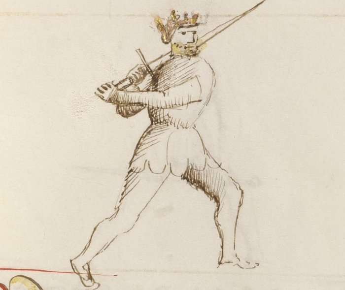

# Porta di Ferro Alta

<em>Getty MS Ludwig XV 13, folio 22r, c. 1409 - J. Paul Getty Museum (Open Content)</em>

*The High Iron Gate*

Classification: *Stabile — Stable Guard*

Porta di Ferro Alta is the elevated expression of the iron gate family. Where Tutta Porta di Ferro grounds the fencer in a deep low structure and Porta di Ferro Mezzana holds the center, the High Iron Gate raises the sword to the upper line while maintaining the same essential quality of all iron gate guards: stability through structural connection to the body.

For the modern fencer, Porta di Ferro Alta teaches a principle distinct from both of its siblings: **controlling the high line does not require chambering for a descending blow**. Unlike Posta di Donna, which chambers behind the shoulder for power, or Posta di Fenestra, which holds the high line through a thrusting angle, Porta di Ferro Alta projects into the high line with structural solidity. It intercepts, it threatens, and it holds the upper space through stability rather than deception.

This chapter treats Porta di Ferro Alta Destra and Sinestra together. Both sides share identical tactical principles through mirrored mechanics.

---

## **Fiore's Description**

The Getty manuscript does not provide a separate verse for Porta di Ferro Alta. Like the left-side variants of the bilateral guards, the High Iron Gate is understood as an elevated expression of the iron gate principle: the same foundational structure raised to the upper line.

This should not diminish the guard's importance. Fiore's system describes guards through their tactical behavior, and the High Iron Gate's behavior is distinct from both of its sister guards. Its elevated position creates different threats, different cover lines, and different natural attacks.

The iron gate principle — stable, grounded, forward-pointing — remains unchanged. Only the height changes.

---

## **The Meaning of the Name**

*Porta di Ferro Alta* means *High Iron Door*.

The name places this guard in deliberate relationship with its siblings. Tutta Porta di Ferro stands low; Porta di Ferro Mezzana stands in the middle; Porta di Ferro Alta stands high.

Together, the three guards represent a vertical axis of structural control — the iron gate can hold any height with the same stable, forward-pointing solidity.

The word *alta* simply means *high*, specifying where in that vertical axis this expression of the guard operates.

---

## **Right and Left Variations**

Porta di Ferro Alta exists on both sides of the body with identical tactical function on each.

### **Porta di Ferro Alta Destra**

In the right-side variation, the sword is elevated to the upper line on the right side, with the point directed forward and slightly downward or level, threatening the opponent's high-line openings.

The guard naturally generates a horizontal cut (Mezzano) by rotating the elevated blade across the line, or a direct thrust (Punta) along the extended upper centerline.

### **Porta di Ferro Alta Sinestra**

The left-side variation mirrors the structure. The sword is elevated on the left, the point continues to threaten the upper line forward, and the same horizontal cut and thrusting actions are available from the opposite side.

Both sides should be practiced with equal attention. The high line must be controllable from either direction.

---

## **Physical Structure**

### **Body Position**

The stance is balanced and upright, with weight distributed to maintain mobility.

Unlike Tutta Porta di Ferro, which is strongly forward-weighted to support immediate entry, Porta di Ferro Alta occupies a slightly more neutral position. The elevated sword changes the body's balance requirements — the hands are higher, so the base must be correspondingly stable.

The posture should feel tall and projecting. The guard occupies vertical space, and the body must support that occupation without leaning or overreaching.

---

### **Hand and Sword Position**

The hands are held high — at approximately shoulder height or above — while the sword is elevated and the point directed forward.

This is the key distinction from the other iron gate guards: the hands are high, but the sword is not chambered behind the body as in Posta di Donna. The guard faces forward, point threatening. The height is used for control and interception, not for generating descending power.

The arms should remain slightly bent, preserving elasticity and the ability to respond. A fully locked extension at high position becomes rigid and slow to adjust.

---

## **Tactical Function**

Porta di Ferro Alta controls the upper line through forward-pointing structural presence.

Its primary function is to intercept. When an opponent raises their hands to attack from above — a Fendente, a chamber into Posta di Donna, a high thrust — Porta di Ferro Alta is already at that height with a point directed toward them. The elevated position closes the high-line entry before the opponent's attack fully develops.

This interception can take two forms.

**As a cover:** The elevated blade can deflect an incoming descending strike before it gains full momentum, receiving the attack on the strong part of the blade and redirecting it.

**As a simultaneous threat:** Because the point is forward at high measure, the fencer can thrust into the opponent's opening as the opponent commits to their descending attack. The guard's height places the point on line before the opponent's cut descends far enough to threaten.

---

## **Relationship to the Iron Gate Family**

Understanding Porta di Ferro Alta requires placing it within the vertical structure of the iron gate family.

Tutta Porta di Ferro controls the low line — its beats travel downward, and it enters from below.

Porta di Ferro Mezzana controls the center — it threatens the middle and transitions in any direction.

Porta di Ferro Alta controls the high line — its coverage comes from above the crossing, and it naturally generates cuts and thrusts that travel along the elevated angle.

Together, the three guards cover the full vertical range. An opponent who drives their attack upward will find the Alta waiting. An opponent who attacks the middle will find the Mezzana. An opponent who attacks low will find the Tutta.

---

## **The Natural Strikes**

Because the sword is already elevated and pointing forward, Porta di Ferro Alta naturally generates two primary attacks.

**The Mezzano:** From the elevated position, the blade can rotate horizontally across the opponent's upper line without first traveling downward to build power. The Mezzano from Porta di Ferro Alta is a direct horizontal cut from an already-high, already-threatening position.

**The Punta:** The elevated point is already directed along the upper centerline. A thrust from Porta di Ferro Alta extends directly from the high position toward the opponent's face or throat without requiring the adjustment that a thrust from a low guard demands.

Both attacks are difficult to read because the guard appears to be in a defensive position. The horizontal cut and the thrust both emerge from a posture that looks like it is waiting.

---

## **Modern Application**

In modern fencing, Porta di Ferro Alta fills a gap that neither Posta di Donna nor Posta di Fenestra fully addresses.

Donna and Fenestra are both high guards, but both involve a degree of chamber or lateral positioning that takes time to deploy. Porta di Ferro Alta is already forward-pointing at the high line — it does not need to transition from a chambered position to create a threat.

This makes it particularly useful in close timing situations where a fencer needs to occupy the high line quickly without the wind-up of a chambered guard. Against opponents who habitually attack from above, holding the Alta creates an immediate problem they must solve.

The guard also serves as an effective transitional position when moving between the high guards (Donna, Fenestra) and the middle guards (Mezzana, Breve) — a stable mid-point where the high line is controlled without the commitment of a full chamber.

---

## **Connection to the Four Virtues**

Porta di Ferro Alta expresses the **Elephant** through its structural stability at a height where many guards become unstable or vulnerable to displacement.

The **Lynx** governs the interception timing. The guard's primary tactical use — meeting a descending attack with a forward point or high cover — requires precise reading of the opponent's commitment. Interception requires the decision to be made before the attack fully develops.

The **Tiger** controls the speed of the generated strikes. A Mezzano or Punta from the Alta position must arrive quickly — the guard's stability is only an advantage if the attack it launches gets there first.

The **Lion** commits to maintaining the high line even under pressure. Standing tall in the elevated position against an aggressive opponent requires courage.

---

## **Defeating the Guard**

Porta di Ferro Alta is strongest against opponents who attack directly from above or along the high centerline.

To challenge it effectively, an opponent must find angles that the elevated position cannot address. Low attacks, particularly rising cuts (Sottano) or thrusts aimed below the extended blade, can find the guards that Porta di Ferro Alta leaves open by necessity: the mid-to-low line is less protected when the hands are elevated.

The guard is also challenged by blade displacement. An opponent who can remove the forward point from the line — by beating the blade aside from a strong position — can enter along a line where the Alta is no longer dominant.

Finally, attacks from extreme angles are difficult for any iron gate guard. The structural stability that makes the iron gates reliable also makes them less agile at responding to changing attack angles.

---

## **What This Guard Is Not For**

Porta di Ferro Alta is not a power-chambering guard. It does not generate the kinetic force of Posta di Donna or the explosive compression of Posta di Fenestra. Its strength is structural presence at height, not stored energy.

It is also not a substitute for the low iron gate guards. Porta di Ferro Alta controls the high line; it does not cover the low and middle lines well from its elevated position. Using it at the wrong measure or against low attacks creates vulnerabilities.

Finally, the guard should not be confused with a purely defensive posture. Like all iron gate guards, the Alta is built to respond with forward motion and counterattack — not to retreat.

---

## **Training the Guard**

### **Drill 1 — Structure at Height**

Begin in Porta di Ferro Alta with the sword elevated and the point directed forward along the upper centerline.

Hold the position for ten seconds, checking that the hands are genuinely high, the point is forward rather than drifting upward or sideways, and the body remains balanced rather than leaning.

Have a partner apply gentle pressure from various angles against the elevated blade. Maintain structure without collapsing.

Practice from both Destra and Sinestra.

---

### **Drill 2 — Intercepting the High Attack**

One fencer assumes Porta di Ferro Alta. The partner begins a slow chamber into Posta di Donna.

As the partner's hands rise into the chamber, the fencer in the Alta extends a slow thrust toward the opening that appears in the partner's guard during the chambering motion.

The timing challenge: the thrust must be launched before the partner's chamber is complete, interrupting the preparation rather than waiting for the full descending cut.

Repeat ten times, then switch roles. Begin very slowly, establishing the correct timing window before adding speed.

---

### **Drill 3 — Mezzano from Alta**

From Porta di Ferro Alta Destra, deliver a horizontal Mezzano cut across the opponent's upper line, finishing in Porta di Ferro Alta Sinestra.

Then deliver the return Mezzano from the Sinestra position, finishing back in Destra.

Repeat ten times in each direction. This drill develops the guard's natural cut and demonstrates the bilateral transition between sides at the elevated height.

---

## **Common Errors**

The most common mistake is allowing the point to drift upward rather than forward. The guard should threaten the opponent horizontally along the upper centerline, not point toward the ceiling. An upward point removes the threat and turns the guard into a passive overhead position.

Another error is elevating the hands without maintaining structural connection to the body. The sword should feel integrated into the body's frame at height — not floating separately from it. If the arms become isolated from the torso, the guard loses its stability.

Some students also confuse this guard with Posta di Fenestra because both are elevated. The distinction is in the angle: Fenestra chambers the blade to one side for thrusting and deception; Alta holds the point forward along the high centerline with structural stability.

---

## **Key Idea**

Porta di Ferro Alta brings the iron gate principle to the upper line.

It does not chamber. It does not deceive. It stands at height with the point forward, controls the high-line space between the fencers, and makes both ascending descents and direct thrusts immediately available.

**Where the high guards store power for release, the High Iron Gate simply occupies the line — and in occupying it, makes any approach through the high space a problem the opponent must solve.**

