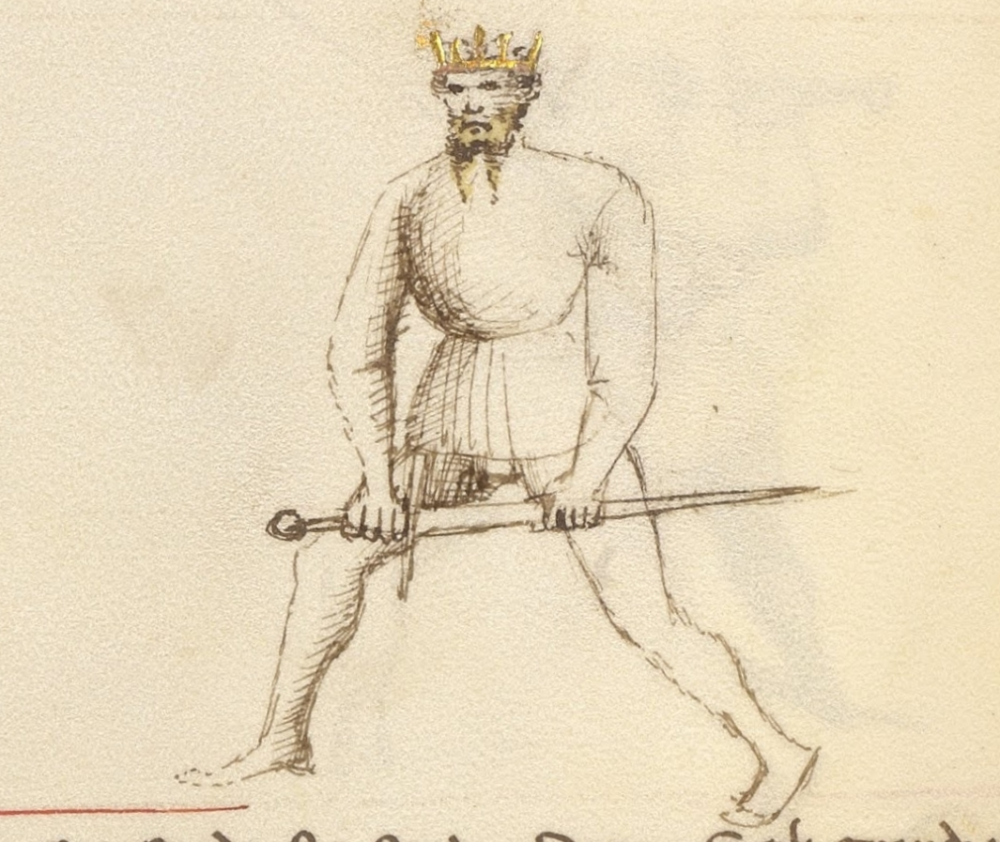

# Porta di Ferro Mezzana

<em>Getty MS Ludwig XV 13, c. 1409 - J. Paul Getty Museum (Open Content)</em>

<em>Flos Duellatorum (Pisani-Dossi MS), c. 1409 - Novati facsimile edition, 1902</em>

*The Middle Iron Gate*

Classification: *Stabile — Stable Guard*

Porta di Ferro Mezzana occupies the center of Fiore's guard system in every sense. Positioned at middle height between the high guards and the low iron gate, it threatens the centerline while remaining within reach of every other guard in the system. Where Tutta Porta di Ferro grounds the fencer in a deep defensive structure, Mezzana balances that solidity with access: the ability to flow upward, downward, or across the line without committing to any single direction.

For the modern fencer, Porta di Ferro Mezzana teaches a principle that no extreme guard can: **the center controls everything**. By occupying the middle ground between high and low, the guard remains relevant regardless of what the opponent does.

Fiore calls it the truest column. This is not merely a compliment. A column stands at the center, bears equal weight from all directions, and holds the structure together. That is precisely what this guard does.

This chapter treats Porta di Ferro Mezzana Destra and Sinestra together. Both sides share the same tactical identity: the principles are identical, the mechanics are mirrored.

---

## **Fiore's Description**

### **Getty Manuscript Text**

*"Porta di ferro mezana son, e son la uerissima colona, che son in mezo tra l'una e l'altra porta, e per auer modo posso far ogni cosa."*

### **Translation**

"I am the Middle Iron Gate, and I am the truest column, for I am in the middle between one gate and the other, and because of my position I can do all things."

Fiore's verse is striking in its confidence. He does not describe what this guard does to specific attacks. He describes what it *is*: the truest column, positioned in the middle, capable of everything.

This description tells us that Porta di Ferro Mezzana is less a guard of specific responses and more a guard of structural centrality. It does not specialize. It sits at the center and makes all responses equally available.

---

## **The Meaning of the Name**

*Porta di Ferro Mezzana* means *Middle Iron Gate*.

The iron gate imagery, shared with Tutta Porta di Ferro and Porta di Ferro Alta, emphasizes the structural, non-yielding quality of the guard family. Like an iron gate, the position holds fast without being forced open.

The word *mezzana*, middle, specifies the guard's position within that family. It stands between the low gate (Tutta Porta di Ferro) and the high gate (Porta di Ferro Alta), occupying the median of the vertical line.

---

## **Right and Left Variations**

Like all guards with a clear lateral orientation, Porta di Ferro Mezzana exists on both sides of the body.

### **Porta di Ferro Mezzana Destra**

In the right-side variation, the sword is held at middle height near the right side of the body, with the point directed forward along the centerline.

The guard naturally threatens with a forward thrust, a rising cut from below, or a descending transition into Tutta Porta di Ferro.

### **Porta di Ferro Mezzana Sinestra**

The left-side variation mirrors the same structure. The sword is held at middle height on the left, the point continues to occupy the centerline, and the same range of actions is available from the opposite side.

Training both sides maintains the guard's hub function. If only the right side is practiced, the fencer's ability to transition toward left-side guards becomes slower and less natural.

---

## **Physical Structure**

### **Body Position**

The stance is balanced and neutral: neither strongly forward-weighted like Tutta Porta di Ferro, nor rear-weighted like Posta di Fenestra.

The body remains upright and mobile. Because the guard must be able to transition in any direction, it cannot commit its weight too strongly in one direction. The balanced stance preserves that readiness.

The posture should feel alert and capable, not passive. Porta di Ferro Mezzana is a guard that actively threatens; the body must reflect that intention.

---

### **Hand and Sword Position**

The hands are held at approximately chest to solar plexus height, the middle of the vertical line.

The point is directed forward along the centerline, threatening the opponent's face, throat, or chest depending on precise height. The arms are extended enough to project that threat without overreaching.

The sword should feel connected to the body's structure, neither too close nor too far. It occupies the space between the fencer and the opponent, creating a presence that the opponent must address before advancing.

---

## **Tactical Function**

Porta di Ferro Mezzana functions as a hub.

Every other guard in the system can be reached from this position with minimal transition time. The high guards, Posta di Donna, Posta di Fenestra, require the hands to travel upward. The low guards, Tutta Porta di Ferro, Dente di Zenghiaro, require the hands to travel downward. The lateral guards, Coda Longa, Posta Breve, require movement to one side or the other. From the middle, all of these transitions are equally short.

This versatility is what Fiore means when he says "I can do all things." The guard is not all-powerful. It is all-accessible.

The forward point simultaneously serves as a threat. An opponent approaching Porta di Ferro Mezzana must deal with the extended centerline presence before they can safely close distance. This creates the same tactical dynamic as Posta Longa, but from a more defended, structurally stable position.

---

## **The Truest Column**

Fiore's phrase "the truest column" is the defining image of this guard.

A column stands at the center of a structure and bears weight evenly from all sides. It does not lean. It does not specialize in one direction. It provides reliable, constant support to everything around it.

This is the role Porta di Ferro Mezzana plays in the fencing system. It does not generate the overwhelming power of Posta di Donna or the deceptive invitation of Coda Longa. Instead, it provides a reliable, central position from which any action can begin and to which any action can return.

For students who become lost in the middle of an exchange, Porta di Ferro Mezzana offers a reset: a structurally sound, centrally positioned guard from which the exchange can be reorganized.

---

## **As a Finishing Position**

Porta di Ferro Mezzana appears frequently in Fiore's plays as the position a fencer occupies after completing an action.

Many cuts that do not follow through to the low position, descending strikes that stop at middle height, thrusts that don't fully extend, naturally find their structure here. The guard receives and holds the line.

Understanding Mezzana as both a starting and finishing position helps students see it less as a static stance and more as a constant reference point, the place the fencer returns to when they are between intentions.

---

## **Modern Application**

In modern fencing, Porta di Ferro Mezzana is often overlooked in favor of more dramatically positioned guards.

Its value lies precisely in what is easy to miss: it requires the opponent to solve a problem before attacking, it transitions to anything with equal efficiency, and it provides a clear structural reference in the middle of a dynamic exchange.

Students who are prone to overcommitting to one guard or one side of the body will find that regularly returning to Mezzana teaches them to recognize the center and understand when they have drifted away from it. This spatial awareness, knowing where the middle is, is fundamental to controlling distance and reading an exchange.

---

## **Connection to the Four Virtues**

Porta di Ferro Mezzana expresses all four virtues with unusual balance.

The **Elephant** appears in the stable, column-like structure of the guard. It holds its position under pressure rather than yielding.

The **Lynx** is strongly present. The guard's central position is defined by observation, it watches all directions equally and transitions toward whatever the opponent offers. Prudent positioning is the guard's core tactical idea.

The **Tiger** governs the transitions. The value of being at the center is only realized if the transitions to other guards are fast. A slow transition from Mezzana negates the hub advantage.

The **Lion** commits when the observation reveals an opening. The guard does not generate attacks on its own, it creates conditions for attacks and then requires courage to launch them.

---

## **Defeating the Guard**

Porta di Ferro Mezzana is most vulnerable at its edges.

Because it holds the center, it is less immediately dominant in any specific line than a guard specialized to that line. A fencer who forces the Mezzana fencer to commit to one direction, through a strong feint or a real attack on one side, removes the guard's central advantage.

The guard is also less powerful at the extremes of measure. Very close or very far, the middle height becomes less relevant, the range of available transitions narrows, and the guard's hub quality is reduced.

Finally, guards that occupy the same centerline, particularly Posta Longa, create a direct contest for the line. In that situation, the Mezzana must win through timing and structure rather than positional dominance.

---

## **What This Guard Is Not For**

Porta di Ferro Mezzana is not a power-generating guard. It does not chamber for large strikes or produce the kinetic force of Posta di Donna. Power generation requires committing to a direction; Mezzana deliberately avoids that commitment.

It is also not a guard for deception. Where Coda Longa invites attack through apparent weakness, Mezzana is transparent in its positioning. The opponent knows where the point is.

Finally, the guard should not become static. Its value is as a mobile, responsive center, the column that connects everything. A fencer who stands in Mezzana without transitioning, probing, or threatening has missed the point of the guard.

---

## **Training the Guard**

### **Drill 1 — Establishing the Center**

Begin in Porta di Ferro Mezzana with the point directed forward along the centerline.

A partner approaches from various distances and angles. Rotate to track the partner while maintaining the forward point position. The point should remain threatening regardless of the partner's approach angle.

Practice from both Destra and Sinestra.

This drill teaches the guard as a dynamic, tracking position rather than a static stance.

---

### **Drill 2 — The Hub Flow**

Begin in Porta di Ferro Mezzana and flow to each of the following guards in sequence, returning to Mezzana between each:

- Posta di Donna Destra
- Posta di Fenestra Destra
- Dente di Zenghiaro
- Coda Longa
- Posta Longa
- Posta Breve

After completing the sequence on the right, repeat on the left side.

The goal is to experience how close every guard is to the center. Mezzana should feel like the natural mid-point of the entire system.

---

### **Drill 3 — Threat and Entry**

One fencer holds Porta di Ferro Mezzana. The partner attempts to approach from various lines.

The Mezzana fencer responds to each approach by pivoting to maintain point contact with the centerline, then stepping forward with a thrust as the partner enters range.

This drill develops the guard's active threatening function and the forward entry from the middle position.

---

## **Common Errors**

The most common mistake is allowing the point to drop. The guard's forward point is its primary tactical tool. A dropped or wandering point reduces Mezzana to a purely defensive posture and removes the threat that forces the opponent to respond.

Another error is treating Mezzana as an endpoint. Students sometimes settle into the guard and stop moving, mistaking stability for static waiting. The guard should remain responsive and connected to the fencer's ongoing tactical reading.

Some students also over-extend the arms, pushing the hands too far from the body. This weakens the structure and makes the guard easier to displace. The hands should be extended enough to project threat without losing structural integration.

---

## **Key Idea**

Porta di Ferro Mezzana is the center of Fiore's guard system made tangible.

From the middle height, every guard is equally close. Every threat is equally accessible. Every response is equally prepared.

**Fiore calls it the truest column because a column holds everything up by standing in the right place, and that is exactly what this guard does.**

