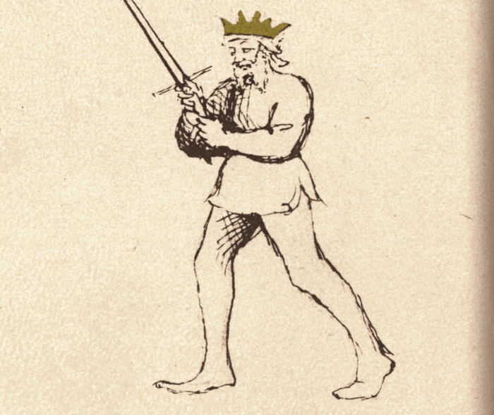

# Posta Frontale

<em>Flos Duellatorum (Pisani-Dossi MS), c. 1409 - Novati facsimile edition, 1902</em>

*The Frontal Guard*

Classification: *Stabile — Stable Guard*

Posta Frontale is one of the most deceptively open guards in Fiore's system. The sword is raised overhead with the point elevated, the body is fully exposed, and the fencer faces the opponent directly with no chamber, no angled protection, no withdrawn reserve. Everything is visible. Everything appears accessible.

This openness is the guard's weapon.

For the modern fencer, Posta Frontale teaches a principle that reverses the instinct of every beginner: **apparent vulnerability can be tactical strength**. The guard does not hide what it is or pretend to protect something. It displays itself openly, invites reaction, and punishes whoever acts on what they see.

Posta Frontale is closely related to Posta Corona, Fiore's own manuscript presents them as names for the same guard or nearly identical positions. This chapter focuses on Frontale's identity as a forward-facing, covering, and counterattacking guard. The distinction between the two is discussed in the Connection to Posta Corona section below.

---

## **Fiore's Description**

### **Getty Manuscript Text**

*"Posta frontale, over corona son, che offender e defender voglio. Lo mio parlare a tutti quanti scopro. Che chi me pora zenzer in punta tal conseglio, de ben ferir poy piuy non li scopro."*

### **Translation**

"I am the Frontal Guard, or Crown, for I want to offend and defend. I reveal my speech to everyone. For whoever can cross me point to point, such counsel, to strike well after, I reveal to him no more."

Fiore's verse is unusual in its philosophical character. Where most guards describe physical actions, beating thrusts, entering close play, delivering powerful cuts, the Frontal Guard describes a game of information.

It reveals everything. And when the opponent acts on what they see, it reveals nothing further. The fencer who attempts to cross the frontal guard point to point receives no more instruction from the guard's open presentation, because that exchange is when the guard closes the trap.

---

## **The Meaning of the Name**

*Posta Frontale* means *Frontal Guard*, a guard that faces the opponent directly without turning or chambering.

Where most guards angle the body to reduce the target and concentrate force, Frontale presents the full front of the body toward the opponent. This direct orientation is both literal, the guard faces forward, and tactical: it presents an honest, transparent challenge.

The name also emphasizes the guard's role as a forward cover. From the elevated position, the guard can project its structure in front of the body rather than to one side, making it a natural obstruction to high attacks.

---

## **Relationship to Posta Corona**

Fiore's own text presents these as one guard: "Posta Frontale, or Crown." In the manuscript, he uses them interchangeably within the same verse.

In practice, many HEMA scholars and practitioners treat them as a single guard seen from two perspectives, Frontale emphasizing the guard's function as a forward-facing cover, Corona emphasizing its structural shape (the elevated blade forming a crown overhead).

This curriculum treats them as separate chapters to develop distinct aspects of each. Frontale emphasizes the covering and counterattacking function: the guard that intercepts incoming strikes and counters immediately. Corona emphasizes the structural shape and the power generation it enables for descending strikes. Both perspectives come from the same physical position.

---

## **Physical Structure**

### **Body Position**

The stance is upright and neutral, with weight balanced rather than forward or rear-weighted.

The body faces the opponent directly. This is not a turned or angled posture. Frontale is genuinely frontal. The shoulders are squared, the torso is forward, and the fencer presents their full facing to the opponent.

The upright posture ensures that the elevated blade can drop into a descending strike quickly and with full body support.

---

### **Hand and Sword Position**

The hands are elevated above the head, at approximately forehead height or above, with the sword raised and the point directed upward and slightly forward.

The arms are extended upward without being rigid. The blade angles slightly forward so that the point is projecting toward the opponent's space rather than pointing directly at the ceiling.

The position creates a roof-like structure above the fencer's head. Incoming high attacks must pass through or around this elevated structure before they can reach the body.

---

## **Tactical Function**

Posta Frontale operates on two simultaneous principles: coverage and counterattack.

**Coverage:** The elevated blade and arms create a protecting canopy above the fencer's head. Descending attacks, Fendente from Posta di Donna, overhead cuts, high thrusts, must negotiate the elevated structure before they can reach the body. The guard does not actively deflect these in the way that Tutta Porta di Ferro beats thrusts to the ground; instead, it presents an obstruction that forces the opponent to change their line or commit to attacking through the elevated blade.

**Counterattack:** As the opponent attempts to cross the point or attack through the open body below the elevated blade, the guard responds by dropping the sword in a powerful descending cut. The elevated starting position generates maximum arc and speed for a Fendente. The counterattack arrives as the opponent is mid-commitment to their own attack.

This is the "reveal" in Fiore's verse. The guard reveals its open body; the opponent attacks; and then the Fendente descends before the opponent can complete their action.

---

## **The Deceptive Openness**

Posta Frontale presents a paradox that is central to understanding it.

The body appears completely exposed. The sword is pointed upward rather than at the opponent. There is no visible defensive cover for the torso, legs, or arms. An opponent reading this position sees a fencer who is unprotected and perhaps committed to a high position that will take time to convert into an attack.

What the opponent does not see:

The elevated position generates the most powerful descending cut available. The sword has maximum arc from above the head, maximum acceleration through the full descent, and the full body weight committed to the drop.

The arms, positioned above the head, create a direct path of interception for any incoming overhead cut. The guard does not need to move to cover a high attack, it is already at height.

The open torso is bait. The fencer wants the opponent to attack the body. That forward commitment is what the counterattack exploits.

---

## **Connection to Coda Longa**

Posta Frontale and Coda Longa share a tactical principle across opposite poles of the guard spectrum.

Coda Longa is low, withdrawn, and appears defensive. Frontale is high, open, and appears vulnerable. Both invite attack through apparent weakness and punish the opponent's commitment with sudden decisive action.

Where Coda Longa invites the opponent to attack into the low opening and then launches upward, Frontale invites the opponent to attack the exposed body and then drops downward with overwhelming force.

A fencer who understands the false guard concept of Coda Longa will recognize it immediately in Posta Frontale, despite the completely opposite physical presentation.

---

## **As a Receiving Position**

Posta Frontale also functions as a natural finishing position for rising cuts.

The Sottano Destra and Sottano Sinestra both naturally carry the blade upward into a high position. When that rising action completes, the guard it arrives in is approximately Frontale, the blade elevated, the hands high, the fencer positioned above the line.

This connection means that for students learning the rising cuts, Frontale provides the immediate finishing reference: the cut rises, arrives in Frontale, and from there the descending countercut is available if needed.

---

## **Modern Application**

In modern fencing, Posta Frontale is often avoided because its openness feels counterintuitive and uncomfortable.

This discomfort is pedagogically useful. Holding a position that appears exposed teaches students to distinguish between what is genuinely vulnerable and what merely looks vulnerable. The guard forces them to reckon with the idea that structure and threat can be maintained from positions that do not look like conventional guards.

In sparring, Frontale is most effective against opponents who are aggressive and willing to commit to attacking an open body. Against cautious opponents who will not take the bait, the guard's deceptive power is reduced and a more active approach is needed.

---

## **Connection to the Four Virtues**

Posta Frontale most strongly expresses the **Lion**.

Holding an open, apparently vulnerable position against an aggressive opponent demands genuine courage. The fencer must resist the impulse to close up, protect the body, or move away. Instead, they stand in the open and invite attack. This is the Lion's audacity applied to guard selection.

The **Lynx** governs the timing of the counterattack. The trap only closes at the right moment, when the opponent has genuinely committed and the opening is real. Releasing the Fendente too early or too late fails the principle.

The **Tiger** provides the speed of the descending response. The countercut from Frontale must arrive before the opponent's committed attack completes.

The **Elephant** maintains the balance and stability of the elevated position under pressure. The guard must not collapse from fatigue or anxiety.

---

## **Defeating the Guard**

Posta Frontale is most vulnerable when the opponent refuses to commit to the bait.

A disciplined opponent who controls measure carefully and attacks with feints rather than committed strikes will not give the guard an opportunity to spring its trap. Without a committed incoming attack to counter, the Frontale must either transition to another guard or attempt to generate its own attack from the elevated position.

The guard is also challenged by indirect approaches. An opponent who attacks the low line or approaches laterally rather than directly into the frontal coverage finds different vulnerabilities.

Finally, a fencer who holds the position past the point of tactical relevance, becoming static in the elevated position rather than living in it dynamically, loses the guard's effectiveness.

---

## **What This Guard Is Not For**

Posta Frontale is not a guard for controlling distance at long measure. The elevated position does not project threat outward the way Posta Longa does, and the open body creates problems at range where an opponent has time to select their attack line carefully.

It is also not a passively defensive guard. The openness of Frontale is a trap, not a refuge. A fencer who retreats into it hoping to absorb attacks will find the open body is simply open.

Finally, the guard requires endurance to hold effectively. The elevated arms tire. A fencer who holds Frontale for extended periods without committing to its active tactical purpose will find the position degrading into genuine vulnerability.

---

## **Training the Guard**

### **Drill 1 — Establishing the Open Guard**

Begin in Posta Frontale with the sword raised and the body fully facing forward.

Hold the position for ten seconds while a partner circles at various distances.

The partner describes what targets appear open and what attack lines seem most available. After the observation, discuss whether those apparent openings are genuinely accessible or whether the elevated structure changes the tactical calculation.

---

### **Drill 2 — The Descending Countercut**

From Posta Frontale, step forward and release a Fendente, allowing the blade to travel in its full arc from above the head down through the target zone, finishing in Dente di Zenghiaro.

Repeat ten times solo, focusing on the arc, the acceleration, and the full follow-through.

With a partner: the partner raises their sword slowly as if chambering into Posta di Donna, and as they raise their hands, the Frontale fencer drops the Fendente into the opening that appears. Practice the timing slowly until the drop consistently arrives before the partner's chambering completes.

---

### **Drill 3 — Baiting and Response**

One fencer holds Posta Frontale. The partner assumes an aggressive guard and advances.

As the partner commits to attacking the open body, the Frontale fencer responds with the descending Fendente, dropping the blade to intercept.

The lesson: the guard is held until the partner truly commits. Responding too early removes the tactical advantage.

---

## **Common Errors**

The most common mistake is leaning backward or retreating. The guard invites attack, retreating with it confuses its message and loses the forward structure needed for the counterattack.

Another error is angling the blade too far forward, so the point aims at the opponent rather than upward. The blade should be elevated with a slight forward tilt, not directed like a threat. The open appearance is the tactic.

Some students drop the guard prematurely from fatigue, before the opponent has committed. Endurance training for the elevated position helps, as does maintaining active intention in the guard rather than simply holding it passively.

---

## **Key Idea**

Posta Frontale is the guard of declared openness and hidden readiness.

It reveals everything and conceals one thing: the descending cut waiting to be released.

**A guard that appears to offer everything invites the attack that defeats itself, and from above the head, the Fendente arrives before the opponent's committed action can complete.**

