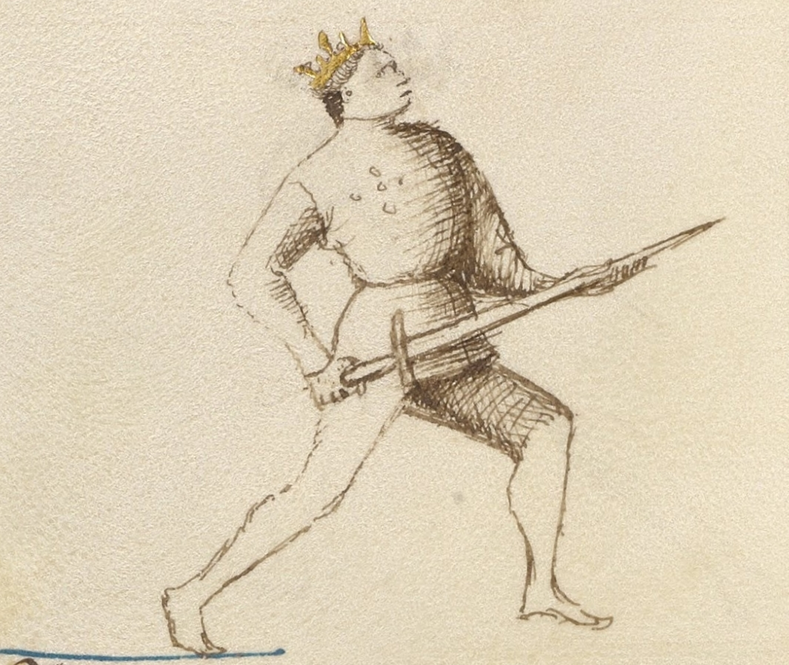
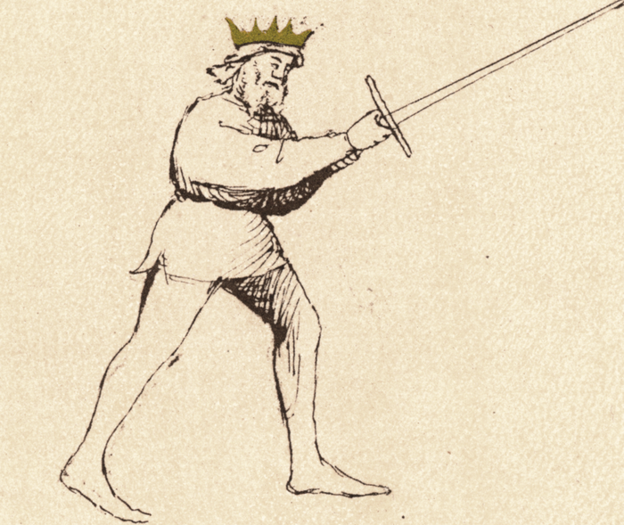

# Posta Longa

<em>Getty MS Ludwig XV 13, c. 1409 - J. Paul Getty Museum (Open Content)</em>

<em>Flos Duellatorum (Pisani-Dossi MS), c. 1409 - Novati facsimile edition, 1902</em>

*The Long Guard*

Classification: *Instabile — Mutable Guard*

Posta Longa is one of the most important guards in Fiore's system. Unlike guards that chamber the sword for power or deception, Longa projects the sword directly toward the opponent, controlling the centerline and threatening immediate offense.

For the modern fencer, Posta Longa teaches one of the most fundamental principles of fencing:

**Distance is controlled by threat.**

By extending the sword between yourself and your opponent, you force them to account for your point before they can safely launch their own attack.

Longa is often reached at the conclusion of an attack, particularly a thrust, but it is also a guard in its own right. It represents extension, measure, and control of the line.

---

## **Fiore's Description**

### **Getty Manuscript Text**

*"Io son posta longa e achosi te aspetto. E in la presa che tu mi uoray fare, Lo mio brazo dritto che sta in erto, Sotto lo tuo stancho lo mettero per certo. E di subito te feriro cum una punta."*

### **Translation**

"I am Long Guard and like this I wait for you. And in the grip that you would like to make against me, my right arm which stands raised, I will place it under your left for certain. And suddenly I will wound you with a thrust."

Notice that Fiore begins by saying:

"Like this I wait for you."

Unlike Donna, which threatens power, or Coda Longa, which invites deception, Posta Longa simply occupies the line and waits.

The guard forces the opponent to act first.

---

## **Bilateral Use**

Posta Longa is a near-central guard. Because the sword extends directly forward rather than to one side, the distinction between Destra and Sinestra is minimal: both expressions of the guard hold the point along the centerline with the same forward-facing structure.

In practice, the slight lateral lean of the arms or the foot that steps forward may vary between right and left approaches, but the tactical function does not change. Both sides should be trained, primarily through the Fenestra-to-Longa thrust drill from each side and through the guard flow transitions that arrive in Longa from both directions.

The key bilateral lesson in Posta Longa is not about left versus right: it is about ensuring that the extended point is available regardless of which guard precedes it and which side the preceding action was executed from.

---

## **The Meaning of the Name**

The name is straightforward.

*Posta Longa* means *Long Guard.*

The sword is extended forward, creating the longest practical reach available without fully committing the body.

The guard extends influence into the space between the fencers.

The sword becomes a barrier, a threat, and a measuring tool simultaneously.

---

## **Physical Structure**

### **Body Position**

The body remains upright and balanced.

Weight may be slightly forward or centered depending on the tactical situation, but the guard should never feel overcommitted.

The extension comes primarily from the sword rather than from leaning the torso.

One of the most common mistakes is reaching with the body instead of reaching with the weapon.

---

### **Hand and Sword Position**

The sword extends directly toward the opponent.

The hands are generally held around solar plexus height, though this may vary slightly depending on measure and target.

The point should threaten:

* face
* throat
* upper chest

The arms are extended but not rigid.

The guard remains alive and mobile.

Although the sword is extended, Longa remains classified as *Instabile* because it transitions easily into other positions and actions.

---

## **Tactical Function**

Posta Longa is a guard of measure and line control.

The extended point creates an immediate tactical problem for the opponent.

Before they can attack, they must answer the threat already occupying the centerline.

This is one of the clearest examples of controlling space through threat rather than movement.

The guard is particularly useful for:

* controlling measure
* threatening thrusts
* forcing reactions
* establishing dominance of the centerline
* transitioning between actions

---

## **Point Against Point**

One of Fiore's most famous observations appears elsewhere in the manuscript:

"Point against point, the longer makes offense first."

Posta Longa embodies this principle.

When two points oppose one another, the fencer who occupies the line most effectively often gains initiative.

The lesson is not merely about arm length.

It is about controlling the line between the two fencers.

Longa teaches students to recognize when they are threatening and when they are merely reaching.

---

## **The Waiting Guard**

Many students initially assume that Longa is an attacking guard.

Fiore presents it differently.

Longa waits.

This does not mean passive inactivity.

Instead, it means creating a threat that forces the opponent to make a decision.

The opponent must:

* deflect the point
* move around the point
* withdraw from the point
* or attack through the point

Each response creates opportunities.

The guard wins by presenting a problem.

---

## **Relationship to Fenestra**

Fenestra and Longa form one of the most important relationships in Fiore's system.

Fenestra is a chambered threat.

Longa is an extended threat.

A thrust often travels:

**Fenestra → Longa**

The sword begins prepared near the head and extends into Longa as the point reaches the target.

Understanding this relationship helps students see guards as connected positions rather than isolated stances.

---

## **Modern Application**

In modern fencing, Longa is one of the most practical guards to understand.

Whether competing, drilling, or sparring, control of the centerline remains a fundamental skill.

The guard teaches:

* measure
* distance management
* point control
* threat projection

Many beginners focus on generating attacks.

Longa teaches them how to make the opponent react first.

---

## **Connection to the Four Virtues**

Longa strongly expresses the Lynx.

The guard depends on judgment of distance and awareness of the line between fencers.

The Tiger appears in the speed of the extending thrust.

The Elephant appears in maintaining structure while extended.

The Lion appears in confidently occupying the centerline and forcing the opponent to deal with your threat.

---

## **Defeating the Guard**

Posta Longa is strongest when it controls the centerline uncontested.

To challenge it effectively, an opponent must first remove or neutralize the point.

Common approaches include:

* changing the line
* beating the blade aside
* approaching from an angle
* forcing Longa to overextend

Simply attacking directly through the point often places the attacker at a disadvantage.

The guard's strength comes from making straightforward attacks difficult.

---

## **What This Guard Is Not For**

Longa is not a static pose.

Many students extend the sword and then stop moving mentally and physically.

The guard should remain active and responsive.

It is also not a guard for excessive leaning. The sword extends, not the body.

Finally, Longa should not become a rigid lockout. The structure remains alive and ready to transition.

---

## **Training the Guard**

### **Drill 1 — The Extended Threat**

Partner A assumes Posta Longa.

Partner B begins in any other guard and attempts to advance safely.

B must solve the problem presented by the point before attacking.

Switch roles.

This drill teaches the tactical value of occupying the line.

---

### **Drill 2 — Point Against Point**

Both partners begin in Posta Longa.

Slowly close distance.

Observe:

* whose point threatens first
* whose structure collapses first
* who controls the centerline

This drill develops awareness of measure and line.

---

### **Drill 3 — Fenestra to Longa**

Begin in Posta di Fenestra.

Extend a thrust into Posta Longa.

Hold briefly.

Recover to Fenestra.

Repeat from both sides.

This drill teaches the relationship between chambered and extended threat.

---

### **Drill 4 — Longa to Longa**

Begin in Posta Longa.

Transition to:

* Fenestra
* Donna
* Dente di Zenghiaro

Then return to Longa.

This develops the understanding that Longa is a hub connecting many actions within Fiore's system.

---

## **Common Errors**

A common mistake is leaning forward to gain reach. Extend the sword rather than the body.

Another error is allowing the point to wander away from the centerline. The guard's strength comes from controlling the line.

Some students also lock their elbows completely, making transitions slower and reducing sensitivity.

---

## **Key Idea**

Posta Longa is the guard of measure and extension.

It teaches the fencer to control space through threat rather than movement.

The sword reaches forward, occupies the centerline, and forces the opponent to respond.

Before the fight can begin, the opponent must solve the problem presented by the point.

