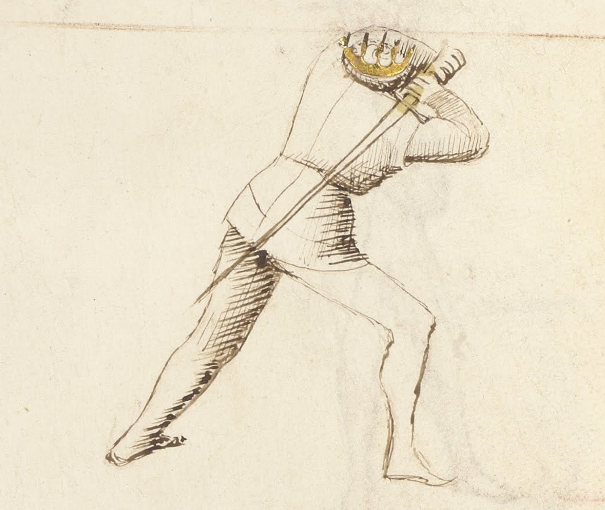
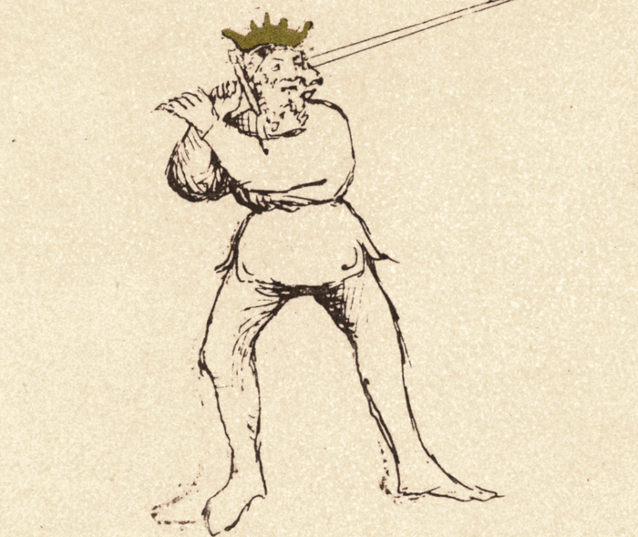

# Posta di Donna Destra

<em>Getty MS Ludwig XV 13, c. 1409 - J. Paul Getty Museum (Open Content)</em>

<em>Flos Duellatorum (Pisani-Dossi MS), c. 1409 - Novati facsimile edition, 1902</em>

*The Woman’s Guard (Right Side)*  
 Classification: *Pulsativa* — Pulsing Guard

Posta di Donna Destra is one of the most powerful and recognizable guards in Fiore dei Liberi’s longsword system. For the modern fencer, Posta di Donna teaches an essential principle: **power comes from preparation**. By winding the sword behind the shoulder, the body stores energy that can be released into a long, accelerating strike.

Fiore describes this guard as capable of both offense and defense. It can deliver all seven blows of the sword while also providing strong coverage against incoming attacks. Properly understood, Posta di Donna is not simply a striking position: it is a guard that threatens overwhelming action.

---

## **Fiore’s Description**

### **Getty Manuscript Text**

*"Posta di Donna son e di spada posso fare tuti li .vij. colpi e posso ben fare couerture de tuti colpi. E le altre prese rompo cum li gran colpi che posso fare. E de cambiare de punta io son presta e sempre lo pe de auanti se tore de uia e quello de dredo se mette per trauerso. E zerchadore serà descouerto e questo farà presto e certo."*

### **Translation**

“I am the Woman's Guard and with the sword I can make all seven blows, and I can cover well from all blows. And I break the other guards with the great blows that I can make. And to exchange the thrust I am always ready. The foot which is in front steps off the line, and that which is behind passes across. And the opponent will be unprotected, and this will happen quickly and surely.”

Fiore’s description highlights several defining characteristics of the guard. It can deliver every strike in the system, it provides strong defensive coverage, and its powerful cuts can break opposing guards. He also describes a specific stepping action used to defeat thrusts.

These elements shape how the guard should be understood and practiced.

---

## **The Meaning of the Name**

*Donna* in medieval Italian means "noblewoman" or "lady", a figure of authority, composure, and command. The guard takes this name not from weakness or passivity, but from its elevated, composed posture and the authority it projects over the surrounding space.

Fiore's guard names consistently describe both the shape of the position and its tactical character. Posta di Donna stands tall with the sword raised over the shoulder, presenting a figure that is fully prepared and capable of decisive action. Like a person of authority who does not need to shout to command attention, the guard threatens through readiness rather than through immediate contact.

The name also carries a structural implication: the guard is poised. Every element is coiled and composed before release. This is a guard that acts when it chooses to, not when provoked.

---

## **Physical Structure**

Posta di Donna Destra places the sword in a deep chamber behind the right shoulder.

### **Body Position**

The left shoulder faces the opponent, presenting a slightly turned stance. The weight may be placed forward or back depending on tactical needs; both variations appear in the historical manuscripts.

The sword is chambered over the right shoulder with the blade wound back so the point aims toward the left knee. The point may angle downward.

The blade should feel coiled behind the body, ready to accelerate forward.

### **Hand Position**

Both hands are held high near the right shoulder. The right hand grips the sword normally near the cross while the left hand supports the pommel.

The pommel should sit near the rear side of the head. Keeping the hands high preserves structure and allows the guard to launch powerful cuts or form strong covers.

---

## **Left-Side Variation: Posta di Donna Sinestra**

Posta di Donna Sinestra mirrors the right-side guard completely. Every principle Fiore describes applies equally from the left: all seven blows are available, defensive covers are strong, and the offline step to defeat a thrust works in reverse.

### **What Changes**

The orientation of the body reverses. The **right** shoulder now faces the opponent. The sword is chambered over the **left** shoulder, with the blade wound back so the point aims toward the right knee.

The hands are held high near the left shoulder. The left hand grips normally near the cross; the right hand supports the pommel.

When the Fendente is launched from this position, the forward step is with the **left** foot, and the cut travels diagonally from left shoulder to the opponent's right side. The offline step described in Fiore's verse moves to the right rather than the left.

### **Why Both Sides Matter**

The left-side guard is not a drill for its own sake. It is a distinct tactical position that attacks the opponent's right side, a line that most defensive habits and guard structures protect less reliably.

When Donna Destra and Donna Sinestra are used in combination, they force the opponent to defend two separate lines of powerful descending attack. Neither side can be covered without partially exposing the other. This bilateral threat is significantly more difficult to defend against than either cut alone.

Many of Fiore's plays involve flowing from one side to the other after an exchange. Without left-side proficiency, those transitions are unavailable.

### **Transitioning Between Sides**

The most natural path between the two Donna guards passes through Dente di Zenghiaro.

A Fendente from Donna Destra finishes in Dente di Zenghiaro. From there, the fencer winds across, hips rotating, blade rising behind the opposite shoulder, into Donna Sinestra. The Fendente Sinestra finishes again in Dente di Zenghiaro, from which the fencer can return to Donna Destra.

This cycle is one of the fundamental flowing sequences in the system:

**Donna Destra → Fendente → Zenghiaro → Donna Sinestra → Fendente → Zenghiaro**

### **Drill — Bilateral Donna Flow**

Begin in Posta di Donna Destra and deliver a Fendente Destra, finishing in Dente di Zenghiaro.

Flow to Posta di Donna Sinestra, chambering the sword over the left shoulder with the point toward the right knee.

Deliver a Fendente Sinestra, finishing in Dente di Zenghiaro.

Return to Posta di Donna Destra and repeat.

Perform ten complete cycles, twenty cuts total. The left-side guard and cut should feel as stable and committed as the right. If the left side is noticeably weaker, isolate left-side repetitions before returning to the bilateral flow. Equal proficiency on both sides is the goal, not just awareness that both sides exist.

---

## **Tactical Function**

Posta di Donna is a guard of potential energy. The sword waits behind the body, gathering momentum before release.

From this position the fencer can launch powerful attacks, intercept incoming strikes, or step off the line to defeat a thrust.

Fiore emphasizes the guard’s ability to break opposing guards with powerful descending blows. When properly delivered, the cut from Posta di Donna is difficult to stop and often forces the opponent into a defensive reaction.

---

## **Common Tactics**

Although Fiore tells us this guard can deliver all seven blows, certain actions arise most naturally from this position.

The most common is the **fendente**, a powerful descending cut. The sword travels in a long arc from behind the shoulder, gaining momentum before striking downward. This attack is frequently used to break opposing guards or force a defensive reaction.

Another common use of the guard is to apply pressure against the opponent’s structure. Even if your original strike is parried, such as a fendente, the momentum of the cut can drive the opponent’s blade aside and create opportunities for follow-up attacks.

Fiore also describes a tactic for countering thrusts. By stepping off the line with the front foot while delivering a descending cut, the fencer allows the thrust to pass harmlessly while striking simultaneously. This movement both avoids the attack and controls the engagement.

---

## **Modern Application**

In modern longsword practice, Posta di Donna remains the primary power-generating guard and one of the first positions taught in most curricula. Its combination of mechanical advantage, blade coverage, and tactical versatility makes it foundational.

The most common error in modern practice is shortening the chamber. Against faster opponents or with lighter synthetic weapons, students often reduce the wind-back of the blade to gain speed, but this reduces power generation and limits the arc of acceleration. The full chamber is intentional; the strike should feel like releasing stored energy rather than pushing the sword forward.

The bilateral dimension of the guard is especially important in modern training. Many schools default to right-side work; Donna Sinestra deserves equal attention. The threat of powerful descending attacks on both lines forces the opponent to defend from above on both sides simultaneously, far more demanding than a single powerful line.

---

## **Connection to the Four Virtues**

Each of Fiore’s guards reflects the four virtues represented in the segno.

Posta di Donna expresses all four.

The **Elephant**, representing fortitude, appears when the stance is rear-weighted. The body withdraws slightly while maintaining strong structure.

The **Tiger**, symbolizing speed, is seen in the accelerating strike that launches from the chambered position.

The **Lynx**, representing prudence, reminds the fencer that distance must be judged carefully. Because the sword travels a long path, correct measure is essential.

The **Lion**, symbolizing audacity, reflects the decisive commitment of the strike. When the cut launches, it does so with confidence and intent.

---

## **Defeating the Guard**

Posta di Donna is most powerful when it can initiate from a full chamber at proper measure.

The guard's primary vulnerability is distance. At the correct measure, the descending cut is overwhelming. Forced closer than ideal, the large chamber becomes a liability rather than an advantage. Closing measure aggressively before the guard can wind up and release limits its effectiveness significantly.

Guards with a forward point, particularly Posta di Fenestra and Posta Longa, can contest the centerline before the fendente arrives. A thrust launched into the developing cut, timed to reach the opponent before the blade fully releases, can contest the exchange from the inside.

Because the chamber is large and visible, experienced opponents can sometimes read the initiation early. Maintaining distance control, refusing to commit to a single defensive line, and pressuring Donna before it can settle into its preferred measure are the most reliable ways to limit it.

---

## **What This Guard Is Not For**

Understanding the limitations of a guard is just as important as understanding its strengths.

Posta di Donna Destra is not ideal at very close distance. Because the sword begins far behind the body, it requires space to accelerate. If the opponent is already too close, the chamber may be difficult to deploy quickly.

It is also not the best guard for rapid thrust exchanges. Guards with forward points, such as Posta Longa or Posta di Fenestra, are better suited for quick thrusting actions.

Finally, Posta di Donna does not function well as a passive waiting guard. If the fencer simply holds the position without threatening action, the opponent may exploit the large chamber. The guard works best when used with initiative and intent.

---

## **Training the Guard**

The following drills develop the structure, mechanics, and movement of Posta di Donna.

### **Drill 1 — Establishing Structure**

Begin in a left foot forward stance and chamber the sword over the right shoulder. Aim the point toward the left knee and hold the position for ten seconds.

While holding the guard, check that the hands remain high, the shoulders and back are engaged, and the stance feels balanced.

Practice both the forward-weighted and rear-weighted versions of the guard.

For partner practice, one fencer assumes Posta di Donna while the other moves around them at different distances and angles. The fencer in guard maintains structure while pivoting to track the opponent.

This exercise teaches the guard as a dynamic position rather than a static pose.

---

### **Drill 2 — The Great Blow (Fendente)**

From Posta di Donna, step forward with the right foot and release the blade into a descending diagonal cut.

Allow the sword to travel through its full arc, finishing in Dente di Zenghiaro, the low guard that will be studied in the next lesson. 

Repeat the motion several times, focusing on smooth acceleration and coordinated body rotation.

In partner practice, the strike is delivered slowly while the partner observes the path of the blade and the structure of the cut.

---

### **Drill 3 — Off-Line Footwork**

Fiore describes a passing step that moves the fencer off the line of attack.

From Posta di Donna with the left foot forward, step the left foot offline at roughly a forty-five degree angle to the left. The right foot then passes forward to become the new lead foot.

This movement advances while simultaneously leaving the opponent’s line of attack.

Practice the step without the sword first, then repeat it while delivering a fendente.

---

## **Common Errors**

Students often hold the sword too close to the body. The blade should be wound further back so the point aims toward the left knee or beyond.

Another common mistake is dropping the rear hand. The hands should remain high, with the pommel near the ear.

Finally, students sometimes plant their feet too firmly. The guard should remain mobile, with the fencer balanced on the balls of the feet.

---

## **Key Idea**

Posta di Donna Destra is a guard of stored power.

The sword waits behind the body, gathering momentum before striking. When used with proper structure and timing, it allows the fencer to deliver powerful attacks, break opposing guards, and counter incoming thrusts with decisive action.

It demonstrates a core principle of Fiore’s art:

**A well-prepared strike ends the exchange before the opponent can recover.**

