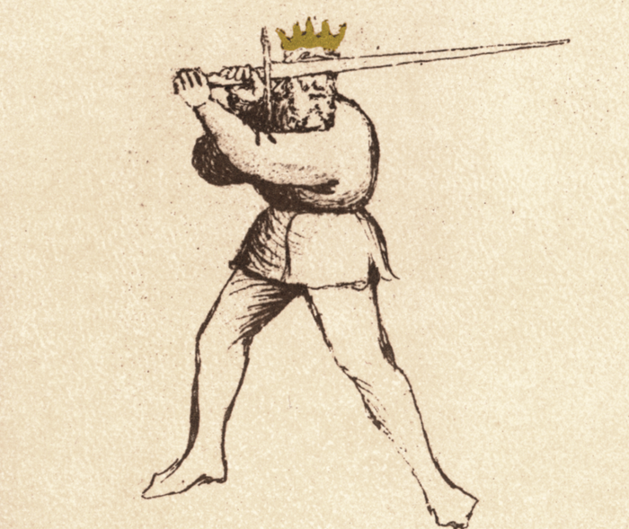

# Posta di Fenestra

<em>Flos Duellatorum (Pisani-Dossi MS), c. 1409 - Novati facsimile edition, 1902</em>

*The Window Guard*

Classification: *Instabile — Mutable Guard*

Posta di Fenestra is one of the most versatile and dynamic guards in Fiore dei Liberi’s system. Positioned with the point forward and the body slightly withdrawn, it allows the fencer to threaten continuously while remaining ready to defend, strike, or transition.

For the modern fencer, Fenestra represents a principle distinct from Posta di Donna. Where Donna emphasizes power through preparation, Fenestra emphasizes **control through presence**. The point is already in line, allowing the fencer to provoke, respond, and act without large preparatory movement.

Fiore describes this guard as one of deception, adaptability, and intelligence. It is not a static position, but a guard that moves, tests, and manipulates the opponent.

---

## **Fiore’s Description**

### **Getty Manuscript Text**

*"Questa si e posta di Finestra, che de malicie & inganni sempre la e presta. E de covrir e de ferir ella e magistra. E cum tutte guardie ella fa questione e cum le soprane e cum le terene. E d'una guardia a'l'altra ella va spesso per inganar lo compagno. E a metter grande punte e saver le romper e scambiare, quelli zoghi ella po ben fare."*

### **Translation**

“This is the Window Guard, who is always ready with malice and deception. She is a master of covering and striking. She questions all other guards, both the high and the low. She shifts frequently from one guard to another to deceive the companion. And she is well-suited to delivering great thrusts, knowing how to break them, and performing the exchange of points.”

Fiore emphasizes deception, versatility, and the ability to threaten with the point. This guard is defined not by a single action, but by its ability to adapt and provoke.

---

## **The Meaning of the Name**

*Fenestra* means "window" in Italian. The guard takes its name from the position of the sword held to one side of the head, creating the visual appearance of a window frame: the blade and arm forming one edge, the body the other.

Like many of Fiore's names, "Fenestra" captures both the shape and the tactical character. A window is simultaneously an opening and a point of observation: a controlled aperture that provides information and creates opportunity in both directions.

Fiore emphasizes this dual nature in his description: the guard is "always ready with malice and deception" and is a "master of covering and striking." The fencer sees clearly through the guard while the opponent faces a constant threat they cannot simply ignore. The opening is also a trap.

---

## **Physical Structure**

Posta di Fenestra places the sword to one side of the head with the point extended forward toward the opponent.

### **Body Position**

The stance is typically rear-weighted, with the body drawn slightly back. This increases distance while keeping the point threatening.

The torso remains upright and balanced, allowing for quick movement in any direction.

---

### **Hand and Sword Position**

The hands are held at approximately head height. The blade is angled forward with the true edge facing upward, and the point directed toward the opponent’s face or throat.

The arms remain slightly bent, preserving fluidity and responsiveness.

---

## **Right and Left Variations**

Posta di Fenestra exists on both sides of the body. Fiore does not provide a separate manuscript text for the left-side guard, the same verse and principles apply mirrored across the body.

**Posta di Fenestra Destra** holds the sword to the right of the head, with the point directed forward and left toward the opponent. The true edge faces upward. From this position, the thrust travels to the left along the natural extension of the arm.

**Posta di Fenestra Sinestra** mirrors the position exactly: sword to the left of the head, point directed forward and right, true edge upward. The thrust from Sinestra crosses to the right.

The structure, mechanics, and tactical function are identical on both sides. What changes is the **line of threat**. Fenestra Destra threatens the opponent's left-center; Fenestra Sinestra threatens their right-center. Shifting between sides forces the opponent to track and adjust to a new line.

This is the practical meaning of Fiore's phrase "from one to another I wander to deceive." A fencer who can question the opponent from both sides has doubled the deceptive range of the guard. The opponent cannot settle into a single defensive answer because the threatening line keeps moving.

Both sides must be trained to equal standard. A Fenestra Sinestra that is slower or less credible than the Destra eliminates the deceptive value of the side-switch, the opponent learns to ignore the left side and guard only the right.

---

## **Tactical Function**

Posta di Fenestra is a guard of control, deception, and adaptability.

From this position, the fencer can threaten with the point while remaining ready to strike, defend, or transition. Fiore describes it as capable of both covering and wounding, making it equally effective in offense and defense.

Because the point is already forward, it can oppose both high and low guards without requiring large adjustments. The guard invites reaction, encouraging the opponent to respond and creating opportunities to exploit.

---

## **The “Questioning” Concept**

Fiore writes that he “questions all the guards.”

This idea becomes far more powerful when both sides are available.

From Fenestra, the fencer can:

* threaten with the point to draw a reaction  
* shift between sides to create uncertainty  
* force the opponent to defend multiple lines

With both Destra and Sinestra, the fencer is no longer limited to a single line of attack. The opponent must constantly adjust, never settling into a stable defense.

This is the practical expression of deception.

---

## **Modern Application**

In modern fencing, Posta di Fenestra is often used as a primary engagement guard.

The forward point allows for quick thrusts and immediate reactions. It is especially effective in exchanges where tempo is critical.

When both sides are used, the guard becomes even more powerful. Switching between right and left allows the fencer to control the centerline dynamically, forcing the opponent to adjust repeatedly.

This creates hesitation, and hesitation creates openings.

---

## **Connection to the Four Virtues**

Posta di Fenestra strongly expresses the **Lynx.**

The fencer observes, provokes, and responds based on the opponent’s behavior.

**The Tiger** appears in the speed of the thrust and transitions.  
**The Elephant** maintains structure despite movement.  
**The Lion** commits when the opportunity appears.

---

## **Defeating the Guard**

Posta di Fenestra is most effective when the opponent reacts to the point and commits to a single defensive response. It becomes less effective when the opponent refuses to chase the threat or controls distance carefully.

Because the guard depends heavily on deception and transition, forcing it to remain stationary limits its effectiveness. A guard with strong centerline control, such as Posta Longa or Dente di Zenghiaro, can contest Fenestra's forward point without being drawn into the guard's preferred transitional exchanges.

Closing the measure aggressively can also reduce the guard's transitional advantage. Fenestra functions best at the distance where it can shift between sides and deliver thrusts with room to develop. At very close measure, the extended arm becomes more vulnerable and lateral transitions require more committed footwork.

Consistent pressure that denies the fencer time to shift between Destra and Sinestra removes the deceptive core of the guard, at that point, the opponent only needs to solve one line rather than two.

---

## **Common Tactics**

The most natural action from Fenestra is the thrust. Because the point is already forward, it can be delivered quickly with minimal preparation.

The guard is also used to provoke reactions. By maintaining a threatening point, the fencer forces the opponent to respond.

With both sides available, the fencer can shift between right and left to create openings. This constant change prevents the opponent from settling into a defensive rhythm.

---

## **What This Guard Is Not For**

Posta di Fenestra is not a power-generating guard. It does not produce the same forceful strikes as Posta di Donna without transitioning.

It is also ineffective if held statically. Without movement or intent, the guard becomes predictable.

Finally, shifting weight too far forward exposes the body. The guard relies on maintaining distance while threatening with the point.

---

## **Training the Guard**

### **Drill 1 — Structure and Mobility**

Begin in Fenestra and hold the position, ensuring the point threatens the opponent.

Transition smoothly to Posta di Donna and back.

With a partner, track their movement while maintaining the point on target.

---

### **Drill 2 — The Thrust**

From Fenestra, extend into a thrust and finish in Posta Longa.

Focus on maintaining a straight line and controlled extension.

---

### **Drill 3 — Four-Guard Flow**

Cycle through:

* Donna Destra  
* Fenestra Destra  
* Donna Sinestra  
* Fenestra Sinestra

This develops fluid transitions and bilateral control.

---

### **Drill 4 — Side Switching**

Begin in Fenestra Destra. Quickly transition to Fenestra Sinestra while maintaining threat.

The partner must adjust to the new line.

This drill develops deception and timing.

---

## **Key Idea**

Posta di Fenestra is a guard of control and deception.

When used on both sides, it becomes something more: a system of continuous threat. The opponent is forced to react, adjust, and defend without rest.

This is what Fiore means when he says:

“From one to another I wander to deceive.”

