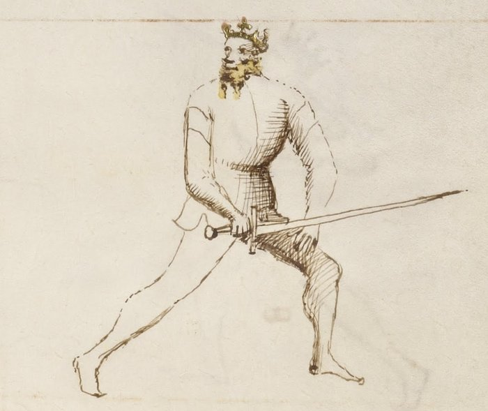

# Tutta Porta di Ferro

<em>Getty MS Ludwig XV 13, folio 22r, c. 1409 - J. Paul Getty Museum (Open Content)</em>

*The Full Iron Gate*

Classification: *Stabile — Stable Guard*

Tutta Porta di Ferro is the most defensively complete guard in Fiore dei Liberi's longsword system. Where other guards control through threat, deception, or reach, the Full Iron Gate controls through structural solidity. The sword sits low and close to the body, the stance is grounded and forward-weighted, and the guard projects an almost immovable quality.

For the modern fencer, Tutta Porta di Ferro teaches a principle that no offensive guard can: **defense and forward motion are not opposites**. The guard does not retreat from attack. It receives every blow with a cover, beats thrusts to the ground, and simultaneously enters with a passing step into the opponent's space. It defends by moving forward, not backward.

This chapter treats Tutta Porta di Ferro Destra and Sinestra together. Both sides express identical tactical principles through mirrored body mechanics.

---

## **Fiore's Description**

### **Getty Manuscript Text**

*"Tuta porta di ferro son e sto in grande forteza e per aspectar ogni arma da mane bona son io e corta se io ho bona spada si non troppo longa. E partome cum couertura e uago a strenger punte cambio e la mia metto dentro, ancho rebato le punte in tera e sempro uago cum uno passo e de ogni colpo facio couertura."*

### **Translation**

"I am the Full Iron Gate and I stand in great strength. I am good for waiting for every hand weapon, long and short, if I have a good sword, not one that is too long. And I leave with a cover and I go to close. I exchange the thrusts and put mine in. Also, I beat the thrusts to the ground, and I always go with a pass, and I make a cover of every blow."

Fiore describes a guard that is at once a fortress and a forward-moving force. Every action it takes includes a defensive element — but none of those actions involve retreating.

The guard waits, then enters. The guard covers, then strikes. The guard beats the thrust down, and puts its own point in.

---

## **The Meaning of the Name**

*Tutta Porta di Ferro* means *Full Iron Gate*.

The image is deliberately architectural. An iron gate does not yield. It resists force through its own mass and structure, not through movement or deception.

The word *tutta* — full, or complete — distinguishes this guard from the middle variant. Where the Porta di Ferro Mezzana occupies the middle height, Tutta is the lowest and most grounded expression of the iron gate principle.

---

## **Right and Left Variations**

Tutta Porta di Ferro exists on both sides of the body and the tactical principles are identical across both.

### **Tutta Porta di Ferro Destra**

In the right-side variation, the sword is held low near the right hip with the point angled forward and slightly upward. The right foot may be forward or the stance squared, depending on context.

The guard naturally generates a rising thrust that exchanges with the opponent's incoming point, and a low beat that deflects thrusts toward the ground.

### **Tutta Porta di Ferro Sinestra**

The left-side variation mirrors the structure on the opposite side. The sword rests near the left hip, the point continues to threaten forward, and the same upward thrusting and downward beating actions are available from the left line.

Training both sides ensures the guard can receive attacks from any angle and enter into close measure regardless of which direction the fencer faces.

---

## **Physical Structure**

### **Body Position**

The stance is forward-weighted with a grounded, stable base.

The body remains upright rather than crouching, but the weight is committed forward. This is not a position of retreat or passivity. The forward weight enables the immediate passing step that Fiore describes as the guard's signature movement.

The structure should feel settled and difficult to move. Like the Elephant of Fiore's segno, this guard does not give ground.

---

### **Hand and Sword Position**

The hands are held low near the hip, with the sword angled so the point projects forward and slightly upward toward the opponent.

The point height is important: it should threaten the opponent's low-to-middle line rather than pointing at the ground. Dropping the point eliminates the guard's offensive capability and removes the pressure it naturally exerts.

The sword sits close to the body in a compact, connected position. The structure integrates the weapon into the body's frame rather than extending it outward.

---

## **Tactical Function**

Tutta Porta di Ferro operates through three interconnected actions that Fiore describes explicitly.

**Covering every blow:** The guard's low and close structure makes it resistant to displacement. Every incoming strike is met with a covering action rather than absorbed through the body. This cover is not purely defensive — it is the first step toward counterattack.

**Beating the thrust to the ground:** Against a direct thrust, Tutta Porta di Ferro responds by driving the incoming blade downward. The guard's low hand position makes this natural: a slight rise of the point can deflect a thrust from above while simultaneously threatening an upward exchange.

**Entering with a passing step:** Fiore specifies that the guard "always goes with a pass." Every defensive action is accompanied by a forward passing step that closes distance. The opponent's thrust is beaten down; the fencer simultaneously steps forward into their space. The exchange of points follows: their blade is redirected, and the fencer's point enters.

This forward entry into close measure is what makes Tutta Porta di Ferro more than a passive defensive guard. It defends by advancing.

---

## **The Elephant Virtue**

Of all Fiore's guards, Tutta Porta di Ferro most fully embodies the Elephant.

The Elephant's verse describes a creature that carries a castle on its back and never kneels, never loses its footing. The guard mirrors this exactly. Under pressure, it does not retreat. It absorbs force through structure, deflects through compact motion, and advances rather than withdrawing.

This is the guard's most important psychological lesson: strength in fencing comes not from refusing to engage, but from the confidence to receive and enter.

---

## **The Exchange of Thrusts**

Fiore's description includes a precise tactical action: "I exchange the thrusts and put mine in."

This refers to the *scambiar di punta* — the exchange of thrusts — one of the defining techniques of Fiore's system.

From Tutta Porta di Ferro, as an incoming thrust arrives, the fencer performs a small deflecting motion that redirects the threatening blade while simultaneously launching their own thrust into the opening. The two actions occur together, not sequentially.

The guard's low position enables this exchange cleanly. The incoming thrust passes above or to the side; the outgoing thrust travels through the deflected line.

---

## **Modern Application**

In modern fencing, Tutta Porta di Ferro is often undervalued because its defensive appearance can make it seem passive.

This misreading is corrected by remembering the forward-moving nature of the guard. It is designed to meet attacks directly and enter close measure, which is exactly the opposite of passive waiting.

The guard is particularly effective against aggressive thrusting. Opponents who rely on extended thrusts from guards like Posta Longa or Posta di Fenestra will find that Tutta Porta di Ferro can consistently beat those thrusts downward and enter before they can recover.

It is also an excellent receiving position for the end of a cutting flow. Many of Fiore's plays end in a low guard after a descending cut — Tutta Porta di Ferro provides the strongest structural position at that height.

---

## **Connection to the Four Virtues**

Tutta Porta di Ferro expresses the **Elephant** most fully of any guard in the system.

Its grounded, immovable structure and refusal to yield ground under pressure are the direct expression of Fortitude. The guard stands in great strength precisely because it does not attempt to evade — it meets force with structure.

The **Tiger** appears in the forward-moving pass that accompanies every defensive action. The entry must be explosive, not hesitant.

The **Lynx** governs the precise moment of the exchange. The deflection and the forward step must coordinate exactly — too early and the deflection misses; too late and the thrust has already arrived.

The **Lion** is required for the willingness to stand in a low guard and receive incoming attacks rather than retreating. It demands courage to hold the ground and enter.

---

## **Defeating the Guard**

Tutta Porta di Ferro is most vulnerable when forced to deal with changing angles.

Because the guard is low and close, attacks that change direction — rising cuts from below, high attacks that don't follow the expected line — can find openings that the downward-beating motion cannot address.

The guard is also less effective at longer measure. Its design is built around close entry and deflection. An opponent who maintains distance and avoids the entering step limits the guard's primary tactical capability.

Rotational cuts that arrive from unexpected angles, rather than direct thrusts, also challenge the iron gate's linear defensive response.

---

## **What This Guard Is Not For**

Tutta Porta di Ferro is not a guard for controlling long measure or projecting threat across distance. Posta Longa serves that purpose.

It is also not a guard of deception. Unlike Coda Longa, which creates false openings, or Posta di Fenestra, which manipulates the opponent's decisions, Tutta Porta di Ferro presents itself honestly. Its strength lies in structure, not subterfuge.

Finally, the guard should not become static. Fiore's description specifically includes constant forward motion with a passing step. A fencer who holds Tutta Porta di Ferro without moving is misusing the guard — it is built to advance, not to wait indefinitely.

---

## **Training the Guard**

### **Drill 1 — Establishing the Iron Gate**

Begin in Tutta Porta di Ferro with the sword near the hip and the point angled forward.

Have a partner apply gentle lateral and forward pressure against the blade and shoulders, testing the structural stability of the position.

Maintain the guard without retreating or collapsing. The body should absorb and redirect pressure through its connected structure rather than bracing with individual muscles.

Practice from both Destra and Sinestra.

---

### **Drill 2 — Beating the Thrust**

One fencer assumes Tutta Porta di Ferro. The partner delivers a slow thrust from Posta Longa.

As the thrust arrives, the fencer in the iron gate rises slightly and deflects the incoming blade downward with a covering motion, simultaneously stepping forward with a passing step.

The forward step closes distance as the thrust is beaten to the ground.

Repeat ten times from each side, then switch roles. Focus on the coordination of deflection and entry — both must happen together, not sequentially.

---

### **Drill 3 — The Exchange of Thrusts**

Building on Drill 2: as the partner's thrust is deflected, immediately launch a counterthrust along the newly cleared line.

The deflection, the forward step, and the outgoing thrust form a single continuous action.

Practice slowly at first, establishing the coordination before adding speed. The drill succeeds when the deflection and the counter feel like one motion rather than two.

---

### **Drill 4 — Guard Flow into Close Measure**

Begin in Posta di Donna Destra. Deliver a descending Fendente and allow the blade to finish in Tutta Porta di Ferro.

From Tutta Porta di Ferro, immediately step forward with a passing step and transition into close distance.

This drill connects the guard to the natural flow of the cutting system and demonstrates how it functions as a receiving position after an attacking action.

---

## **Common Errors**

The most common mistake is dropping the point toward the ground. The point must remain forward and slightly elevated, threatening the opponent's low-to-middle line. A point aimed at the floor provides no offensive pressure and makes the guard purely passive.

Another frequent error is retreating when pressured. This reverses the purpose of the guard. Every defensive action in Tutta Porta di Ferro is accompanied by a forward step, not a backward one.

Some students also hold the hands too far from the body. The compact, hip-connected position is the source of the guard's structural strength. Reaching the hands outward weakens the structure and makes the weapon easier to displace.

---

## **Key Idea**

Tutta Porta di Ferro is the guard of immovable forward motion.

It does not evade. It does not deceive. It stands in great strength, receives every attack with a covering action, beats thrusts to the ground, and simultaneously enters the opponent's space.

**Its paradox is that it defends by advancing — and in advancing, it converts the opponent's attack into the opportunity for its own.**

