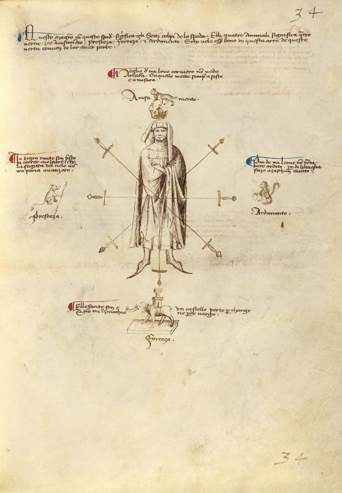

# The Segno, the Four Virtues, and the Structure of the System

<em>Getty MS Ludwig XV 13, folio 32r, c. 1409, "We are four animals of such a nature; whoever wants to fence, let them compare themselves to us." J. Paul Getty Museum (Open Content)</em>

---

## **Introduction**

Before learning guards, strikes, or techniques, it is necessary to understand the framework that supports Fiore’s system.

At the beginning of the longsword section, Fiore presents a diagram known as the **segno**, or “sign.” This image introduces four animals and seven swords, representing the core principles of his art. It is not simply an illustration, but a summary of the entire system.

If the guards show positions, and the techniques show actions, the segno explains something deeper: how a fencer should think, how they should act, and how the system itself is organized.

This chapter builds that foundation. It explains the meaning of the animals, the structure of the seven blows, and the way Fiore’s system can be understood as a cohesive whole rather than a collection of techniques.

---

## **Medieval Bestiaries**

To understand why Fiore chose these specific animals, it is important to understand the intellectual world he lived in.

In the medieval period, bestiaries were widely circulated texts that described animals not as biological creatures, but as carriers of meaning. These books combined observation, myth, and symbolism, using animals to communicate moral, philosophical, and practical ideas.

An educated reader would not simply see an animal. They would recognize what it represented.

The lion signified courage and authority. The elephant represented strength and stability. The tiger embodied speed and decisiveness. The lynx represented perception and insight.

These associations were part of a shared cultural language. Fiore did not need to explain them in depth because his audience already understood them.

By drawing from bestiary tradition, Fiore is not decorating his manuscript. He is teaching through symbolism.

---

## **The Segno**

The segno appears at the beginning of the longsword section in Fior di Battaglia. It shows a master fencer surrounded by four animals and seven swords.

This image is not decorative. It is instructional.

The four animals represent the **virtues of the fighter**.  
The seven swords represent the **fundamental actions of the system**.

Everything in Fiore’s art can be understood through this diagram.

---

## **The Four Virtues**

Fiore explicitly identifies four essential qualities of a complete fighter: prudence, audacity, celerity, and fortitude.

Each animal represents one of these virtues.

---

### **The Lynx — Prudence**

The lynx is placed above the master’s head, holding a compass.

Fiore writes:

“No creature sees better than me, the Lynx.

And I always set things in order with compass and measure.”

Prudence is judgment.

It is the ability to perceive what is happening, to measure distance and timing, and to understand the opponent’s intentions. The compass reinforces this idea, it represents precision and correct evaluation.

Fiore places this virtue above all others because it governs them. Without correct judgment, all other qualities become unreliable.

---

### **The Lion — Audacity**

The lion holds a heart beneath its paw.

Fiore writes:

“None carries a bolder heart than me, the lion,

But to everyone I make an invitation to battle.”

Audacity is the willingness to act.

It is the ability to commit at the right moment, to enter the exchange, and to take initiative. Without it, even correct decisions remain unused.

However, audacity must be guided. Courage without judgment leads to poor outcomes.

---

### **The Tiger — Celerity**

The tiger holds an arrow, symbolizing speed.

Fiore writes:

“I, the tiger, am so swift to run and to wheel

That even the bolt from the sky cannot overtake me.”

Celerity is both physical and mental. It is the ability to execute an action quickly, and the ability to decide quickly.

The arrow reinforces this idea. It represents swiftness, directness, and immediate action. The phrase that the tiger “never retreats” adds another layer: this virtue is not only about moving fast, but about acting decisively once the moment has come.

When an opportunity appears, hesitation causes failure. The tiger represents the ability to act immediately once the decision is made.

---

### **The Elephant — Fortitude**

The elephant stands beneath the master, carrying a castle.

Fiore writes:

“I am the elephant and I carry a castle as cargo,

And I do not kneel nor lose my footing.”

Fortitude is structure.

It is the ability to maintain balance, posture, and stability under pressure. The elephant does not collapse or lose position. It remains stable regardless of force.

This is what allows techniques to function under resistance.

---

## **The Balance of the Virtues**

None of these qualities can stand alone.

A fencer with good judgment but no courage will hesitate. A fencer with courage but no judgment will act at the wrong time. Speed without structure produces weak actions, and structure without speed produces slow ones.

The segno places all four virtues around the master equally. This is not symbolic decoration: it is instruction.

All four must be present and balanced.

---

## **The Virtues in Action**

The four virtues are not abstract ideas. They appear in every exchange.

When a fencer misjudges distance and strikes too early, that is a failure of prudence. When a fencer sees an opening but hesitates, that is a failure of audacity. When a correct action arrives too slowly, that is a failure of celerity. When a fencer loses balance or is displaced, that is a failure of fortitude.

Likewise, successful actions demonstrate the balance of these qualities. A well-timed strike requires correct judgment, committed execution, sufficient speed, and stable structure.

In this way, every exchange becomes a reflection of the virtues.

---

## **How the Segno Is Used**

The segno is not only symbolic, it is practical.

It provides a method for evaluating performance in training. After any action, a fencer can ask whether the decision was correct, whether the action was committed, whether it was fast enough, and whether the structure held.

This allows both students and instructors to identify underlying problems. Rather than correcting isolated movements, they can address the quality that caused the failure.

The segno becomes a diagnostic tool, not just a historical image.

---

## **Using the Segno in Training**

The segno can be applied directly during practice.

If a fencer consistently lands late, the issue may not be the technique, but celerity. If they are struck while attacking, the issue may be prudence rather than speed. If their actions collapse under pressure, the issue is fortitude.

This approach allows training to focus on principles rather than memorization. It shifts attention from “what went wrong” to “why it went wrong.”

---

## **The Seven Blows (Sette Colpi)**

The seven swords surrounding the master represent the fundamental strikes of the system.

Fiore writes that these blows form the basis of all actions.

“We are the seven blows of the sword…”

These are not isolated techniques, but the building blocks of the entire system.

---

## **The Structure of the Blows**

Fiore organizes strikes into three angles and a thrust.

There are descending cuts, middle cuts, and rising cuts, each performed from both the right and left sides, along with a central thrust.

This structure provides complete coverage of all lines of attack. It also ensures that the fencer develops both sides of the body equally.

Each blow connects one guard to another, creating a system that flows rather than remaining static.

---

## **Guard Classifications**

In addition to the virtues and the blows, the guards themselves can be understood through classification.

These classifications describe how a guard behaves within the system.

Some guards are designed to generate powerful actions. Others are designed to adapt and respond. Others provide strong defensive structure.

Understanding these roles allows the fencer to see relationships rather than memorizing isolated positions.

---

### **Pulsing Guards**

Pulsing guards generate force through stored energy and release it through committed action.

These guards often begin in a chambered position and emphasize decisive movement.

They are associated with strong, difficult-to-stop actions.

---

### **Mutable Guards**

Mutable guards are adaptable and responsive.

They transition easily, create deception, and allow the fencer to adjust to the opponent. These guards are rarely static and are defined by movement rather than position.

---

### **Stable Guards**

Stable guards prioritize structure and control.

They resist pressure, maintain strong defensive positions, and allow the fencer to control the line of engagement.

---

## **Why This Comes First**

Fiore does not begin with techniques. He begins with principles.

This is intentional.

Without understanding the virtues, a student may learn the shape of a technique without understanding when or why it works. The result is mechanical fencing, correct movements applied at the wrong time.

By establishing these ideas first, Fiore provides a framework for decision-making. The guards and techniques that follow are expressions of these principles.

---

## **Key Idea**

The segno is the foundation of Fiore’s system.

The virtues describe how to act.  
The blows describe what to do.  
The classifications describe how the system is organized.

Together, they form a complete framework for understanding and practicing Fiore’s art.