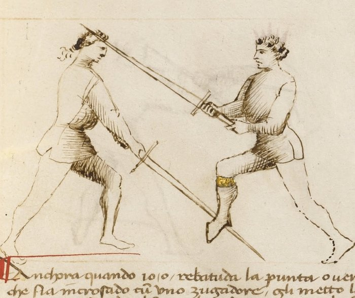

# Breaking the Thrust — Rompere di Punta

<em>Getty MS Ludwig XV 13, folio 27r, c. 1409 - J. Paul Getty Museum (Open Content)</em>

*The Breaking of the Point*

Classification: *Gioco Largo — Wide Play*

Where the *scambiar di punta* counters a thrust by stepping offline in a single motion, the *rompere di punta* takes a different approach. It beats the blade aside, presses it to the ground, and follows with a rising cut to the throat.

Two actions, not one. But compressed tightly together, the beat and the follow-up must arrive before the opponent recovers.

**Redirect before the thrust arrives, then close the door behind it.**

---

## **Fiore's Description**

### **Getty Manuscript Text**

*"Anchora questo zogho del romper di punta ch'e lo segondo zogho che m'e denanzi. Ch'e quando io o rebatudo la punta del compagno cum lo mio brazo manco, io li vado apresso de subito cum la mia spada, e metto lo pede ritto inanzi e cum la mia spada premo lo suo in terra, e subito tayo cum lo filo falso de la mia spada in la gola del compagno."*

### **Translation**

"Also this play of breaking the thrust, which is the second play before me. When I have beaten down the thrust of my companion with my left arm, I immediately go close with my sword, and place my right foot forward, and with my sword I press his to the ground, and immediately cut with the false edge of my sword into the throat of my companion."

Fiore describes the action precisely.

First the beat. Then the right foot forward. Then the press. Then the cut.

Each action enables the next. Remove any one, and the play does not work.

---

## **The Setup**

The opponent passes in with a committed thrust aimed at your chest or face.

You are at extended measure. The thrust is developing, it has committed but has not yet arrived.

---

## **The Technique**

**Make a small traverse with the front foot to the left.** This is not a large step. It is a short, angled movement that takes you slightly off the line of the incoming thrust. The goal is to create a better angle for the beat, not to go fully offline as in the *scambiar*.

**Strike the incoming thrust upward with your sword.** As your front foot moves, your blade rises to beat the opponent's weapon from below, hitting it upward and away from the line. This is an active beat, not a parry. You are striking the blade aside.

**Make a *mezza volta* with the rear foot.** The half-turn step: your back foot passes forward and across, changing your facing. This is the crucial action in the play. Without it, what follows has no body weight behind it. The *mezza volta* adds commitment and mass to the press.

**Press your sword down onto his, driving his blade toward the ground.** With the right foot now forward and your body weight engaged, push down on the opponent's blade. The goal is to pin it, or at minimum drive it far enough from center that it cannot threaten you. If done fully, his blade reaches the ground.

**Cut up with the false edge to the throat.** As the press continues, or as his blade is controlled, your sword rotates and rises, delivering a rising cut with the back edge to the opponent's throat. The angle of this cut requires the false edge: the blade is angled upward, and the true edge cannot make this cut efficiently from below.

---

## **Why It Works**

The *rompere di punta* works through sequential control.

The beat removes the thrust from the line. The *mezza volta* and press prevent the opponent from recovering and re-thrusting. The false-edge cut arrives before he can disengage.

Each step closes one exit for the opponent.

The beat: he cannot thrust through your blade.
The press: he cannot pull back and re-thrust before the follow-up arrives.
The false-edge cut: his throat is exposed and the blade arrives from below, where it is difficult to see and harder to defend.

---

## **Why the Mezza Volta Matters**

Many students skip the *mezza volta* because the play seems to work without it, in slow drilling.

At speed, it fails.

The pressing action requires body weight. If your rear foot remains behind you, the press is powered only by your arms. Your opponent, whose hands are on the sword hilt and whose body is fully committed to the thrust, can recover before arm strength alone pins the blade.

The *mezza volta* shifts your weight forward and changes your facing so that the press is driven by your whole body.

Practice it deliberately until the step happens automatically.

---

## **The Counter-Remedy**

The opponent can defeat this play by recovering the blade before it reaches the ground.

If he feels the beat and understands what follows, he can pull the blade back and re-thrust before your press has control. The window is small, the *mezza volta* must happen quickly, but a trained opponent can exploit hesitation.

He may also disengage around your blade as you press, thrusting again from the other side. This is why the false-edge cut must follow immediately; it occupies your sword in a position where it can interrupt the disengagement.

---

## **Connection to the System**

The *rompere di punta* sits with the plays of the Second Remedy Master, the master who addresses crossings at the mid-blade.

It connects to *Posta di Fenestra*, which creates a natural angle for the upward beat. The Window Guard already has the sword raised; the beat develops from that position.

It also connects forward: after the press, the opponent's blade is controlled and you are close. If the false-edge cut is not immediately available, say, because he is wearing armor at the throat, the close distance makes stretto entries available.

---

## **Modern Application**

In modern fencing, the *rompere di punta* trains two principles that apply broadly.

The first is the beat-parry. Deflecting an incoming weapon with an active strike rather than a passive block is faster, more disrupting, and creates immediate follow-up opportunity. Many modern longsword fencers default to static parries; the beat trains aggression from the defensive role.

The second is the pressing action. Controlling the opponent's blade after a deflection, rather than withdrawing and creating a new exchange, is a high-percentage action. Even if the press does not pin the blade to the ground, the intent to press drives your point forward and your body weight into the engagement.

In competition, the full pressing-to-ground sequence is contested; opponents at speed often disengage before the pin completes. Train the intent regardless. The body mechanics of committing through the press are more valuable than the press itself.

---

## **Connection to the Four Virtues**

The **Tiger** governs the speed at which the beat, the *mezza volta*, and the follow-up must compress together.

The **Elephant** appears in the pressing action, structural weight engaged through the rear foot's advance. Without that stable forward mass, the press has no power.

The **Lynx** governs the timing of the initial beat: you must strike the opponent's blade as the thrust is developing, not after it has fully committed and is already past you.

The **Lion** appears in the false-edge cut to the throat, a committed finishing action that cannot be half-delivered.

---

## **What This Play Is Not For**

The *rompere di punta* is not a counter to a cut.

A descending cut arrives along a different arc than a thrust. The upward beat that works against a thrust may not intercept a cut at all.

It is also not a response to a slow or retracted thrust. The play requires a committed opponent, someone whose weapon is advancing toward you with intention. Against a probe or a feint, the beat finds nothing to beat.

Finally, it should not be practiced without the *mezza volta*. Training the beat and press without the half-turn creates a habit that will fail at speed. The step is not optional.

---

## **Training the Play**

### **Drill 1 — Mezza Volta Isolation**

Without a partner, practice the footwork sequence alone:

Start with left foot forward. Make a small traverse to the left with the front foot. Then execute the *mezza volta* with the rear foot, pass it forward and across until the right foot is now leading.

The transition should feel continuous, not stopped-and-restarted.

Add the pressing motion with the sword: as the *mezza volta* completes, drive the sword downward as if pressing a blade toward the ground.

**Focus:** The *mezza volta* adds forward weight to the press. The body should arrive in a forward, weighted position after the step.

---

### **Drill 2 — Full Sequence, Partner**

Partner A delivers a committed thrust in slow motion.

Partner B: small traverse left with front foot → beat the thrust upward → *mezza volta* with rear foot → press Partner A's blade down → false-edge cut to Partner A's throat.

Pause at each stage to verify:

* Did the beat genuinely intercept the thrust?
* Did the *mezza volta* happen before the press?
* Is the finishing cut using the false edge?

Increase speed in stages as each component becomes reliable.

**Focus:** Sequential control. Each action prevents the opponent's next action.

---

## **Common Errors**

A common mistake is making the initial traverse too large. This delays the beat. The front foot moves only slightly off the line, enough to create the angle for the upward beat, not to go fully offline.

Many students omit the *mezza volta* entirely and rely on arm strength for the press. This works in slow drilling but fails at speed. The step must happen.

Pausing between the beat and the press is also frequent. The beat and the *mezza volta* should flow directly into the press without stopping. A hesitation gives the opponent time to recover the blade.

Finally, using the true edge on the finishing cut. The cut rises from below at a steep angle. The false edge makes this cut efficiently; the true edge does not.

---

## **Key Idea**

The *rompere di punta* removes the threat, pins the weapon, and cuts to the unprotected throat.

Each step closes one door for the opponent.

**Beat it. Press it. Cut. In sequence, without pause, each action enabling the next.**
