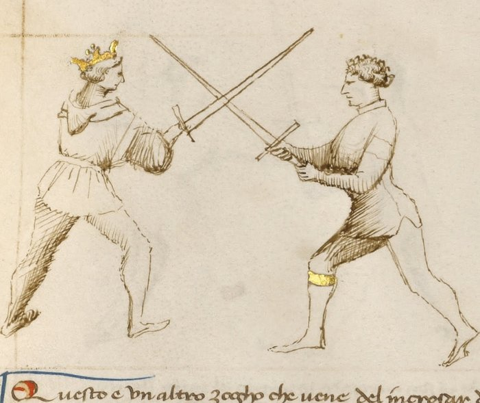

# Entering at the Crossing — Incrosar

<em>Getty MS Ludwig XV 13, folio 28r, c. 1409 - J. Paul Getty Museum (Open Content)</em>

*The Crossing*

Classification: *Gioco Largo — Foundational Framework*

The *incrosar* is not a single technique. It is the moment from which all plays begin.

When two swords first make contact, whether from a strike, a parry, or deliberate measure closing, that moment of blade contact is the crossing. Everything that follows in Fiore's play system originates here.

**Where blades meet, the decision is made. Read the crossing before you act.**

---

## **The Crossing as a Decision Point**

In Fiore's system, the crossing is not something that happens to you.

It is information.

The moment your blade touches your opponent's blade, you receive data: where on your sword is the contact? Where on their sword? How much pressure are they applying? Which direction does that pressure push?

The answers to these questions determine which plays are available. Not which plays you want to use: which ones the geometry actually permits.

The crossing tells you where you are. Before any technique can be chosen, the crossing must be read.

---

## **The Three Crossings**

Fiore identifies three types of blade crossing, distinguished by where on the blades contact is made.

### **The Punta Crossing — Contact at the Tips**

When the blades meet at their points, neither fencer has leverage over the other.

This is the weakest crossing. The contact is light, unstable, and temporary. A fencer who tries to control this crossing, applying pressure, waiting for an opportunity, will find that there is no control to be had.

Fiore's First Remedy Master addresses this crossing with a single instruction: act immediately. Change the line and strike hard to the head or arms. Do not wait.

At the punta crossing, only wide play is possible. You are too far from the opponent for close play. And the contact is too weak for any technique that requires stability.

### **The Mezza Spada Crossing — Contact at Mid-Blade**

When the blades meet near their midpoints, the situation becomes richer.

Both fencers have some leverage. Both have some control. Both have options.

This is the most important crossing in Fiore's system. The majority of his wide play, more than twenty plays in the manuscript, originates here.

From the *mezza spada*, both wide play and close play are available. A cut or thrust can be delivered at long measure. A passing step forward can bring you into stretto range. The crossing is stable enough to hold briefly while you assess.

The *mezza spada* is the decision point: go wide, or go close.

### **The Tutta Crossing — Contact Near the Hilt**

When the blades meet near the hilt, one fencer has gained a significant mechanical advantage.

The fencer whose hilt is in contact has strong leverage over the opponent's blade. The fencer whose blade is further from the hilt is weak.

At this crossing, only close play is viable. You are already at stretto distance. Cutting or thrusting at long measure is not possible from here. The plays available are the pommel strike, the joint locks, the disarms, and the throws.

Whether you intended to be at *tutta* crossing or not, you are in the close game now.

---

## **The Foot Position Tells You Which Game**

The crossing tells you what is possible. The foot position confirms which game you are in.

**Left foot forward:** You are in wide play. The largo techniques apply.

**Right foot forward:** Close play is now available. The stretto entries are within reach.

This is not coincidental. Fiore designs his play sequences so that the footwork of each largo action either maintains the left-foot-forward position (continuing in wide play) or naturally results in the right foot forward (signaling that stretto is now the appropriate game).

When you find yourself with the right foot forward after a wide-play action, this is not an error. It is the system telling you to shift games.

---

## **Which Guards Produce Which Crossings**

Through mechanical analysis, we can observe that some guards naturally tend toward one crossing type — though Fiore does not map these correlations explicitly in the Getty.

*Posta di Donna*, with the sword chambered behind the shoulder and the body already turned, tends to produce a *punta* crossing. A strike from Donna meets the opponent's blade near the tips.

*Posta di Fenestra*, with the sword extended and the point forward, tends to produce a *mezza spada* crossing. The Window Guard reaches toward the opponent and meets their blade at mid-length.

*Tutta Porta di Ferro*, with the sword low and hands near the body, tends to produce a *tutta* crossing. The low guard invites contact near the hilt.

These are tendencies, not rules. The opponent's actions also determine where the crossing lands. But knowing your guard's typical crossing type helps you anticipate which plays are most likely to be available from the start.

---

## **The Left-Right-Left Pattern**

Fiore's wide play follows a rhythm of left and right.

You approach with your left foot forward.

As the exchange develops, a passing step with the rear foot, forward and across, moves the right foot to the lead. This step appears in multiple largo plays: the *scambiar di punta*, the *rompere di punta*, and others.

When the right foot is forward, you are in position for the close game.

If a stretto technique is appropriate, execute it. If not, if you still have space and prefer to continue in wide play, a left-foot pass to the outside completes a full rotation and resets the wide-play position.

This three-beat rhythm, left forward, right forward, left to outside, is the structural backbone of the transition between games.

---

## **Modern Application**

The ability to read a crossing at speed is the most important diagnostic skill in Fiore-based competition.

Every decision in the play system flows from the crossing: which techniques are available, which game you are in, which direction your next action should go.

A fencer who cannot read crossings quickly will find Fiore's plays difficult to apply. The techniques are sound, but they require the correct entry. The *scambiar* works from certain crossings; it does not work from others. The pommel strike is appropriate in stretto; it is not accessible from largo range.

Train the crossing read explicitly. In partner drilling, pause at the moment of blade contact and name the crossing type before continuing. Over time, the identification becomes automatic: not a thought, but a recognition.

---

## **Training the Crossing**

### **Drill 1 — Crossing Identification**

Partner A strikes toward Partner B in slow motion, seeking blade contact.

At the moment of contact, both partners pause.

Partner B names the crossing type: *punta*, *mezza spada*, or *tutta*.

Partner A confirms or corrects.

Resume. Repeat with different entry angles, guards, and strike types to vary which crossing results.

**Focus:** Accurate identification of crossing type from blade pressure and position, not from prediction.

---

### **Drill 2 — Crossing to Game**

Partner A strikes toward Partner B, establishing a crossing.

Partner B identifies the crossing type and immediately names the appropriate game: *largo* or *stretto*.

If largo: Partner B executes one wide-play technique (any of the three largo plays learned).
If stretto: Partner B executes the *volta di pomo* (pommel strike) as a stretto entry.

The goal is not perfect technique, it is connecting the crossing read to an immediate game decision.

**Focus:** The crossing identification leads directly to a game choice leads directly to a technique. No deliberation in between.

---

## **Key Idea**

The crossing is where the fight resolves.

Two fencers meet, blades touch, and in that moment the system's logic becomes applicable. The crossing tells you which game you are in, which techniques are available, and which action is appropriate.

**Read it before you act. Act without hesitation once you have.**

The fencer who misreads the crossing acts in the wrong game. The techniques fail, not because they are wrong techniques, but because they are wrong for this situation.

Read the crossing. Know your game.
