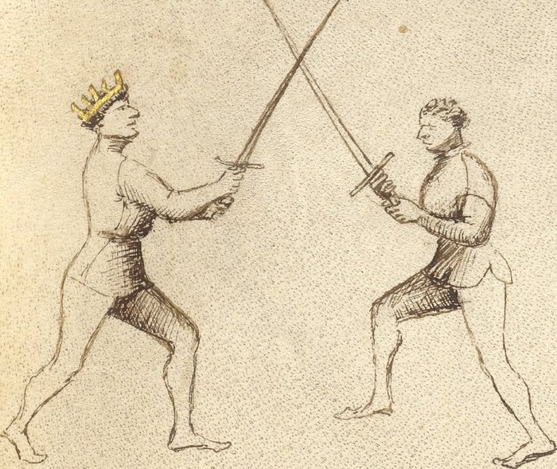

# Exchange of Thrusts — Scambiar di Punta

<em>Getty MS Ludwig XV 13, folio 25r, c. 1409 - J. Paul Getty Museum (Open Content)</em>

*The Exchange of Points*

Classification: *Gioco Largo — Wide Play*

The *scambiar di punta* is the most direct counter to a thrust. When the opponent advances with a point aimed at your face or chest, you do not retreat. You do not block and then counter. You step offline and thrust simultaneously — a single motion that removes your target and creates your own.

**Step out of the attack, not into it. The same movement that removes your target creates your own.**

The name carries a deliberate pun. *Punta* means both *thrust* and *point*. The exchange is not simply an exchange of thrusts — it is an exchange of points, in which your point replaces theirs.

---

## **Fiore's Description**

### **Getty Manuscript Text**

*"Questo zogho si chiama scambiar di punta e fa si in questo modo: como lo compagno te vene cum una punta, tu gli va fora de strada cum lo pè dinançi, e poy passa anche fora de strada cum l'altro pè, e cum le braze, incrosa la sua spada, e la tua punta va in lo volto overo in lo petto."*

### **Translation**

"This play is called exchange of thrusts, and is done in this way: as your companion comes at you with a thrust, you step out of line with your front foot, and then also step off the line with your other foot, and with your arms, cross his sword, and your point goes into his face or his chest."

Notice that Fiore gives the footwork first.

The step is not a preparation for the counter-thrust. The step and the thrust are the same action.

---

## **The Setup**

The opponent advances with a thrust aimed at your face or chest.

You are in wide play — blades have not yet crossed, or have just made contact at the point.

The threat is direct and committed.

---

## **The Technique**

The action has three components that happen as one motion:

**Step offline with the front foot.** Move the leading foot out of the line of attack — forward and to the outside, approximately forty-five degrees off the original line. This removes you from the path of the thrust.

**Pass the rear foot to follow.** The back foot steps obliquely across, completing the offline movement and bringing the body fully out of line. This is not a retreat. You are moving forward and off the line simultaneously.

**Cross his sword with your arms extended low.** As your feet move, your arms extend outward and downward. The goal is to collect the incoming blade — not block it, but redirect it past you. Your arms go low and wide. This controls his point without stopping your own motion.

**Drive your point into his face.** While your arms collect his blade low, your sword's point is already angling upward toward his face. By the time the crossing is complete, your thrust has arrived.

These are not four steps. They are one motion in four directions.

---

## **Why It Works**

The *scambiar di punta* works because it solves two problems simultaneously.

The opponent's thrust is a threat to a specific location: where you were standing. The offline step removes you from that location. His thrust arrives where you are no longer.

At the same moment, your arms extend to collect his blade. His weapon is redirected past you at the low line. Even if he committed fully, his point cannot find you.

Your point, meanwhile, has been driving toward him throughout. He has not moved offline. He is still where he was.

The geometry is simple: you are no longer where he is thrusting, and your point is where he still stands.

---

## **The Counter-Remedy**

A skilled opponent can defeat the *scambiar*.

If he anticipates your offline step — or if he maintains control of his blade as you collect it — he can beat your counterthrust aside before it arrives.

When this happens, your right foot has likely passed forward in the course of the action. That means stretto is now available.

The exchange of thrusts, when it succeeds, ends the exchange. When it fails, it becomes the entry into close play. Either outcome has a continuation.

---

## **Connection to the System**

The *scambiar di punta* flows most naturally from guards that already prepare the body for an offline passing step.

*Posta di Donna Destra* positions the sword behind the shoulder and the body turned slightly, ready to pass offline with the rear foot.

*Tutta Porta di Ferro* — the Full Iron Gate — generates the exchange directly. Fiore describes it as the guard "from which the exchange of thrusts naturally comes."

The play also connects forward: if the exchange succeeds, the opponent is struck. If the opponent counters and your right foot is now forward, the pommel strike and close-play entries are immediately available.

---

## **Modern Application**

For the modern fencer, the *scambiar di punta* is the most directly competition-relevant play in Fiore's entire system.

The reason is structural. Most HEMA scoring systems reward clean hits to open targets. A counterthrust that lands while your own target has moved offline is exactly this: your opponent's weapon arrives at empty space while yours arrives on target.

The technique also trains a principle that applies regardless of ruleset or weapon: when someone commits to a thrust, the correct answer is usually not to intercept it but to not be there.

In practice, the single-tempo execution — step and thrust as one motion — is what competitors find most difficult to achieve and most valuable when they do. Train it until the step and the thrust feel like the same impulse, not two separate decisions.

---

## **Connection to the Four Virtues**

The *scambiar di punta* expresses all four virtues, but primarily two.

The **Tiger** governs the speed of the action. The exchange of thrusts is a single-tempo counter — it must be fast enough that your point arrives before the opponent can recover or adjust. A slow *scambiar* is not a *scambiar*.

The **Lynx** governs the timing. You must read the opponent's thrust as it begins, not after it has fully committed. The step offline must happen early enough to clear the line of attack.

The **Lion** appears in the commitment to the counterthrust. The arm extends, the point drives forward. There is no half-measure here.

The **Elephant** provides the structure that keeps the body stable while moving offline. The footwork changes your position, but your sword arm must remain controlled throughout.

---

## **What This Play Is Not For**

The *scambiar di punta* is not a defense against a cut.

A descending strike travels along a wide arc. The offline step that removes you from a thrust does not necessarily remove you from a cut that follows the same arc. Do not attempt to exchange the thrust against an attack that begins as a cut.

It is also not a blocking technique. The arm extension is a collecting motion — it redirects the incoming blade, not stops it. Attempting to block with force defeats the geometry of the play.

Finally, it is not a two-step action. Stepping offline and then thrusting is slower, more telegraphed, and easier to counter. If you find yourself pausing between the step and the thrust, the technique is not yet trained.

---

## **Training the Play**

### **Drill 1 — Solo Offline Stepping**

Step forward and offline at forty-five degrees with the front foot, then pass the rear foot to follow.

Practice until the two steps feel like one motion, not two.

Add the arm extension: as you step, extend both arms outward and downward as if collecting a blade that isn't there.

Repeat from both sides.

**Focus:** The step and extension are simultaneous. The body arrives offline before the feet stop moving.

---

### **Drill 2 — Slow Partner Thrust**

Partner A presents a slow, committed thrust aimed at Partner B's face.

Partner B performs the *scambiar* at half speed: step offline with front foot, pass rear foot, collect Partner A's blade low, extend point toward Partner A's face.

Both partners pause at the completion to verify:

* Is Partner B fully offline?
* Is Partner A's blade collected and redirected low?
* Is Partner B's point aimed at Partner A's face?

Switch roles. Repeat.

**Focus:** Correct geometry at completion. Do not yet worry about speed.

---

### **Drill 3 — Live Threshold**

Partner A commits to a thrust at their own comfortable pace.

Partner B performs the *scambiar* at full speed, aiming to have the point on target before Partner A can recover.

Begin slowly and increase speed as the geometry becomes reliable.

**Focus:** The step and thrust arriving simultaneously. Partner B should not be hit, and Partner A should be touched. If either fencer is hit unexpectedly, slow down and identify what broke.

---

## **Common Errors**

A common mistake is executing the offline step and the thrust as two separate actions. The footwork happens first, then the thrust follows. This makes the play slower and gives the opponent time to adjust. The step and the thrust are one motion.

Another error is stepping offline at too shallow an angle. A slight lean to the side does not remove you from the line of attack. The step must genuinely clear the path of the incoming weapon.

Many students keep their arms too high as they collect the incoming blade. The arms should extend low and outward — this redirects the opponent's thrust past you at the low line. Arms at chest height do not collect the thrust, they meet it.

Finally, some students stop moving once the crossing is made, rather than driving the point through to the target. The play does not end at the crossing. It ends at the touch.

---

## **Key Idea**

The *scambiar di punta* is not a parry followed by a thrust.

It is a single action in which stepping offline and thrusting are the same impulse.

The opponent's point arrives at empty space. Yours arrives at a target that has not moved.

**Step out of the line. Drive the point home. These happen together, or not at all.**
