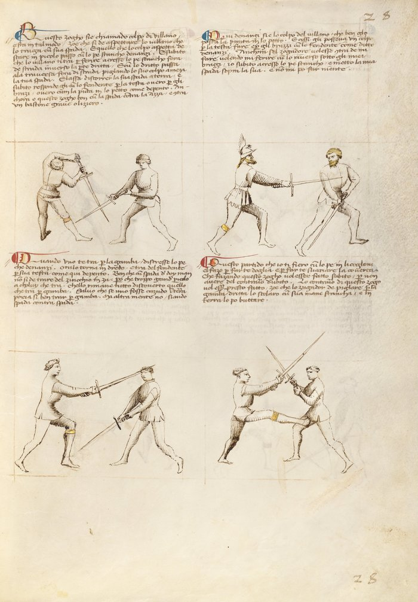

# Peasant's Blow — Colpo di Villano

<em>Getty MS Ludwig XV 13, folio 26r, c. 1409 - J. Paul Getty Museum (Open Content)</em>

*The Villain's Blow*

Classification: *Gioco Largo — Wide Play*

The *colpo di villano* does not teach you how to strike.

It teaches you when to stop contesting the bind and step out of it entirely.

**When you cannot win the bind, leave it. Geometry beats force.**

---

## **Fiore's Description**

### **Getty Manuscript Text**

*"Questo zogho si'e chiamado colpo di villano e sta in tal modo, Zoe che si de aspettare lo villano che vada ultra la coverta, e poy da lo fora de strada dal lato che va la spada."*

### **Translation**

"This play is called the Peasant's Blow, and it is like this: you must wait for the villano to go past the cover, and then give it to him from outside the line on the side where the sword goes."

The name requires explanation.

*Villano* — often translated as peasant or villain — refers to the attacker in this play. Not because the blow is unrefined, but because it is overcommitted. A trained swordsman controls his blade after the bind. The *villano* does not. His strike continues past the center line and does not stop there.

Fiore is not mocking the attack. He is describing what happens mechanically. The blow goes too far and creates a gap.

---

## **The Setup**

The opponent delivers a descending strike — typically a *fendente* — and the blades meet in a bind.

In the bind, you recognize that you are weak. Your blade is losing the contest of force and pressure.

Rather than continue to fight it, you wait.

The opponent's blade, driven with force and little control, continues past the point of contact. It does not stop at center. It keeps going.

That continuation is what you are waiting for.

---

## **The Technique**

**Recognize that you are weak in the bind.** This is the critical first step. You are not going to win this contest of force. Accepting that fact is what makes the play possible.

**Wait for the opponent's blade to pass the cover.** The *villano* commits the stroke with enough force that it travels past center — past where a controlled blow would stop. This is the moment.

**Step to the outside line.** Move to the side away from the opponent's blade as it passes. You are stepping into the space his overextension has created. The blade is no longer between you; it has continued past.

**Strike from the outside.** From the outside line, you deliver your own cut to the opponent who is now overextended and unable to recover.

The geometry is simple: a fencer whose blade has passed center cannot immediately defend themselves from the side they have just exposed.

---

## **Why It Works**

A controlled strike stops at the center line.

A controlled fencer commits only as much energy as the strike requires, and retains the ability to recover, change lines, or defend after the blow.

The *villano*'s blow does not stop. It continues past center because it was delivered with more force than control.

When that happens, the geometry changes. The opponent's weapon arm is extended and past center. Their body has leaned into the blow. Their ability to change direction is momentarily gone.

The outside line is briefly open.

The *colpo di villano* exploits that window.

---

## **The Counter Master's Lesson**

The Counter Master in this play does not demonstrate a counter-technique.

He demonstrates how not to be the *villano*.

A controlled strike — one that stops at center, that does not overcommit, that retains recovery — does not create this opening. The counter to the *colpo di villano* is simply to be a disciplined attacker.

This is one of Fiore's most direct teaching moments. He is not only showing a technique; he is showing what happens to fencers who swing without control.

Fiore also notes explicitly: this play works against an axe or a staff strike delivered with the same overcommitment. The weapon does not matter. The overextension does.

---

## **Connection to the System**

The *colpo di villano* sits as the fourth play of the Second Remedy Master of wide play.

It connects to all guards that might find themselves weak in a bind — particularly low guards like *Tutta Porta di Ferro* or *Dente di Zenghiaro*, which invite heavy binds and can be overwhelmed by a powerful descending blow.

It also connects to a broader principle in Fiore's system: the fencer who cannot win the current engagement should not fight it. Exiting an unfavorable position is not retreat. It is tactical awareness.

---

## **Modern Application**

In modern HEMA competition, the *colpo di villano* pattern appears constantly — though rarely by name.

Any time a competitor swings hard and overcommits — a common tendency under pressure — the correct response is not to try to out-muscle the bind. It is to step offline and exploit the geometry.

The challenge in training this play is that recognizing overcommitment in real time is difficult. A controlled blow and an overcommitted blow may look similar in the early stages. The *villano* reveals itself at the moment of contact, when blade pressure tells you that the opponent has more force than control.

Train the outside-line step as a reflex. When the bind feels wrong — when you are losing the contest of force — the answer is not more force. The answer is to leave.

---

## **Connection to the Four Virtues**

The **Lynx** governs this play entirely.

The Lynx is awareness: seeing clearly, reading the situation, and acting on what you observe rather than what you wish were true.

Recognizing that you are weak in the bind is a Lynx action. So is waiting for the overextension rather than acting prematurely. And so is identifying the precise moment when the opponent's blade has passed far enough for the outside line to open.

The **Tiger** governs the speed of the step — you must move to the outside line before the opponent recovers.

The **Lion** governs the commitment to the strike from the outside line. Once the moment arrives, act without hesitation.

The **Elephant** — structural strength — is notably *absent* from this play. The play works precisely because you have abandoned the contest of strength.

---

## **What This Play Is Not For**

The *colpo di villano* does not work against a controlled strike.

A fencer who delivers a disciplined *fendente* — one that commits only to center and recovers — does not create the overextension that makes this play possible. Attempting the outside-line step against such a blow may leave you exposed.

It is also not a preemptive technique. You cannot decide in advance to use the *colpo di villano* and then act on that plan. The play must respond to what the opponent actually does. If you step to the outside line before the opponent's blade has passed center, you step into their weapon.

Finally, it is not a solution to a bind that is merely difficult. Difficult binds may still be winnable. The *villano*'s blow is overextended — past center, past recovery. The distinction matters.

---

## **Training the Play**

### **Drill 1 — Recognizing the Overextension**

Partner A delivers a *fendente* in two versions, alternating without signaling which:

*Version 1:* A controlled blow that stops at center, binding with Partner B's sword.
*Version 2:* An overcommitted blow that continues past center.

Partner B must identify which version was delivered and respond accordingly: contest the bind on Version 1, step to the outside on Version 2.

Do not tell Partner B which is coming. The goal is recognition, not anticipation.

**Focus:** Identifying the overextension through blade pressure and visual cue — not by prediction.

---

### **Drill 2 — Outside-Line Entry**

Partner A delivers the overcommitted *fendente*.

Partner B: recognize the overextension → step to the outside line → deliver a cut from that position.

Begin slowly. Increase speed as the step and the recognition become reflexive.

Partner A should occasionally deliver a controlled blow (Drill 1 behavior) to prevent Partner B from defaulting to the outside step every time.

**Focus:** The step happens because of what Partner A's blade does, not because Partner B decided to use this play.

---

## **Common Errors**

The most common error is attempting the play against a controlled strike. The geometry does not work. If the opponent's blade has not passed center, stepping to the outside line puts you beside a weapon that can still threaten you.

Another common error is stepping too late. The window is brief — from the moment the blade passes center to the moment the opponent recovers. Hesitation closes the window.

Many students also try to win the bind instead of leaving it. When the blade pressure tells you that you are losing, the habit of trying harder is deeply ingrained. The *colpo di villano* teaches you to override that habit.

---

## **Key Idea**

The *colpo di villano* does not win by being stronger.

It wins by recognizing that strength is not the contest.

The opponent's force has committed his blade past where it can defend him. The geometry has opened.

**Recognize that you have lost the bind. Leave it. The outside line belongs to you now.**
