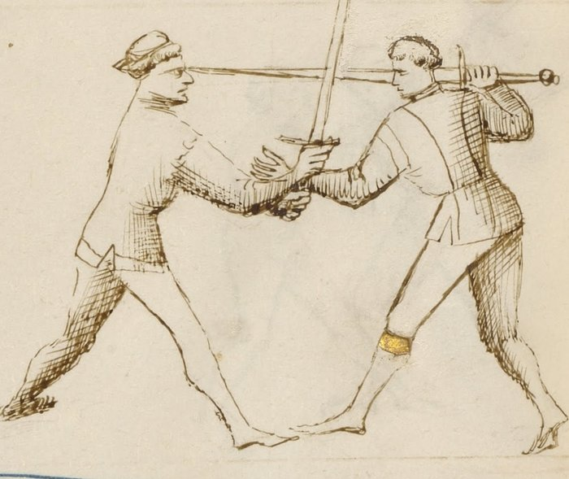

# Disarms — Disarmare

<em>Getty MS Ludwig XV 13, folio 29v, c. 1409 - J. Paul Getty Museum (Open Content)</em>

*The Taking of the Weapon*

Classification: *Gioco Stretto — Close Play*

In Fiore's plays, disarming the opponent is not a standalone technique. It is a destination: the end of a chain that begins with a stretto entry and builds through position until the opponent's grip can be broken and their weapon taken.

No one is disarmed from nothing. The disarm follows the position that makes it possible.

**Release your sword to take theirs. The one who holds less controls more.**

---

## **Fiore's Description**

### **Getty Manuscript Text**

*"Anchora digo che l'ultimo zogho del stretto si'e lo disarmare: e fa si in questo modo, lo zogho denançi... prendo la so spada cum la mano destra in meça... e laxo la mia andar... e cum la man stancha piglio la so spada apresso del pomo, e volto lo suo spada a man manca... e così gli tolo la so spada di mano."*

### **Translation**

"I also say that the last play of stretto is the disarm: and it is done in this way, the play before... I take his sword with my right hand at the middle... and I let my own go... and with my left hand I take his sword near the pommel, and turn his sword to the left hand... and so I take his sword from his hand."

Fiore's instructions are clear in sequence: grab mid-blade with the right hand → release your own sword → grab near the pommel with the left → rotate left → strip the sword.

The crucial step most students overlook: letting your own sword go.

---

## **The Setup**

You are in stretto range with a prior play established, a pommel strike, a blade wrap, or an arm grab has brought you close and created a controlled position.

The opponent's grip on their sword is accessible.

The disarm follows from this position. It does not precede it.

---

## **The Primary Disarm Sequence**

**With your right hand, grab the opponent's blade at the mid-point.** Not at the tip, the blade is dangerously sharp, and not near the pommel where their grip is strongest. The middle of the blade, controlled with the flat, is the target. This is half-swording your opponent's weapon.

**Release your own sword.** This is the counterintuitive step. You let go.

Most fencers resist this deeply. The sword in your hand feels like control. But the disarm cannot complete while both hands are occupied with your own weapon. The release is not a mistake. It is the technique.

**With your left hand, grab the opponent's sword near the pommel.** Now both your hands are on their weapon: right hand at mid-blade, left hand near the pommel.

**Rotate the sword to your left.** Turn the weapon against the direction of the opponent's grip. The sword rotates in a direction the wrist does not comfortably follow. The fingers open.

**The sword is yours.** Strip it as the grip fails.

---

## **Why It Works**

The human grip has a strong and a weak direction.

When you control both ends of the opponent's sword, mid-blade and near the pommel, and rotate it against their wrist's natural range, the grip fails mechanically. It is not about squeezing harder or pulling faster. The rotation defeats the grip.

The release of your own sword is what makes both your hands available. Without it, you can grab the mid-blade with one hand, but your other hand is occupied with your own hilt. Two-handed control of the opponent's weapon is what allows the rotation to work.

---

## **Variants**

Fiore describes multiple disarm plays in the stretto section. The primary sequence above is the most direct. Variants differ in which hand grabs which part of the sword first, and in whether the disarm follows from a blade control or an arm control.

**From an arm grab:** After securing the opponent's weapon arm, the hand that holds the arm transitions to grab the mid-blade while the other hand takes the pommel end. The mechanics from that point are the same.

**From a blade wrap:** When the blade is already behind the opponent's neck (the volta di pomo arc), the pulling motion used for the throat cut can transition directly to a two-handed control of the opponent's sword.

All variants share the same final sequence: two hands on their sword, rotate against the grip, strip the weapon.

---

## **The Prior Play Is Required**

Fiore is explicit: the disarm is the *last* play of stretto. Not the first.

A fencer who tries to disarm without a prior setup, who simply reaches for the opponent's sword from open measure, will find their hand cut.

The prior play does two things. First, it creates physical proximity, you cannot disarm from a distance. Second, it compromises the opponent's posture and attention. A fencer who has just taken a pommel to the face, or whose arm is locked at the shoulder, is not in a position to maintain a strong grip on their weapon.

The disarm requires both of these conditions.

---

## **Connection to the System**

The disarm follows most naturally from:

* The pommel strike: after the pommel arrives and the blade is behind the neck, the hand position naturally allows a grab at the mid-blade
* The Upper Bind (soprana): the elevated position significantly weakens the opponent's grip, making the disarm strip easier
* Any wrap that controls the opponent's sword arm: the arm control allows a transition to mid-blade grip without interference

The disarm leads to:

* Holding the opponent's sword with both hands, in a dominant position
* Following with a counter-thrust or strike using the captured weapon
* Ending the engagement with the opponent disarmed and compromised

---

## **Modern Application**

In modern HEMA competition, the disarm is a scored action in most rulesets, often worth significant points.

The competitive insight Fiore provides is that disarms are not luck. They are engineered through the preceding play. A competitor who consistently arrives in stretto range with an established arm grab or pommel strike is also consistently in disarm territory.

Train the prior play chain first. The disarm follows from position, not from athleticism.

Specific competition notes: the transition moment, releasing your own sword, is where most beginners hesitate. The opponent often recovers in that moment. Practice the release as a committed, fast action, not a tentative letting-go. The timing of the release and the mid-blade grab should happen as close to simultaneously as possible.

---

## **Connection to the Four Virtues**

The **Lion** governs the release. The moment of releasing your own sword requires commitment, a willingness to be briefly without a weapon in service of a superior position. Half-measures here fail.

The **Tiger** governs the speed of the two-handed grab. Once your own sword is released, both hands must secure their positions on the opponent's sword before they can react.

The **Lynx** governs the read of the opponent's grip strength. Is the prior play sufficient? Has the pommel strike disrupted them enough, or the arm lock weakened their grip enough? Acting on the disarm from an insufficiently prepared position is the most common failure.

The **Elephant** governs the final rotation, turning the sword against the grip requires body weight behind it, not just arm strength.

---

## **What This Play Is Not For**

The disarm is not a first technique.

Reaching for the opponent's weapon without a prior play is not the disarm, it is an invitation to be cut.

It is also not a partial action. Grabbing the mid-blade without releasing your own sword is not the disarm; it is a bind. Grabbing near the pommel without the mid-blade control is not the disarm; it is a pull that the opponent can resist. Both hands on the sword, rotate, strip, this is the technique. Partial versions produce partial results.

Finally, the disarm is not appropriate at extended measure. You must be inside stretto range, close enough that the opponent's sword is within reach of both your hands simultaneously.

---

## **Training the Play**

### **Drill 1 — The Release**

Partner A holds their sword extended, grip firm.

Partner B grabs Partner A's sword at mid-blade with the right hand and simultaneously releases their own sword. Do not hesitate.

Then Partner B grabs near Partner A's pommel with the left hand.

Rotate left. Strip.

Repeat until the release of Partner B's own sword happens as a committed, fast action, not reluctantly.

**Focus:** The release is the technique. Train it without flinching.

---

### **Drill 2 — From a Pommel Strike Entry**

Begin with the full pommel strike sequence: bind → roll under → pommel to face → blade behind neck.

From the blade-behind-neck position, Partner B grabs Partner A's sword at mid-blade with the right hand → releases own sword → grabs near Partner A's pommel with the left → rotates left → strips.

Partner A maintains grip until the rotation strip.

**Focus:** The disarm follows continuously from the pommel position. There should be no pause to set up the grab.

---

## **Common Errors**

The most common error is refusing to release the own sword. Students hold on. The disarm requires both hands free. Train the release as a committed action.

Another error is grabbing at the wrong points, too close to the tip (dangerous; the edge cuts) or too close to the pommel (the opponent's grip is strongest there). Mid-blade for the right hand, near the pommel for the left.

Rotating in the wrong direction is also frequent. The rotation must go against the opponent's wrist, left in Fiore's primary description. Rotating the wrong way adds pressure in a direction the grip can resist.

Finally, attempting the disarm without a prior entry. Without a prior play establishing position and disruption, the opponent's grip is strong and their attention is fully on their weapon. The disarm does not begin cold.

---

## **Key Idea**

The disarm is the last play of stretto because it requires everything that came before.

Position. Proximity. Disruption.

When these are established, releasing your sword to take theirs is not a risk.

**Grab the middle. Let your sword go. Grab the pommel. Rotate. Strip.**
