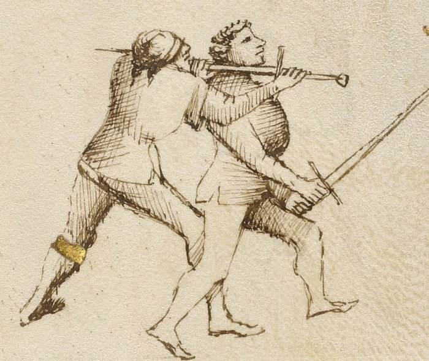

# Lower Bind — Ligadura Sotana

<em>Getty MS Ludwig XV 13, folio 29r, c. 1409 - J. Paul Getty Museum (Open Content)</em>

*The Underbind*

Classification: *Gioco Stretto — Close Play*

The joint locks in Fiore's system are called *ligadure* — bindings. They do not stop an opponent by pain alone. They control position. Once the arm is controlled, the body must follow.

The Lower Bind forces the arm downward and under. The elbow is levered below the shoulder. The body tilts to follow the arm.

**Control the arm below the shoulder. The body must follow.**

---

## **Fiore's Description**

### **Getty Manuscript Text**

*"Anchora digo che lo primo ligadure ch'e chiamada sotana, per ch'e lo brazo del compagno va sotto in terra."*

### **Translation**

"I also say that the first binding, which is called the lower bind, is so called because the companion's arm goes downward toward the ground."

Fiore names the lock by what the arm does, not by the position of the hands. The arm goes down. That is the lock.

---

## **The Setup**

You are in stretto range. A grab or wrap has given you control of the opponent's weapon arm.

The contact is typically at the forearm or wrist.

Your position is to the outside of the opponent's weapon arm — on the side away from their body's rotation. This outside position is what makes the downward leverage possible.

---

## **The Technique**

**Secure the arm at the wrist or forearm.** The grab must be firm but not rigid. You are about to move the arm; if your grip fights the motion, the lock stalls.

**Step to the outside of the arm.** Your position relative to the opponent's weapon arm is critical. To apply downward leverage, you must be on the outside — to the side where the arm can be pushed away from the body rather than into it.

**Drive the arm downward.** Pull the forearm down and under. The elbow is the lever point. As the forearm drops, the elbow is driven upward and outward — this is the lock. The joint is stressed against its natural range of motion.

**Press through the lock.** Do not stop when the arm is controlled. Press through — driving the arm down continues to compromise the opponent's balance and posture. A fencer whose arm is driven to the ground cannot simultaneously defend with their body.

**Transition or finish.** From the downward lock, you can: drive the opponent to the ground, transition to a disarm, or follow with a pommel strike to the face.

---

## **Why It Works**

The elbow joint bends in one direction only.

When you drive the forearm downward while the elbow is forced upward and outward, you are loading the joint against its mechanical limit.

The opponent faces two choices: submit to the lock and drop to the ground, or resist — in which case the joint fails.

In either case, the opponent is no longer in a position to threaten you.

The outside position is what enables this. If you are on the inside — between the arm and the body — driving the arm downward brings the opponent's hand toward their own body, where they can resist. On the outside, there is nothing to resist against.

---

## **The Abrazare Connection**

This lock is not invented for the longsword. It comes directly from Fiore's wrestling section.

In *abrazare*, the lower bind is taught as a standalone takedown from a wrestling clinch. When translated to the longsword, the same mechanics apply — one hand grabs the opponent's weapon arm, the other applies the leverage — but now both parties are holding swords, and the grab must be acquired through a prior stretto entry.

If you find the mechanics of this lock difficult, study the wrestling section. The body mechanics make more sense when the lock is practiced without the additional complexity of the longsword.

---

## **Connection to the System**

The Lower Bind follows most naturally from:

* The pommel strike (volta di pomo): after the pommel arrives and the blade is behind the neck, a grab of the opponent's weapon arm with the rear hand can set up the lower bind before the throat cut
* A sword wrap: with the blade already behind the opponent's neck, the downward pulling motion resembles the lower bind's mechanics

The Lower Bind leads most naturally to:

* Driving the opponent to the ground
* A disarm, if the opponent's grip can be broken during the downward motion

---

## **Modern Application**

In modern HEMA competition, joint locks are permitted in varying degrees depending on the ruleset.

Some tournaments allow controlled applications. Others restrict to light touch or prohibit them entirely.

What remains valid regardless of ruleset is this: the *ligadura sotana* teaches the principle of arm control — gaining a position outside the opponent's weapon arm where their options are reduced. Even where a full lock cannot be applied, arriving at the outside position with a hand on the opponent's weapon arm creates scoring opportunities and positional advantages that rule-bound competition rewards.

Train the full lock. Use the principle.

---

## **Connection to the Four Virtues**

The **Elephant** governs this lock entirely.

The Elephant is structural weight: stable, grounded, and difficult to move. The lower bind requires exactly this. Your weight must be engaged behind the downward leverage. If you are off-balance or light on your feet at the moment of application, the opponent's resistance overcomes you.

The **Tiger** governs the speed at which the grab must be made after the initial stretto entry. The window is brief.

The **Lynx** governs the position — reading whether you are on the inside or outside of the arm before committing to the downward leverage.

The **Lion** does not govern this play. It is a technique of control, not a committed strike.

---

## **What This Play Is Not For**

The Lower Bind does not work on the inside of the arm.

If you grab the opponent's forearm from the inside — with their arm between you and their body — driving the arm downward has nowhere useful to go. They rotate and you have leverage against nothing.

It is also not a standalone entry. You cannot arrive cold at close range and apply this lock. A prior pommel strike, wrap, or grab must first compromise the opponent's position.

Finally, it is not the same as the Middle or Upper Bind. These locks look similar at the beginning; they differ in the final angle and the height at which the arm is controlled. The wrong lock applied from the wrong position results in neither a lock nor control.

---

## **Training the Play**

### **Drill 1 — Position and Leverage Without Resistance**

Partner A holds their arm extended, sword in hand.

Partner B grabs Partner A's forearm from the outside. Without applying force, identify: Am I on the outside? Is my position set?

Then apply slow, steady downward leverage on the forearm while guiding the elbow upward and outward.

Partner A lets the arm move freely. Trace the path of the arm until the lock position is clear.

**Focus:** Outside position, downward forearm, upward elbow. Get these three correct before adding any resistance.

---

### **Drill 2 — From a Stretto Entry**

Begin with the pommel strike (Drill 2 from Pommel Strike page): roll under the bind → pommel to face → blade behind neck.

At the moment the pommel arrives and the blade is behind the neck, Partner B's rear hand grabs Partner A's weapon arm from the outside.

Apply the lower bind: drive the forearm down while guiding the elbow up and outward.

Partner A offers light resistance.

**Focus:** The lower bind follows continuously from the pommel strike position. There should be no pause between the pommel arriving and the grab securing the arm.

---

## **Common Errors**

A common mistake is applying the lock from the inside of the arm. This does not create leverage in the right direction. Confirm your outside position before committing.

Another error is gripping the opponent's wrist too tightly without moving the arm. The lock is applied through motion — pulling the forearm downward — not through squeezing. A static grip with maximum force creates an isometric contest, not a lock.

Many students stop at the moment the arm is forced down, rather than pressing through to a resolution. The lock is a transition, not a destination. Continue to a ground position, a disarm, or a finishing strike.

---

## **Key Idea**

The lower bind forces the arm in the direction the joint will not travel.

The opponent cannot resist without structural failure.

**Get to the outside. Drive the forearm down. Press through to a resolution.**
