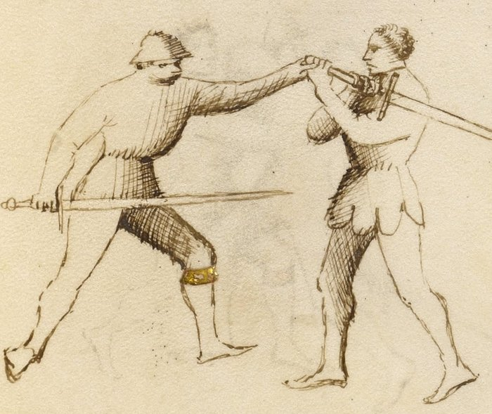

# Middle Bind — Ligadura Mezana

<em>Getty MS Ludwig XV 13, folio 29r, c. 1409 - J. Paul Getty Museum (Open Content)</em>

*The Middlebind*

Classification: *Gioco Stretto — Close Play*

The Middle Bind is taught first among Fiore's three joint locks, not because it happens most often, but because the spiraling motion it requires underlies all three.

It controls the weapon arm at shoulder height through a wrapping rotation against the elbow. The arm cannot travel further once the spiral is set. The opponent either drops or the joint fails.

**Spiral the arm. The rotation locks it, not the grip.**

---

## **Fiore's Description**

### **Getty Manuscript Text**

*"Anchora digo de lo secondo ligadure ch'e chiamado mezana, per che lo brazo del compagno va in meza statura."*

### **Translation**

"I also say of the second binding, which is called the middlebind, because the companion's arm goes to the middle position."

Middle position: the arm controlled at shoulder height, neither driven down nor elevated above. The elbow, bent and wrapped, becomes the lever.

---

## **The Setup**

You are in stretto range. A prior action, a pommel strike, a sword wrap, or an arm grab, has brought you into contact with the opponent's weapon arm.

You are on the outside of the arm, or can achieve that position with a small step.

---

## **The Technique**

**Make contact with the weapon arm, outside or below the elbow.** The initial grab establishes control at the forearm.

**Wrap your arm over and under the opponent's weapon arm.** This is the spiraling motion that defines the lock. Your arm travels over their elbow and then under it from the outside. The arm wraps around theirs, creating a spiral. The elbow is caught inside the spiral.

**Bring the locked arm to shoulder height.** The wrap sets the lever at shoulder height. Not down (that would be the lower bind) and not up (that would be the upper bind). The arm is level with the shoulder, controlled.

**Close the spiral.** Drive your arm against the resistance of their elbow joint. The rotation of your wrap means that any forward motion by the opponent, any attempt to push through, increases the leverage against their own joint.

**Press toward the ground.** From shoulder height, a short press downward completes the takedown. The opponent's balance is already compromised by the lock; the press directs the fall.

---

## **Why It Works**

The elbow does not rotate.

It bends in one plane. When you wrap your arm around the opponent's weapon arm and trap the elbow inside the spiral, you have taken the joint to its limit in a direction it cannot travel.

What distinguishes the Middle Bind from simple strength is the wrapping motion. A direct grab from the outside contests force against force, the person with more arm strength wins. The spiral redirects the joint against itself. Strength cannot overcome the mechanical limit of the elbow's rotation.

The shoulder-height control position also matters. At shoulder height, the opponent's body is upright and balanced. A downward press from this position breaks their balance immediately because there is no lower position for the arm to escape to.

---

## **The Spiral as Foundation**

The Middle Bind is the foundation because its core motion, the spiraling wrap, appears in modified form in all three ligadure.

In the Lower Bind, the spiral begins and the arm is driven down before reaching shoulder height.

In the Upper Bind, the spiral continues and the arm is driven upward past shoulder height.

In the Middle Bind, the spiral arrives at shoulder height and stops there.

Once the wrapping motion is understood mechanically, the other two locks are variations of the same fundamental action, not separate techniques.

Train the mezana first. The other two follow from it.

---

## **The Abrazare Connection**

The *ligadura mezana* is one of Fiore's wrestling plays before it is a longsword technique.

In the wrestling section, it appears as a standing control, one wrestler wraps the other's arm and drives them to the ground. The mechanical principle is identical. The longsword adds the complication that both parties are holding weapons, and the initial contact must be established through a stretto entry before the wrap can be applied.

Students who struggle with this lock often benefit from practicing it without the sword first: two people, no weapons, drilling the wrapping motion until the spiral becomes automatic. Then reintroduce the sword context.

---

## **Connection to the System**

The Middle Bind follows from:

* The pommel strike, after the pommel arrives and the opponent's weapon arm is accessible
* Any stretto position where you have outside contact with the weapon arm and the elbow is accessible

The Middle Bind leads to:

* The ground: a short press from the shoulder-height control position
* The disarm: the controlled arm position makes disarming available
* The Upper Bind: if the opponent pulls their arm backward to resist the lock, allow the arm to travel upward and follow into the *ligadura soprana*

---

## **Modern Application**

In controlled sparring, the *ligadura mezana* is one of the most demonstrable stretto techniques because the wrapping action is clearly mechanical, it is evident why the lock works, and it works consistently across different body types and strength levels.

In competition, its direct application depends on the ruleset. What applies universally is the entry position: outside the weapon arm, with contact at the forearm. This position limits the opponent's offensive options and creates scoring opportunities through pommel strikes or follow-up cuts whether or not the lock itself is completed.

Train the lock fully. Use the position.

---

## **Connection to the Four Virtues**

The **Elephant** governs the structural weight behind the wrap. Without body weight engaged, the spiraling motion is a gesture rather than a lock.

The **Tiger** governs the speed of the initial wrap. The wrapping motion must happen before the opponent can pull the arm back or change position.

The **Lynx** governs two things: reading the outside position (is the elbow accessible for the wrap?), and reading the resistance, if the opponent pulls back as you apply the mezana, following their motion upward leads directly to the soprana.

The **Lion** is present in the final press. Do not pause at the locked position; commit through to the ground.

---

## **What This Play Is Not For**

The Middle Bind cannot be applied from the inside of the arm.

If you are between the opponent's arm and their body, the wrapping motion runs into the body and cannot complete. The outside position is not optional.

It also cannot be forced through strength alone. If the spiral is not correctly seated around the elbow, adding force does not make the lock work, it creates a contest of arm strength, which the stronger person wins regardless of technique.

Finally, do not hold the locked position. Once the arm is controlled at shoulder height, the logical continuation is a press to the ground. Holding the lock statically gives the opponent time to find a counter.

---

## **Training the Play**

### **Drill 1 — The Spiral in Isolation**

Without a partner, practice the wrapping motion with your own arms.

Extend one arm forward (this is the opponent's weapon arm). With the other arm, practice wrapping over and under the extended arm, the arm goes over, then curves under, trapping the elbow inside.

Repeat until the spiral motion is smooth and automatic.

Then practice on a partner without applying any downward force: just execute the wrap until it seats correctly around their elbow.

**Focus:** The spiral must seat around the elbow specifically. Contact anywhere else on the arm does not produce the lock.

---

### **Drill 2 — Lock to Ground**

Partner A extends their weapon arm.

Partner B establishes contact at the forearm from the outside → wraps over and under the elbow → brings the arm to shoulder height → presses slowly downward.

Partner A offers graduated resistance: start at zero resistance and increase over multiple repetitions.

Partner B adjusts the depth and timing of the spiral to maintain the lock under resistance.

**Focus:** The lock increases in effectiveness as resistance increases, because the elbow's mechanical limit is fixed. If the lock fails under resistance, the spiral is not seated correctly.

---

### **Drill 3 — From a Stretto Entry**

Begin with the pommel strike sequence (pommel to face, blade behind neck).

After the pommel arrives, Partner B grabs Partner A's weapon arm from the outside with the rear hand.

Partner B applies the *ligadura mezana*: wrap over and under the elbow → shoulder-height control → press to the ground.

Partner A does not resist in the first few repetitions. Increase resistance as the sequence becomes familiar.

**Focus:** The mezana follows from the pommel strike without a pause. The entry creates the position; the lock executes from it immediately.

---

## **Common Errors**

A common mistake is wrapping too high on the arm, catching the forearm in the spiral instead of the elbow. The elbow is the lever. The lock does not work without it.

Another error is applying force before the spiral is seated. Many students squeeze the arm and push downward before the wrap is complete. The squeeze does not produce the lock; it produces a resistance contest.

Stopping at the locked position rather than pressing through is also frequent. The lock is unstable if held statically. It is most effective as a transition to the ground, not as a position to maintain.

Finally, applying this lock from the inside of the arm. The wrap cannot complete from the inside. Check the position before beginning the spiral.

---

## **Key Idea**

The Middle Bind is the foundation of Fiore's locking system.

The spiral is the mechanic. The elbow is the lever. The shoulder height is the control point.

**Wrap over and under. Seat the spiral at the elbow. Press through to the ground.**
