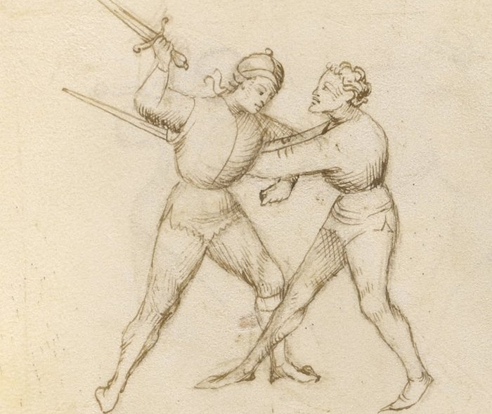

# Pommel Strike — Colpo di Pomo

<em>Getty MS Ludwig XV 13, folio 29r, c. 1409 - J. Paul Getty Museum (Open Content)</em>

*The Pommel Turn*

Classification: *Gioco Stretto — Close Play*

When you enter the close game from the mandritto side, the first technique available to you is not a cut or a thrust.

It is the pommel.

The sword rotates around the opponent's blade, using it as a fulcrum, and the pommel drives into the bridge of the nose. The blade continues its arc behind the opponent's neck. A pull of the sword cuts the throat and sets up a throw.

**Use the bind as a fulcrum. The opponent's blade makes your pommel faster.**

This technique is also called the *volta di pomo*, the pommel turn, which better describes the motion. The sword does not swing. It pivots.

---

## **Fiore's Description**

### **Getty Manuscript Text**

*"Questo si chiama volta di pomo, e fa si in questo modo: quando io son in lo stretto cum lo compagno... io metto lo mio pomo in la so facia... e la mia spada va de dredo lo so collo... e io gli dago una bona streta in la gola."*

### **Translation**

"This is called the pommel turn, and is done in this way: when I am in close play with my companion... I put my pommel in his face... and my sword goes behind his neck... and I give him a good tightening at the throat."

Fiore makes a specific claim about this technique elsewhere in the manuscript: "I have proven that four teeth will be knocked out of the mouth with such a play."

This is one of his rare statements about physical consequence. He believed in this technique.

---

## **The Setup**

You have entered stretto. The blades are in contact at mid-sword or near the hilt.

The bind is on your mandritto side, your forehand side. The contact is on your right.

You are close to the opponent's body.

---

## **The Technique**

**Roll your sword under the bind.** This is the pivoting motion that defines the technique. Using the opponent's blade as a fulcrum, rotate your sword so that it passes beneath their blade. The hilt drops. The point begins to rise and arc behind the opponent.

**Drive the pommel into the bridge of the nose.** As the sword rotates, your pommel, the weighted end of the hilt, arrives at your opponent's face. This is not a swing. It is a close-range driving motion, leveraged by the rotation. The face is close. The pommel arrives fast.

**Continue the arc.** Do not stop at the pommel strike. Allow the sword to continue its rotation so that the blade passes behind the opponent's neck. Your point is now on the other side.

**Pull the sword.** With the blade behind the neck, drawing the sword back cuts the throat. The same motion also disrupts the opponent's balance, a pull on the neck is an entry to a throw.

---

## **Why It Works**

The *volta di pomo* works because it uses the opponent's resistance against them.

In a stretto bind, the opponent is pressing against your blade. That pressure provides the fulcrum. By rotating under the bind rather than fighting it, your pommel travels along an arc that the opponent cannot easily intercept, it comes from a direction they are not defending.

The speed of the pommel strike is amplified by the lever length of the sword. A small rotation at the hilt produces significant speed at the pommel end.

The blade wrap behind the neck then creates a situation with no good exit: a pull cuts, a push disrupts balance, and neither option is comfortable.

---

## **The Counter-Remedy**

The opponent can defeat this play by controlling the Scholar's pommel before the rotation completes.

If they feel the sword beginning to roll under the bind and grab the Scholar's hands or pommel, the technique stalls. The Scholar's sword is momentarily controlled and the situation must be resolved differently.

The window to counter is small. The rotation happens quickly from close range. But a trained fencer who is sensitive to the initial rolling motion can interrupt it.

This is why the *volta di pomo* must be executed with commitment and speed, not tentatively.

---

## **Connection to the System**

The pommel strike is the entry point for the entire stretto game from the mandritto side.

It creates the position from which joint locks, disarms, and throws become available. After the pommel arrives and the blade is behind the neck, you have multiple continuations:

* Pull the sword to cut the throat and throw
* Transition to a joint lock on the weapon arm
* Press the blade against the neck and step through for a throw
* Execute a disarm while the opponent is disrupted by the pommel strike

The technique does not stand alone. It opens a door. What you do next depends on what the opponent does in response.

The riverso side, when contact is on your left, requires a different approach. The pommel strike works from the mandritto bind. From the riverso, a wrap or grab is needed first.

---

## **Modern Application**

In modern HEMA competition, the *volta di pomo* principle, using the bind as a fulcrum rather than fighting it directly, is directly applicable.

Many HEMA rulesets allow pommel strikes in some form, though scoring varies. Even where the pommel strike itself is not scorable, the positional advantage it creates is real. Arriving with the blade behind an opponent's neck in a controlled position demonstrates dominance of the bind and creates genuine follow-up opportunities.

The key competitive insight is this: in close measure, many fencers default to trying to cut or thrust at a distance that is too short for those techniques to work well. The pommel strike teaches the correct response to close range, not a longer weapon technique crammed into smaller space, but a different tool for a different problem.

---

## **Connection to the Four Virtues**

The **Tiger** governs the speed of the rotation. From close range, the pivot must happen before the opponent can react to the new direction of the sword.

The **Elephant** provides the stability of the stretto position. You are close to the opponent; your base must be solid enough that the rotation does not disrupt your own balance.

The **Lynx** governs the read of the bind side. The pommel strike is only available from the mandritto bind. Attempting it from the wrong side is not simply ineffective: it may expose you. The Lynx identifies which side is in contact before acting.

The **Lion** governs commitment. The technique requires a complete rotation, not a tentative attempt. Half-executing the *volta di pomo* creates neither a pommel strike nor a clean follow-up.

---

## **What This Play Is Not For**

The pommel strike does not work from the riverso bind.

If the contact is on your left side, rotating your sword under the bind brings your pommel away from the opponent's face, not toward it. The technique is specific to the mandritto entry.

It is also not a technique for distance. You must be in stretto, close enough that the arc of the pommel can reach the opponent's face. Attempting this at extended measure produces nothing.

Finally, the pommel turn is not complete without the blade arc behind the neck. The pommel strike alone, without the continuing rotation, is a half-technique. It may stun or disrupt, but it does not resolve the situation. The follow-through is essential.

---

## **Training the Play**

### **Drill 1 — The Rotation in Isolation**

Without a partner, hold the sword and practice the pivoting motion of the *volta di pomo*.

Roll the sword so the hilt drops and the blade rises, as if passing beneath a bind.

Continue the rotation so the pommel drives forward and the blade arcs behind where the opponent's neck would be.

Practice until the motion is smooth and continuous, not a pommel strike followed by a blade movement, but a single rotating arc.

**Focus:** One continuous pivot, not two separate actions.

---

### **Drill 2 — From a Stretto Bind**

Partner A and Partner B stand in a stretto bind: blades crossing near the hilt, bodies close, both hands on the sword.

Partner B identifies the bind side. If it is mandritto, execute the *volta di pomo*: roll under the bind → pommel to Partner A's face → blade behind Partner A's neck.

Partner A offers a constant pressure in the bind but does not counter yet.

**Focus:** The rolling motion uses Partner A's blade as the fulcrum. The pommel should arrive at the face without a large preparatory motion.

---

### **Drill 3 — Entry and Follow-Through**

From Drill 2, extend the sequence: after the pommel arrives at the face and the blade is behind the neck, Partner B makes the decision, pull (threat of throat cut + throw) or transition to a joint lock.

Partner A responds in slow motion to whichever follow-up Partner B selects.

**Focus:** The pommel strike is the beginning, not the end. Practice flowing into the next technique without pausing.

---

## **Common Errors**

A common mistake is swinging the pommel like a punch. The pommel strike is not a hit from a distance, it is a close rotation using the bind as a pivot. If you attempt it from more than arm's length, you are not executing the technique correctly.

Another error is stopping the rotation at the moment of pommel contact. The blade must continue its arc behind the neck. Stopping at the pommel leaves you with a hit but no follow-up position.

Many students also attempt the pommel strike from the riverso bind. This is the wrong side. From the left, the rotation moves the pommel away from the target. Identify the bind side before acting.

---

## **Key Idea**

The *volta di pomo* does not fight the bind.

It uses the bind.

The opponent's resistance provides the fulcrum. The sword pivots around it. The pommel arrives at the face and the blade continues behind the neck.

**Roll under the bind. Drive the pommel. Continue the arc. The technique is one rotation, not three steps.**
