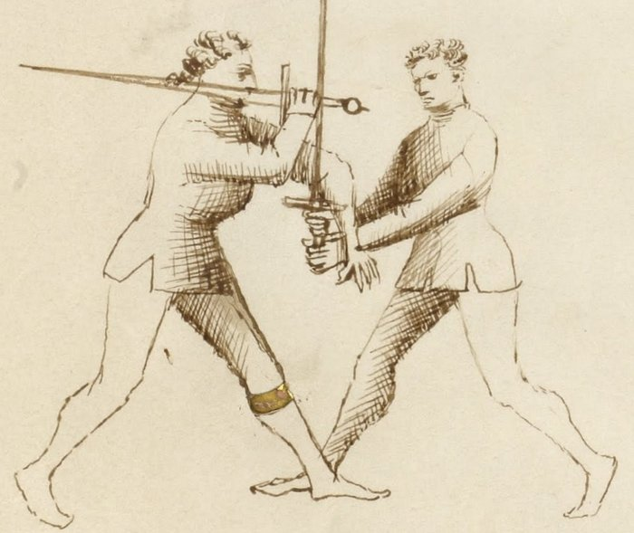

# Throws and Takedowns — Gettare e Abbattere

<em>Getty MS Ludwig XV 13, folio 30r, c. 1409 - J. Paul Getty Museum (Open Content)</em>

*Throwing and Felling*

Classification: *Gioco Stretto — Close Play*

A stretto sequence does not resolve by stopping.

It resolves by putting someone on the ground, disarming them, or forcing them to yield. Throws and takedowns are not a separate chapter of Fiore's system: they are how the other stretto plays end.

The lock extends. The blade wraps. The pommel arrives. Each of these creates a position. The throw is what you do with that position.

**Every stretto play can end on the ground. Throws are not separate: they are destinations.**

---

## **Fiore's Description**

### **Getty Manuscript Text**

*"Questo zogho si'e bon per gettare lo compagno in terra... e fa si in questo modo: io l'abraçavo e voltavo lo mio pié ritto driedo lo so pié stancho e cum le braça, lo geto in terra."*

### **Translation**

"This play is good for throwing the companion to the ground... and it is done in this way: I embraced him and turned my right foot behind his left foot and with my arms, I threw him to the ground."

Fiore describes the hip throw entry directly: embrace, step behind the foot, throw with the arms.

Other throw descriptions appear throughout the stretto section attached to specific plays. The throws are not consolidated in a single location: they are distributed as the natural ends of preceding sequences.

---

## **Throws and Takedowns Are Different**

Fiore's vocabulary distinguishes them.

*Gettare* — throwing — involves momentum. You catch the opponent in motion or create motion, redirect it, and their own movement carries them to the ground. Hip throws and sweeping throws use this principle.

*Abbattere* — felling — involves leverage against a static or resisting opponent. The opponent is not moving; you break their structure through leverage and they fall. The lock-based takedowns from the three ligadure are *abbattere*.

In practice, the distinction matters for training. The gettare requires timing, you must catch the motion. The abbattere requires position, the leverage must be established before the press begins.

---

## **Where Throws Come From**

### **From the Pommel Strike and Blade Wrap**

After the volta di pomo, pommel to face, blade behind the neck, the pulling motion used for the throat cut is also a throw.

When you pull the sword with the blade behind the opponent's neck, you are not only cutting. You are controlling the head. A pull to the side while stepping past the opponent's leg takes them to the ground. This is one of Fiore's most direct throw sequences.

The entry: pommel strike → blade wraps behind neck → pull the sword → step behind their leg → throw.

### **From the Upper Bind (Soprana)**

The soprana has already been described as the lock that most directly produces a throw. Once the arm is elevated and locked, a step-through and downward press brings the opponent down.

What distinguishes this as *abbattere*: the opponent may be completely static and still goes to the ground. The leverage of the elevated, locked arm removes their balance without requiring them to be in motion.

### **From a Clinch at Close Range**

When two fencers arrive in close body contact, not necessarily through a specific technique, but through the collision of engagement, Fiore's abrazare principles apply.

The hip throw: embrace the opponent's body, step your right foot behind their left foot, turn your hips, throw with your arms and body weight.

The leg sweep: your foot hooks behind their foot, a simultaneous push disrupts their balance, the sweep takes the leg and they fall.

The neck push: from behind or the side, a push against the neck and a simultaneous block of the near leg creates a rotational fall.

### **From a Failed Technique**

Fiore designs the stretto system so that when one technique fails, another is available.

The failed mezana that produces the soprana when the opponent resists. The failed pommel strike where the opponent grabs the Scholar's hands, at which point both are bound in a clinch, and the abrazare hip throw is immediately available.

The throws are not fallback techniques. They are continuations of the same engagement.

---

## **The Stretto Decision Tree**

One of Fiore's most significant contributions is that he does not present the close game as a list of techniques. The plays connect into a continuous chain, and the following decision tree summarizes how this curriculum reads that chain.

Enter stretto → pommel strike (if mandritto bind) → blade behind neck → choice: throw now, or continue to joint lock → joint lock → choice: press to ground (soprana), hold for disarm (mezana if they stop), or follow resistance to soprana → soprana → throw → disarmed opponent on the ground.

The throws are at the end of this chain, not at the beginning. You do not enter stretto planning to throw. You enter planning to apply the appropriate technique, and throws are available at each major node in the sequence.

---

## **Modern Application**

In modern HEMA competition, takedowns are a distinct scoring opportunity. Most longsword rulesets include them, and Fiore students who have integrated the stretto sequence have a significant structural advantage over competitors who have not trained the close game.

The specific competitive insight: most longsword fencers focus on blade work at largo measure. When the distance closes, they often either disengage or attempt to continue with extended strikes that cannot work at stretto range.

The Fiore-trained fencer uses the distance collapse as the entry point it was designed to be. The close range creates opportunity, not danger.

Specific competition notes:

* The hip throw from a clinch is consistently available when two fencers crash together, which happens frequently in competition. Train it as a reflexive response to clinch, not a deliberate setup.
* The blade-behind-neck pull throw is quick to apply and hard to see coming. It does not require a complex entry, only the pommel strike (or any action that brings the blade behind the neck) preceding it.
* The soprana throw is the most reliable of the lock-based takedowns in competition because it flows from the mezana, which is itself trained as a response to the pommel strike. The chain trains naturally.

---

## **The Abrazare Foundation**

Fiore's wrestling section (*abrazare*) is not optional reading for the longsword student.

The hip throw, the neck push, the leg sweep, the clinch entries, all of these appear in the wrestling section before they appear in the longsword plays. The mechanics are identical. The longsword adds the swords.

Students who train the abrazare throws separately, without swords, drilling the movement, will find that the longsword versions feel natural and available, not awkward. Students who have only ever trained throws in the context of the sword often find them stiff and unconvincing.

Train the wrestling section. The stretto plays will improve.

---

## **Connection to the Four Virtues**

The **Tiger** governs all gettare throws, the timing of catching motion and redirecting it. A hip throw attempted after the opponent has recovered their balance is not a hip throw; it is a wrestling match.

The **Elephant** governs all abbattere takedowns, the structural weight required to press a locked arm or a controlled neck position through to the ground.

The **Lynx** governs the transition between plays. Reading which throw is available at each node of the stretto chain requires accurate situational awareness during a fast, close-range exchange.

The **Lion** governs the commitment to completion. A partial throw is worse than no throw, it alerts the opponent to your intent and gives them the opportunity to reverse the engagement. Once the throw begins, commit through to the ground.

---

## **What Throws Are Not**

Throws are not techniques to improvise.

Each throw in Fiore's system emerges from a specific prior position. The hip throw from the clinch. The neck-pull from the blade wrap. The soprana throw from the arm elevation. These prior positions must be established first.

A fencer who attempts throws from undefined positions, simply grabbing and hoping, will find them unreliable. The prior play creates the throw.

Throws are also not techniques to use at largo range. The blade wrap, the arm lock, and the clinch entry all require stretto distance. A throw attempted while both parties are at arm's length is not a Fiore throw.

Finally, throws are not endings. They are transitions. Once the opponent is on the ground, the exchange continues, in the manuscript, the Scholar often follows a throw with a thrust to prevent the opponent from rising. Training throws to a landing, then pausing, teaches an incomplete sequence.

---

## **Training the Plays**

### **Drill 1 — Hip Throw from Clinch (No Weapons)**

Partner A and Partner B stand close, both arms engaged in a wrestling hold.

Partner B steps their right foot behind Partner A's left foot.

Partner B turns the hips, extends the arms, and throws Partner A.

Partner A takes the fall safely. (Proper falling technique should be learned first, this is not optional.)

Practice until the step and turn feel like one motion.

**Focus:** The throw is in the hips and the step, not the arms. The arms guide the direction; the leg blocks the base; the hips generate the rotation.

---

### **Drill 2 — Neck Pull from Blade Wrap**

Begin with the pommel strike sequence: bind → roll under → pommel to face → blade continues behind neck.

With the blade behind Partner A's neck, Partner B draws the sword back slowly, applying pressure to the back of Partner A's neck.

Practice the slow pull until the direction of the throw is clear: the pull takes Partner A's head back, their feet come forward, they fall backward.

Add the leg step: Partner B steps one foot behind Partner A's foot as the pull begins. The leg blocks Partner A's foot from retreating, and the combination of the neck pull and blocked foot accelerates the fall.

**Focus:** The pull direction and the step combine. Neither alone is as effective as both together.

---

### **Drill 3 — Full Stretto Chain to Throw**

Begin with the full stretto entry: binding in largo → pass right foot forward → enter stretto → pommel strike → blade wrap → choice of continuation.

At the blade wrap, Partner B chooses:
* Option 1: Neck pull throw (Drill 2)
* Option 2: Continue to mezana → soprana → throw

Partner A does not telegraph which resistance they will offer at the mezana stage.

**Focus:** The throw is selected by what Partner A does, not by what Partner B has planned. Train reading and response, not scripted sequence.

---

## **Common Errors**

Attempting a throw without a prior setup is the most fundamental error. The position must come first.

Committing to the throw before the entry position is established, a premature hip entry before the foot is behind the opponent's, creates a contest that the larger fencer wins by default.

Stopping the throw at the moment of initial commitment, beginning the hip rotation and then hesitating, is worse than not starting. The partial throw alerts the opponent and compromises your own balance. Once it starts, continue to the ground.

Finally, training throws without proper falling practice for both partners. Takedowns carry real injury risk when the recipient does not know how to fall. Invest time in falling before introducing throws into partner drilling.

---

## **Key Idea**

Throws are not standalone techniques. They are the end of a chain.

The chain begins at the crossing, moves through the stretto entry, and arrives at the throw through the position created by the preceding play.

**Build the position. Read the option. Commit to the ground. The throw follows the play.**
