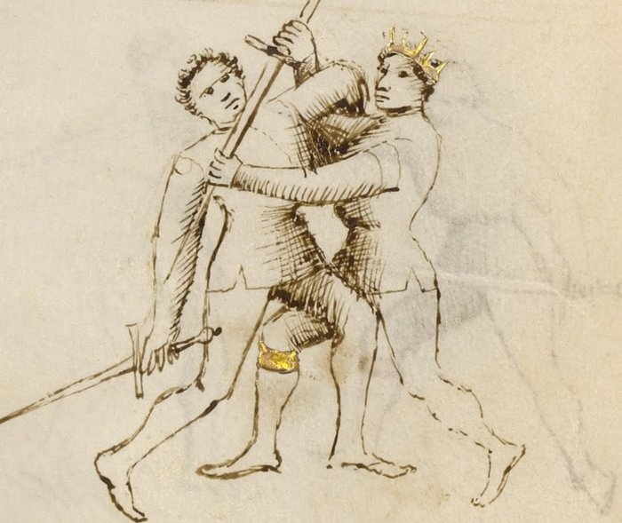

# Upper Bind — Ligadura Soprana

<em>Getty MS Ludwig XV 13, folio 29v, c. 1409 - J. Paul Getty Museum (Open Content)</em>

*The Overbind*

Classification: *Gioco Stretto — Narrow Play*

Where the Middle Bind controls the arm at shoulder height, the Upper Bind drives it higher.

Once the arm is elevated past the shoulder, the body must tilt backward to follow. A tilting body is an unbalanced body. And an unbalanced body falls.

The Upper Bind is the lock that most directly creates a throw.

**Drive the arm high, and the body tilts into a throw.**

---

## **Fiore's Description**

### **Getty Manuscript Text**

*"Anchora digo de lo terzo ligadure ch'e chiamado soprana, per che lo brazo del compagno va in suso."*

### **Translation**

"I also say of the third binding, which is called the overbind, because the companion's arm goes upward."

Fiore's description is brief because the mechanic follows directly from the Middle Bind: it is the same spiraling action continued upward rather than held at shoulder height.

---

## **The Setup**

You are in stretto range, with control of the opponent's weapon arm established through a prior entry or grab.

The most direct path to the Upper Bind: the opponent is resisting the Middle Bind by pulling their arm backward. As they pull, allow the arm to travel upward and follow it: the resistance itself carries the arm into the soprana position.

---

## **The Technique**

**Establish outside contact with the weapon arm.** The same starting position as the Middle Bind: outside the arm, below or at the elbow.

**Begin the wrapping spiral.** The same spiraling motion as the mezana: your arm goes over the opponent's weapon arm and then under, seating around the elbow.

**Drive the arm upward past shoulder height.** Instead of arresting the motion at shoulder height, continue driving the arm up. The elbow travels above the shoulder. The hand goes higher still.

**Lock the arm above the shoulder.** Once the arm is elevated, the shoulder joint reaches its limit. The same elbow spiral that produces the mezana here presses the shoulder rather than the elbow, a different joint at a different angle.

**Step through and press down.** With the arm locked overhead, turn your body into the opponent and press downward. The elevated arm cannot descend freely, the lock prevents it, so the body must tilt back instead. The tilt becomes a fall.

---

## **Why It Works**

The shoulder has more range of motion than the elbow.

But it has limits. When the arm is driven above the shoulder with the elbow locked inside the spiral, the shoulder is loaded at the end of its natural elevation range. Driving further loads it against that limit.

More critically: the body cannot remain upright when the arm is controlled overhead and a downward pressure is applied. The torso has no stable base with one arm elevated and controlled from the outside. The weight of the opposition overcomes the body's ability to remain vertical.

The throw that results is not generated by brute force. It is generated by removing the opponent's balance through the arm control.

---

## **Reading Resistance into the Lock**

The Upper Bind often appears not as a deliberate choice but as a read.

You apply the Middle Bind. The opponent feels the lock at shoulder height and resists by pulling back and upward, attempting to withdraw the arm from the spiral.

A skilled fencer does not try to hold the mezana against this resistance. They follow the arm upward.

The opponent's own resistance carries them into the soprana position. What they thought was an escape has become a more dangerous lock.

This is one of Fiore's clearest demonstrations of the principle of following the opponent's energy rather than fighting it.

---

## **Connection to the System**

The Upper Bind follows from:

* The Middle Bind: follow the opponent's resistance upward when they pull back
* Any pommel strike or arm grab that creates outside contact at the forearm or elbow

The Upper Bind leads most directly to:

* A throw: the step-through and press-down takes the opponent to the ground
* A disarm: the elevated position compromises the opponent's grip significantly; a disarm attempt from the soprana position has a high probability of success

The soprana is the most throw-producing of the three locks. If your goal is to take the opponent to the ground, the Upper Bind is the intended path.

---

## **The Abrazare Connection**

In Fiore's wrestling section, the overhead arm control and the resulting throw are a foundational sequence.

The mechanical elements are identical to the longsword version: outside grip, wrapping spiral, elevation, step-through press. The only difference is that both parties are holding swords.

Because of this, the soprana throw is unusually reliable when practiced. It does not require unusual strength or size. The opponent's own mass works against them once the arm is elevated and locked.

---

## **Modern Application**

In modern HEMA competition, the Upper Bind throw is permitted in many rulesets and scores as a takedown.

The throw that results from the soprana is one of the cleaner takedowns available from a longsword context: it is controlled, directional, and does not require going to the ground with the opponent. You apply the lock, the opponent falls. You remain standing.

Training the soprana specifically for competition: practice the transition from resistance to elevation (Drill 2 below) rather than the lock from a static starting position. The realistic competition entry is a resisted mezana followed by the upward continuation, not a cold soprana from the start.

---

## **Connection to the Four Virtues**

The **Lynx** governs the read that converts resistance into the soprana. Feeling the opponent pull back and following upward rather than fighting the withdrawal requires sensitivity to what the opponent is doing in real time.

The **Tiger** governs the speed of the elevation, once the arm begins traveling upward, the spiral must follow quickly enough to maintain control.

The **Elephant** governs the step-through press that completes the throw. The body weight must be engaged behind the downward press to overcome the opponent's upright mass.

The **Lion** governs commitment: once the arm is elevated and the body begins to tilt, continue through to the ground. A partial throw that stops halfway can reverse.

---

## **What This Play Is Not For**

The Upper Bind does not work from the inside of the arm, for the same reason as the other ligadure. Outside position is required.

It is also not a technique to force when the opponent is actively stable in a mezana resist. If the opponent has spread their weight and is genuinely resisting the mezana without pulling back, the soprana is not available. In that case, transition to the lower bind or the disarm.

Finally, do not stop at the locked position overhead. The lock at elevation is unstable, both parties are off-balance. The throw must follow immediately. Holding the soprana without completing the throw invites a counter.

---

## **Training the Play**

### **Drill 1 — Elevation in Isolation**

Without a partner, practice the spiraling motion from the Middle Bind drill, but continue the arc upward rather than arresting at shoulder height.

Note where the spiral seats at overhead position: the shoulder joint is loaded from the outside, the elbow is controlled within the spiral.

Add the step-through press: once the arm is overhead, turn the body and press downward as if completing the throw.

**Focus:** One continuous motion: from the wrap, through shoulder height, to overhead elevation, into the step-through.

---

### **Drill 2 — Reading Resistance into Soprana**

Begin with the Middle Bind (Drill 2 from Middle Bind page): Partner B applies the mezana at shoulder height.

At a cue, Partner A resists by pulling the arm backward and upward.

Partner B follows the arm upward rather than holding the mezana position: continue the spiral upward → lock at overhead position → step through → slow-motion press toward the ground.

Partner A allows the throw to complete in slow motion.

**Focus:** Partner B does not fight the resistance. They follow it upward. The resistance generates the soprana.

---

### **Drill 3 — Full Entry to Throw**

Begin with the full stretto entry sequence (pommel strike → blade behind neck → arm grab → mezana attempt → mezana resisted → follow to soprana → step-through throw).

Practice the full chain at slow speed, increasing speed on the sections that become reliable.

**Focus:** The soprana is the destination of a chain, not an isolated technique. The chain should feel continuous, not assembled from separate steps.

---

## **Common Errors**

A common error is forcing the arm overhead against resistance without following the spiral. This is a strength contest, not a lock. If the arm is not being elevated through the spiral mechanic, the technique is not the soprana.

Another error is allowing the arm to come back down after elevation. Once overhead, the press must follow immediately. Hesitation allows the opponent to drop the arm before the throw can complete.

Many students step through the throw too early, before the arm is fully elevated. The throw is powered by the combination of elevation and the step-through press. Stepping through at shoulder height produces a different result than stepping through at full overhead elevation.

Finally, not committing to the ground. A partial throw that stops halfway reverses more easily than one completed to the ground.

---

## **Key Idea**

The Upper Bind follows resistance.

The opponent pulls back against the Middle Bind. Follow their arm upward. Lock it overhead. Step through and press down.

Their own weight and the geometry of the lock bring them to the ground.

**Drive the arm high. Step through. Commit to the ground.**
