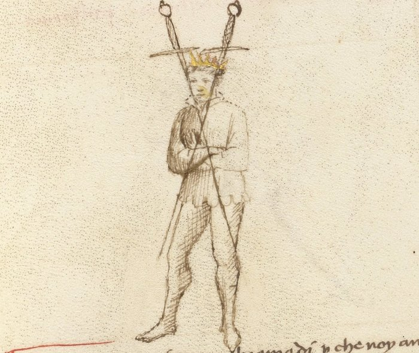

# Fendente Destra

<em>Getty MS Ludwig XV 13, folio 23r, c. 1409 — "We are downward blows and we dispute; by cleaving the teeth with proper intention." J. Paul Getty Museum (Open Content)</em>

*The Descending Cut from the Right*

Fendente (Destra) is one of the fundamental cuts in Fiore dei Liberi’s system. It is a descending diagonal strike delivered from the right side, combining gravity, structure, and forward motion to generate powerful impact.

For the modern fencer, the fendente represents a core principle of effective striking: **power comes from alignment and acceleration, not effort**. When performed correctly, the cut feels heavy, controlled, and difficult to stop.

This strike is closely associated with Posta di Donna, where the blade begins in a chambered position. However, it can be delivered from multiple guards and adapted to different tactical situations.

---

## **Physical Description**

### **Path of the Blade**

The fendente begins high on the right side, most commonly from Posta di Donna Destra.

From this position, the blade travels diagonally downward at roughly a forty-five degree angle, cutting from the right shoulder toward the opponent’s left side. The strike may land on the head, shoulder, arm, or continue through toward the torso.

The motion should feel continuous, with the blade accelerating as it descends.

---

### **Body Mechanics**

The cut is typically delivered with a forward step of the right foot.

As the step occurs, the hips rotate into the strike, followed by the shoulders and arms. The weight shifts forward, allowing the body to support the motion of the blade.

The arms guide the cut, but the power comes from the coordinated movement of the entire body.

---

### **Ending Position**

The fendente most commonly finishes in Dente di Zenghiaro, a low guard with the point forward.

It may also finish in Porta di Ferro Mezzana, depending on the height and intent of the strike.

In either case, the blade should end low with structure intact, ready to continue into the next action.

---

## **Tactical Function**

The fendente is a primary offensive action used to attack from above with force and control.

Its descending angle allows it to target the head, neck, shoulder, and arms. Because the strike travels forward and downward, it has strong reach and can apply pressure even when met by the opponent’s blade.

Fiore refers to such strikes as “great blows,” capable of breaking opposing guards. When delivered with proper structure, the fendente can force a defensive reaction or displace the opponent’s weapon.

---

## **Modern Application**

In modern fencing, the fendente is often delivered in a more compact form than described in the manuscripts.

The full chamber from Posta di Donna may be shortened to reduce telegraphing and improve speed. Likewise, the forward step may be reduced to a smaller advance or slight weight shift, depending on distance and timing.

Because modern training weapons do not bite like sharp blades, control of the sword line becomes more important than raw cutting force. As a result, fencers often prioritize maintaining presence in the bind after the strike rather than relying on the cut to break through.

---

## **Connection to Guards**

The fendente is closely linked to several guards.

### **Primary Starting Guards**

The most common starting position is Posta di Donna Destra, where the blade is already chambered for a descending strike.

It may also be delivered from Posta Breve for a quicker, more compact version, or from Posta Frontale (Corona) for a more vertical, forceful action.

---

### **Ending Guards**

The strike most often concludes in Dente di Zenghiaro, providing a strong low position for continuation.

It may also end in Porta di Ferro Mezzana when the cut finishes at a higher level or transitions into a defensive structure.

---

## **Connection to the Four Virtues**

The fendente reflects all four of Fiore’s virtues in action.

The **Lion** is present in the commitment of the strike. Once launched, the cut should be delivered with intent.

The **Tiger** appears in the acceleration of the blade, ensuring the strike arrives quickly despite its power.

The **Elephant** provides structure, keeping the body aligned and stable throughout the motion.

The **Lynx** governs targeting and distance, ensuring the cut lands accurately.

---

## **Common Tactics**

The fendente is most commonly used as an initiating attack from above, forcing the opponent to defend or yield the line.

It may also be used to break through an opponent’s guard or apply pressure into the bind. Even when parried, the momentum of the strike can displace the opposing blade and create openings.

The cut is also effective as a counterattack when the opponent advances. By striking into their movement, the fencer can intercept and disrupt their action.

Because of its committed nature, timing is critical. A poorly timed fendente may be intercepted or countered before it develops.

---

## **What This Cut Is Not For**

The fendente is not well suited to very close distance. If the opponent is already within range, the descending motion may be too large to deploy effectively.

It is also less effective in rapid, tight exchanges where smaller, more direct actions are required.

Finally, the cut should not be performed with excessive tension or force. Attempting to “muscle” the strike reduces efficiency and slows the blade.

---

## **Training the Cut**

The following drills develop the mechanics and application of the fendente.

### **Drill 1 — Solo Cutting**

Begin in Posta di Donna Destra with the blade chambered over the right shoulder.

Step forward with the right foot and release the cut, allowing the blade to travel diagonally downward.

Follow through completely, finishing in Dente di Zenghiaro.

Repeat several times, focusing on smooth acceleration and coordinated movement.

The cut should feel natural, with gravity assisting the motion rather than resisting it.

---

### **Drill 2 — Targeting**

With a partner, practice delivering the fendente in slow motion without contact.

One fencer delivers the cut while the other observes the path of the blade.

Focus on accurate targeting of the opponent’s left side, including the head, shoulder, arm, and upper torso.

Switch roles and repeat.

---

## **Common Errors**

Students often stop the cut at the point of contact during solo practice. The blade should continue through its full arc, finishing in a stable guard.

Another common mistake is pulling the cut or failing to commit. The strike should accelerate through the target rather than stopping short.

Finally, some students rely only on their arms. The cut must be driven by the coordinated movement of the hips and shoulders, not just the upper body.

---

## **Key Idea**

The fendente is a cut of structure and acceleration.

When performed correctly, it does not feel forced. The blade falls naturally along its path, guided by the body and supported by gravity.

**Its effectiveness comes not from strength alone, but from timing, alignment, and commitment.**

