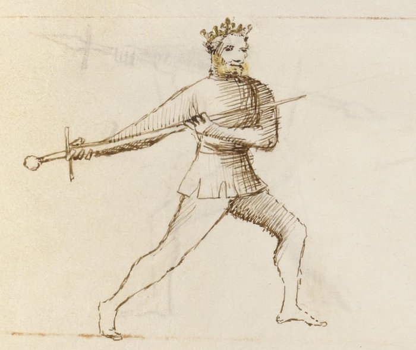

# Fiore for HEMA Fencers

[← Back to Materials](../Materials.md){ .md-button }

<em>Getty MS Ludwig XV 13, folio 22r, c. 1409 — "Six masters we are, and we dispute one to another; each does something that the others do not." J. Paul Getty Museum (Open Content)</em>

*Author: Chris Mineweaser*

An interpretation of the longsword system of Fiore dei Liberi for modern HEMA fencing practice. Drawn from the Getty Manuscript (c. 1409), this material covers guards, the seven blows, and tactical concepts — with commentary focused on competitive and practical application rather than strict historical reconstruction.

---

## What's Inside

**History** — Background on Fiore dei Liberi and the structure of his system, including the Segno and the four virtues.

**Glossary** — Italian terminology used throughout the curriculum, with definitions and context.

**Guards** — All twelve guards of the longsword system, with mechanical description, bilateral variations, tactical purpose, and counters.

**Strikes** — The seven blows of the sword: the three fendente, two mezzani, two sottani, and the thrust.

**Plays** — Fiore's combat plays (*zoghi*) organized by game: Gioco Largo (wide play, measure, geometry) and Gioco Stretto (close play, joint locks, disarms, throws). Includes the Exchange of Thrusts, Breaking the Thrust, the Peasant's Blow, the three joint locks, disarms, and takedowns — with modern competitive application throughout.
