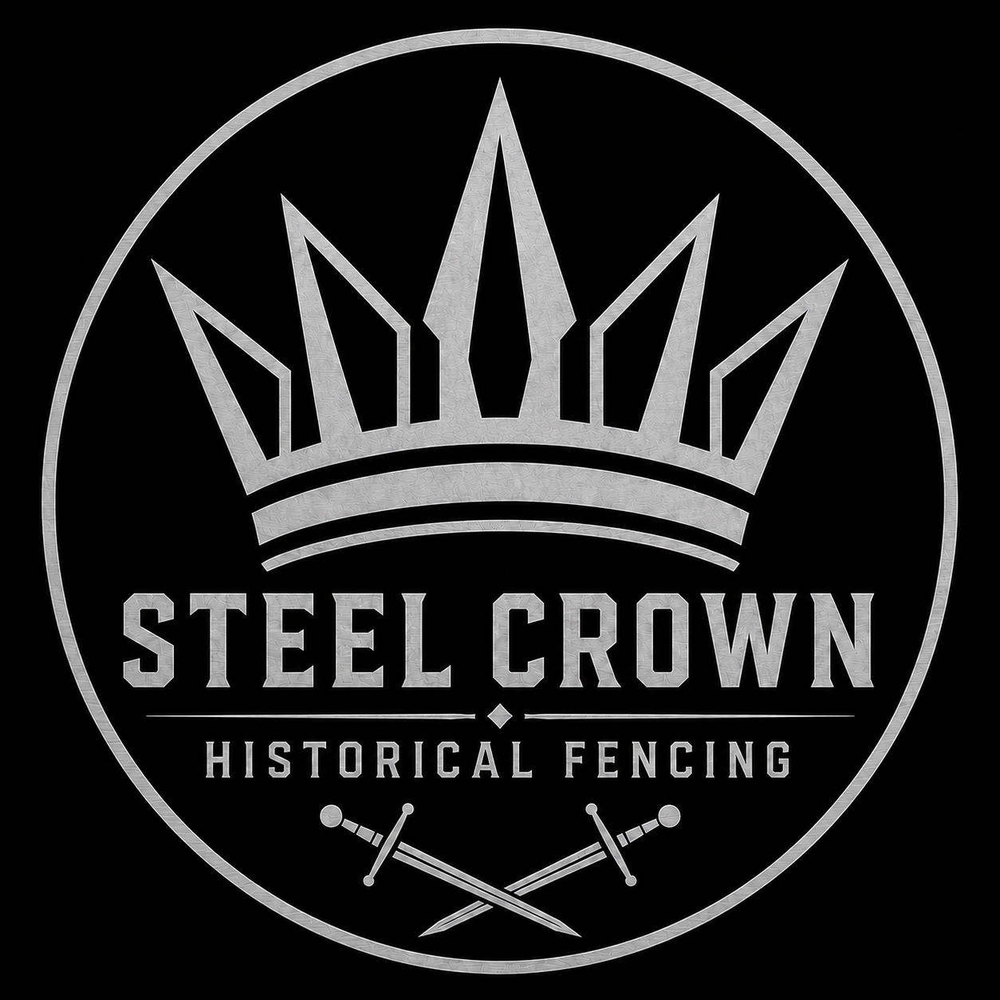

  
  
Steel Crown Historical Fencing

  
Historical European Martial Arts · Charlotte, NC

[About the Club](About.md){ .md-button }

Steel Crown Historical Fencing is a HEMA organization in Charlotte, North Carolina dedicated to the serious study and practice of historical fencing. We train longsword and other weapons drawn from primary historical sources, with an emphasis on disciplined technique, honest instruction, and a culture where every member is both a student and a contributor.

Whether you are new to HEMA or an experienced practitioner, you will find a training environment built on mutual respect, open knowledge, and long-term development.

---

## What We Do

-   :material-sword:{ .lg .middle } **Longsword**

    ---

    Primary weapon and focus of all training, from foundational technique to competitive application.

-   :material-trophy:{ .lg .middle } **Competition**

    ---

    We train to compete. Sparring culture and curriculum are built around tournament preparation.

-   :material-account-group:{ .lg .middle } **Training Culture**

    ---

    Honest feedback, shared knowledge, mutual growth. No gatekeeping, no ego.

-   :material-book-open-page-variant:{ .lg .middle } **Study Materials**

    ---

    Full curriculum documentation for Fiore dei Liberi and Godinho Montante, available to all members.

---

## Our Approach

We believe that excellence and community reinforce one another. Our training culture is built around honesty, sportsmanship, and shared growth — not ego, gatekeeping, or political maneuvering. Knowledge is shared freely. Feedback is given directly and respectfully. Every member is expected to contribute to the strength of the club.

[Read our Mission and Values](About.md){ .md-button }
[Club Standards](Standards/Instructor Standards.md){ .md-button }

---

## Materials

Our study materials cover the historical sources we train from, with full documentation of guards, strikes, and tactical concepts.

[Fiore for HEMA Fencers](Fiore for HEMA Fencers/Glossary.md){ .md-button .md-button--primary }
[Godinho Montante](Montante/Introduction.md){ .md-button .md-button--primary }

---

## Contact

We are based in **Charlotte, North Carolina**.

- **Email:** [steelcrownhistoricalfencing@gmail.com](mailto:steelcrownhistoricalfencing@gmail.com)
- **Instagram:** [@steelcrownhistoricalfencing](https://www.instagram.com/steelcrownhistoricalfencing)

Reach out if you are interested in training, have questions about our program, or want to connect with the club.
